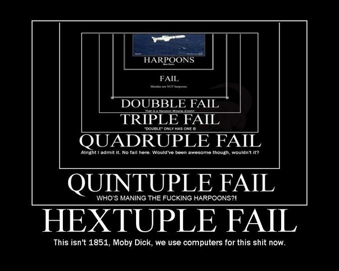

**********
Einleitung
**********

Ziele dieser Arbeit
===================

Abstract (English)
==================

This paper describes the conceptual design and development of a user
interface of a three dimensional multimodal process modeling tool,
which allows the user to create and reprocess process models, flow
charts, meta models, etc. The Editor combines multiple input types
to provide a userfriendly handling. As peripheral devices, mouse and
keyboard, the Microsoft Kinect and the Nintendo Wii are used. With
a modular design of the user interface, tieing-in further input systems
can be done with minimal time and effort. The tool uses the SIRIS
framework, which is designed for creation of interactive applications
in a virtual reality. 

Abstract (Deutsch)
==================

Die vorliegende Arbeit beschreibt die Konzeption und Entwicklung der
Dabei werden verschiedene Arten der Eingabe zusammengeführt um den
Benutzer eine möglichst intuitive Bedienung anzubieten. Als Peripheriegeräte
kommen Maus und Tastatur, sowie Microsoft Kinect und Nintendo Wii
zum Einsatz. Durch die Modularisierung der Bedienschnittstelle ist
ein Einbinden weiterer Eingabesysteme mit minimalem Aufwand durchführbar.
Das Werkzeug selbst basiert auf SIRIS, einem Framework zur Erstellung
von interaktiven Anwendungen in einer Virtual Reality. 
Bla bölloüä äßßßßßb rbbtat atatccc gggt

Aufbau
======

    Da ist eine Caption. Jaja, schon schön, das Bild....

rfrogk 
Benutzer eine möglichst intuitive Bedienung anzubieten. Als Peripheriegeräte
kommen Maus und Tastatur, sowie Microsoft Kinect und Nintendo Wii
rpkfrgp
Benutzer eine möglichst intuitive Bedienung anzubieten. Als Peripheriegeräte
kommen Maus und Tastatur, sowie Microsoft Kinect und Nintendo Wii

    Und weils so schön war das gleiche nochmal ;)

da issn Zitat:

:cite:`jablonski_workflow_1996`

Nette Skizze:

    Verbindung im graphbasierten Ansatz
    

Hier wird ein anderes Kapitel referenziert:

Anderes Kapitel, wo endlich mal was Konkretes steht :ref:`ref_anwendungsfall`.
