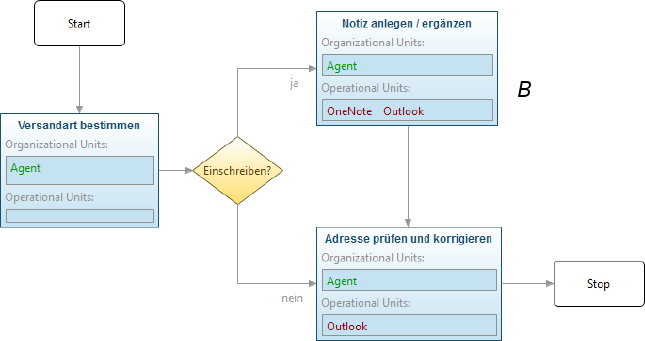

**********
Grundlagen
**********

Dieses Kapitel beschäftigt sich mit Grundlagen, die für das Verständnis der Modellierungsaspekte dieser Arbeit wichtig sind. 
Zuerst wird eine Einführung in die Beschreibung von Prozessmodellen durch Sprachen gegeben und das Konzept der perspektivenorientierten Prozessmodellierung :cite:`jablonski_workflow_1996` gezeigt.
Anschließend wird die Metamodellierung, insbesondere das Linguistic Meta Model :cite:`volz_werkzeugunterstutzung_2011` vorgestellt, welches die Basis für die Anpassbarkeit des hier entwickelten Modellierungswerkzeugs darstellt.

.. _prozessmodellierungssprachen:

Prozessmodellierungssprachen
============================

Modellierung hat im Rahmen des Prozessmanagements die Aufgabe, komplexe (Geschäfts-)Abläufe aus der Realität in einer abstrahierten, das heißt vereinfachten, aber dennoch korrekten Form darzustellen\ [#f1]_.
Einerseits werden werden Prozessmodelle erstellt, um Zusammenhänge besser zu erkennen und Optimierungsmöglichkeiten für den realen Prozess aufzuzeigen.
Andererseits können abstrakt modellierte Prozesse von einem Softwaresystem automatisch ausgeführt bzw. simuliert werden :cite:`ter_hofstede_business_2003`.

Um Modelle formulieren zu können bedarf es einer passenden Modellierungssprache. 

Zu einer Sprache gehört eine **abstrakte Syntax**, die allgemein Elemente einer Sprache und deren Beziehungen beschreibt.
Erst eine **konkrete Syntax** legt sozusagen das "Aussehen" der Sprache fest :cite:`clark_applied_2008`.
Grundsätzlich lassen sich textuelle und grafische Notationen für Sprachen unterscheiden. 

Visuelle Sprachen und deren Klassifikation
------------------------------------------

Wohl die leistungsfähigste "Schnittstelle" des Menschen ist das visuelle System :cite:`ware_information_2004`, welches auf die Erkennung von Mustern und Strukturen ausgelegt ist.
Daher eignen sich besonders grafische Darstellungen dafür, einen Überblick über komplexe Modelle zu geben und Zusammenhänge zwischen einzelnen Modellelementen aufzuzeigen.
So spielen visuelle Sprachen auch eine große Rolle in der Prozessmodellierung :cite:`ter_hofstede_business_2003` :cite:`jablonski_perspective_2008`.

Die konkrete Syntax einer grafischen (oder "visuelle") Sprache umfasst eine Ansammlung von grafischen Objekten (auch "Formen" oder "Figuren" genannt), die Sprachelemente repräsentieren.
Elemente können auf verschiedene Arten miteinander in Beziehung gesetzt werden. 
Grafische Sprachen lassen sich nach diesem Kriterium prinzipiell in zwei Klassen, welche in :num:`Abbildung #klassifikation-vis` gezeigt werden, und Mischformen einteilen :cite:`costagliola_classification_2002`.

So können visuelle Sprachen einem **graphbasierten** Ansatz folgen.
Graphen bestehen aus Knoten und Kanten. Kanten drücken dabei eine Relation zwischen bestimmten Knoten aus, mit denen sie "verbunden" sind.
Für die Bedeutung ist das "Verbundensein" über die Kante und nicht die Positionierung im Raum entscheidend.

Im Gegensatz dazu steht eine **geometriebasierte** Darstellung, welche die relative Positionierung von Modellelementen für die Darstellung von Beziehungen nutzt.
So kann ein Objekt an einem anderen anhaften, oder in diesem enthalten sein.

.. _klassifikation-vis:

.. figure:: _static/diags/klassifikation_vis.eps
    :width: 13cm

    Graph- und geometriebasierter Ansatz im Vergleich

Aus den beiden Ansätzen können Mischformen ("Hybride") gebildet werden, die so eine größere Auswahl an Möglichkeiten zur Visualisierung von Beziehungen bieten können.
In der Praxis sind daher solche Ansätze in der UML :cite:`booch_unified_1999` und auch in der Prozessmodellierung zu finden, wie an den Beispielen in den folgenden Abschnitten zu sehen ist.

.. _popm:

Perspektivenorientierte Prozessmodellierung
-------------------------------------------

In einem Prozessmodell wird oft eine Vielzahl von Informationen dargestellt, die verschiedenste Bereiche der Prozessausführung beschreiben.
Nach dem Konzept der perspektivenorientierten Prozessmodellierung (POPM) werden die "Informationsbestandteile" eines Prozesses in sog. "Perspektiven" (oder auch "Aspekte" genannt) eingeteilt 
:cite:`jablonski_workflow_1996` :cite:`jablonski_perspective_2008`.

Es wurden folgende fünf wichtigen Perspektiven identifiziert, die auch in :cite:`volz_werkzeugunterstutzung_2011` (S.251f) beschrieben werden:

Funktionale Perspektive 
    Dies umfasst alle funktionalen Einheiten eines Prozesses. Hier sind Ablaufschritte, Entscheidungen oder Konnektoren (AND, OR) eingeschlossen. Ablaufschritte werden wieder als "Prozess" bezeichnet. Dies drückt aus, dass ein Prozessschritt selbst aus mehreren Schritten bestehen kann. Ein solcher Prozess(schritt) wird als "komposit" bezeichnet. So ergibt sich eine Hierarchie von Prozessverfeinerungen.

Verhaltensorientierte Perspektive 
    Dies wird auch als "Kontrollfluss" bezeichnet und gibt die zeitlichen bzw. logischen Abhängigkeiten zwischen Elementen der funktionalen Perspektive an. Durch diese Perspektive wird also die Ausführungsreihenfolge festgelegt. 

Organisationale Perspektive 
    Einem Prozess lässt sich eine ausführende Entität, beispielsweise eine abstrakte Rolle oder eine konkrete Person zuordnen, die für die Ausführung verantwortlich ist.

Datenbezogene Perspektive 
    Prozesse sind ohne Daten, die im Ablauf erstellt, modifiziert und ausgetauscht werden quasi undenkbar. Datenflüsse legen oft auch die Abhängigkeiten zwischen Prozessschritten fest.

Operationale Perspektive 
    Zur Ausführung von Prozessen sind verschiedene Betriebsmittel wie Maschinen, Werkzeuge oder Rechnerressourcen erforderlich, welche in dieser Perspektive abgebildet werden.

Dies soll explizit keine vollständige Aufzählung sein, sondern nur eine Zusammenfassung sehr häufig vorkommender Bestandteile. 
So kann es nötig sein, für einen Anwendungsfall weitere Perspektiven hinzuzufügen oder Perspektiven um neue Elemente zu erweitern.
Daraus ergibt sich, dass (grafische) Modellierungssprachen, die POPM unterstützen möglichst erweiterbar sein sollten. 

:num:`Abbildung #ipm-process`\ [f5]_ zeigt einen Prozess nach der perspektivenorientierten Prozessmodellierung.

Die funktionale Perspektive wird hier durch drei Prozesse sowie einen Entscheidungsknoten vertreten. 
Kontrollflüsse, die mit grauen Pfeilen visualisiert werden bilden die verhaltensorientierte Perspektive.
Am Entscheidungsknoten kann sich der Kontrollfluss je nach Ausgang des Kriteriums (Einschreiben / Paket?) verzweigen.
Mit dem blau eingekreisten Prozess sind Daten assoziiert, die in einem an den Prozess angehängten grauen Rechteck benannt werden.

Die drei bisher genannten Perspektiven werden, wie zu sehen ist, nach einem graphbasierten Ansatz visualisiert. 
Im Gegensatz dazu werden durch an die Prozessknoten "angeklebte" Zeichenketten die organisationale (unten) und operationale (oben) Perspektive visualisiert.
Dies entspricht dem geometriebasierten Ansatz.

.. _ipm-process:

    Perspektivenorientierte Prozessmodellierung aus :cite:`roth_konzeption_2011`

Grafische Modellierungswerkzeuge
--------------------------------

Für die Erstellung von grafischen Prozessmodellen am Rechner wird eine Unterstützung durch Softwarewerkzeuge benötigt.
Prinzipiell können "Modelle" einfach mit Hilfe von 2D-Zeichenwerkzeugen wie *Dia* :cite:`www:dia` oder *MS Visio* :cite:`www:visio` erstellt werden.
Solche Programme bieten oft schon passende Formen und Verbindungen, beispielsweise für BPMN\ [#f2]_ an. 

Ein Benutzer macht die Bedeutung eines solchen Diagramms an den erkennbaren grafischen Formen und deren Aussehen fest; insofern wäre dies für Menschen durchaus ausreichend.

Durch ein Zeichenprogramm wird das Diagramm intern nur als eine "Ansammlung" von Bildpunkten oder geometrischen Primitiven dargestellt und auch entsprechend gespeichert ("persistiert").
Für ein solches Programm hat die Semantik des Modells keinerlei Bedeutung. 
So ergibt sich ein Problem, wenn der modellierte Prozess automatisch ausgeführt oder verändert werden soll. 
Wie soll den grafischen Elementen eine Bedeutung zugeordnet werden?

Daher sind eher Werkzeuge gefragt, die auch intern eine "Vorstellung" von Modellierungskonzepten haben :cite:`volz_werkzeugunterstutzung_2011`.
Solche Werkzeuge werden – auch in dieser Arbeit – "Modellierungswerkzeuge" genannt.

Ein solches grafisches Werkzeug bietet die Möglichkeit, Modelle zu erstellen, diese in formaler Weise zu persistieren und wieder aus einer physikalischen Repräsentation – beispielsweise einer Datei – zu laden. 
Dem Benutzer wird üblicherweise eine Palette an Modellelementen angeboten, die in einem konkreten Prozessmodell eingesetzt werden können. 
Ein Anwender "baut" ein Modell, indem er grafische Objekte miteinander auf einer "Zeichenfläche" kombiniert.

Ein Modellierungswerkzeug für die perspektivenorientierte Prozessmodellierung wird in :num:`Abbildung #ipm2` gezeigt. 
Auf der linken Seite lässt sich die Palette mit den Modellelementen erkennen, die in verschiedene "Gruppen" eingeordnet sind.

.. _ipm2:

.. figure:: _static/ext_pics/ipm2d-editor.png
    :width: 15cm

    Prozessmodellierungswerkzeug i>PM2 aus :cite:`roth_konzeption_2011`

.. _metamodellierung:

Metamodellierung
================

In der Prozessmodellierung kann es sinnvoll sein, die Modellierungssprache selbst zu verändern, um diese an spezielle Anforderungen anzupassen.
So lassen sich Sachverhalte verständlicher und direkter als mit allgemeinen, fest vordefinierten Sprachen darstellen, indem spezialisierte Sprachelemente verwendet werden.
An ein bestimmtes Einsatzgebiet angepasste Sprachen werden als **domänenspezifische Sprachen** (DSL) bezeichnet :cite:`clark_applied_2008`.

Zur Beschreibung von Modellierungssprachen lässt sich das Konzept der **Metamodellierung** einsetzen :cite:`weisemoller_comparison_2008` :cite:`volz_werkzeugunterstutzung_2011`.
Ein Metamodell lässt sich als ein Modell für eine Ansammlung ("Klasse") von Modellen charakterisieren :cite:`seidewitz_what_2003`.  

Durch die Anpassung eines Metamodells, welches die abstrakte Syntax beschreibt, können neue Modellelemente hinzugefügt und bestehende angepasst oder entfernt werden.  
Andererseits lässt sich die konkrete Syntax, im Falle einer visuellen Sprache also die grafische Repräsentation der Modellelemente ebenfalls durch ein Metamodell spezifizieren.  
So ist es möglich, zu einer abstrakten Syntax mehrere grafische Repräsentationen zu erstellen, die auf spezielle Anforderungen zugeschnitten sein können :cite:`jablonski_perspective_2008`.  

Um Metamodelle zu "erstellen" ist es notwendig, diese auf eine wohldefinierte Weise beschreiben zu können. 
Dies leistet das im Folgenden vorgestellte Linguistic Meta Model (LMM), welches im Rahmen der Open Meta Modelling Environment (OMME), einer Metamodellierungsumgebung, entstanden ist :cite:`volz_werkzeugunterstutzung_2011`.

.. _lmm:

Linguistic Meta Model
---------------------

LMM stellt eine Sprache bereit, welche zur Definition von Metamodellen dient. 
:num:`Abbildung #lmm-model` zeigt die grundlegenden LMM-Elemente und deren Hierarchie.

.. _lmm-model:

    Hierarchie der LMM-Elemente aus :cite:`volz_werkzeugunterstutzung_2011`

Das zentrale Element im LMM ist das **Concept**. 

Ein Concept kombiniert Eigenschaften einer Klasse und eines Objekts, wie sie aus objektorientierten Programmiersprachen\ [#f3]_ bekannt sind. 
So kann ein Concept – wie eine Klasse – Attribute definieren. Gleichzeitig kann ein Concept – wie ein Objekt –  Wertzuweisungen enthalten.
Anders ausgedrückt können Concepts sowohl eine "Typ-Facette", die Attribute definiert als auch eine "Instanz-Facette", die Zuweisungen vornimmt, beinhalten :cite:`atkinson_meta-level_2000`.
Dieses Prinzip wird mit dem Begriff **Clabject** (**Cla**\ ss and O\ **bject**\ ) umschrieben.

Ein Vergleich zwischen Klasse-Objekt-Beziehungen und Concept-Concept-Beziehungen  ist in :num:`Abbildung #vergleich-lmm` zu sehen.

.. _vergleich-lmm:

.. figure:: _static/diags/vergleich_lmm.eps
    :width: 16cm

    Vergleich von objektorientierter Modellierung (links) und Metamodellierung mit Clabjects

Im objektorientierten System stellen Klassen Typen dar; Objekte sind Instanzen von Klassen, welche Werte an die Attribute der Klasse zuweisen.

Im Gegensatz zu der von Klasse und Objekt vorgegebenen Hierarchie aus zwei "Ebenen" lassen sich mit Concepts Hierarchien mit beliebig vielen Ebenen darstellen. 
Dazu können Concepts gleichzeitig den Typ für Concepts auf der darunterliegenden Ebene und eine Instanz eines Concepts (``instanceOf``) auf der nächsthöheren Ebene darstellen.
Ebenso gibt es die Möglichkeit für Concepts, andere Concepts analog zu Klassen zu "erweitern" (``extends``), also einen Subtyp zu bilden. 

In :num:`Abbildung #vergleich-lmm` besitzt ``ConceptC`` eine Instanz-Facette, welche den Attributen aus ``ConceptA`` und ``ConceptB`` Werte zuweist.
Die Typ-Facette von ``ConceptC`` stellt das Attribut ``c`` bereit welches von ``ConceptD`` mit dem Wert 5.5 belegt wird.

Concepts werden, wie in :num:`Abbildung #lmm-model` gezeigt, in **Packages** eingeordnet. Packages bilden zusammen einen **Level**, welcher eine Ebene in der Metamodellierungshierarchie repräsentiert.
Mehrere Levels stellen zusammen das vollständige **Model** dar, wobei auch Modelle mit nur einer Ebene erlaubt sind.

In Concepts können sowohl **literale Attribute** (bspw. string, real, integer) als auch **Concept-Attribute**, welche auf andere Concepts verweisen, angegeben werden.

Levels können ebenfalls zueinander in einer Instanzbeziehung (``instanceOf``) stehen. 
Ein Level *MA* ist die Instanz eines anderen Levels *MB*, wenn alle in *MA* definierten Concepts Instanzen von Concepts in *MB* sind.

Die genannten Beziehungen wie ``instanceOf`` zwischen Levels bzw. Concepts werden in :num:`Abbildung #lmm-model` als "Reference" dargestellt.

Neben der schon erwähnten Instanziierung und Subtypbildung werden von LMM zusätzliche Modellierungsmuster unterstützt. 
Von diesen ist für die vorliegende Arbeit die sog. **Spezialisierung von Instanzen**  bedeutend, deren Vorteile für die Modellierung von :cite:`volz_werkzeugunterstutzung_2011` beschrieben werden.

Dieses Muster wird in :num:`Abbildung #concreteuseof` veranschaulicht.

.. _concreteuseof:

.. figure:: _static/diags/concreteuseof.eps
    :width: 16cm

    Instanz-Spezialisierung ausgehend von ConceptD

In der Abbildung spezialisiert ``UseA`` ``ConceptD`` (``concreteUseOf``). ``UseA`` übernimmt dabei alle Zuweisungen von ``ConceptD``; damit hat das Attribut in ``UseA`` ebenfalls den Wert 5.5.
``UseB`` dagegen setzt wiederum einen Wert für das Attribut ``c``. Das heißt, dass in ``UseB`` die bisherige Zuweisung "überschrieben" wird und damit den Wert 0 hat.
Für ``ConceptD`` ändert sich dabei nichts; die Überschreibung wirkt sich nur in ``UseB`` aus.

In LMM lässt sich für Attribute festlegen, inwieweit das Setzen von Werten in Spezialisierungen zulässig ist und welche Bedeutung dies hat. 

LMM-(Meta-)Modelle lassen sich mit der Sprache Linguistic Meta Language (LML) :cite:`volz_werkzeugunterstutzung_2011` (S.159ff) in einer textuellen Form beschreiben.
Die Syntax ist an bekannte Programmiersprachen wie C++ oder C# angelehnt und kann daher als "menschenlesbar" angesehen werden. 
Gleichzeitig ist es damit möglich, LMM automatisch zu verarbeiten oder es sogar für die Beschreibung von Software zu nutzen, wie im Folgenden am Beispiel des MDF gezeigt wird.

Beispielsweise sieht ein Concept mit einer Zuweisung und einer Attributdefinition in LML wie folgt aus:

.. code-block:: java

    concept ConceptC instanceOf ConceptB {
        a = 7;
        real c;
    }

Zur einfachen Bearbeitung von LMM-Modellen wird von OMME ein textueller Editor auf Basis von Xtext :cite:`www:xtext` bereitgestellt.

.. _mdf:

Model Designer Framework
------------------------

Ebenfalls als Teil der Metamodellierungsumgebung OMME ist das Model Designer Framework (MDF) von Roth :cite:`roth_konzeption_2011` entwickelt worden. 
Dieses erlaubt es, Modell-Editoren mit Hilfe von LMM-Metamodellen zu spezifizieren.
So lassen sich grafische Modellierungswerkzeuge ("Editoren") auf Basis von MDF für beliebige (domänenspezifische) Modellierungssprachen erstellen.

:num:`Abbildung #mdf-modellhierarchie` zeigt die in MDF verwendeten Modelle. Hier sollen nur kurz die für die vorliegende Arbeit wichtigsten Aspekte verdeutlicht werden.
Details können bei Roth in Kapitel 5, Modellhierarchie nachgelesen werden.

.. _mdf-modellhierarchie:

.. figure:: _static/ext_pics/mdf-modellhierarchie.png
    :width: 15cm

    Modellhierarchie von MDF mit Domain-Model- und Designer-Stack aus :cite:`roth_konzeption_2011`

Der *Domain-Model-Stack* (links) enthält alle Modelle, die für die Domäne relevant sind. 
Das *Domain-Metamodel* legt die Elemente der domänenspezifischen Sprache fest, welche im *Domain-Model* genutzt wird, um ein Modell zu beschreiben.

Rechts wird der *Designer-Model-Stack* gezeigt, der den Editor für die Domäne spezifiziert. 
Das *Graphical-Definition-Model* beschreibt Figuren, die sich für die Visualisierung der Domäne einsetzen lassen. 
Figuren werden über das *Editor-Definition-Model* mit den Domänenmodellelementen verbunden. So wird die grafische Repräsentation der Modellelemente im Editor festgelegt.

Bemerkenswert ist, dass auf allen Ebenen LMM – textuell dargestellt durch LML – verwendet wird. 
Damit wird LMM sowohl für die Beschreibung des Modellierungswerkzeugs als auch für die persistente Speicherung und interne Darstellung der mit dem Werkzeug erstellten Modelle genutzt.

:num:`Abbildung #ipm-typ-verwendung-2` zeigt einen Prozess, der in einem mit MDF definierten Editor (*i>PM*\ :sup:`2`) für die :ref:`POPM <popm>` erstellt wurde.

.. _tvk:

Typ-Verwendungs-Konzept
=======================

An :num:`Abbildung #ipm-typ-verwendung-1` und :num:`Abbildung #ipm-typ-verwendung-2` lässt sich das "Typ-Verwendungs-Konzept", welches von i>PM\ :sup:`2` umgesetzt wird, zeigen. 

Das Grundprinzip des Typ-Verwendungs-Konzeptes ist es, einmal erstellte Objekte in unterschiedlichen Zusammenhängen zu verwenden.
Dieses Konzept lässt sich durch die in :ref:`LMM <lmm>` eingeführte Spezialisierung von Instanzen leicht realisieren\ [#f4]_.

Die Spezialisierung von Instanzen, deren Einsatz für das Typ-Verwendungs-Konzept und das im Folgenden gezeigte Beispiel werden auch in der Arbeit von Volz :cite:`volz_werkzeugunterstutzung_2011` (S.56ff) beschrieben.

:num:`Abbildung #ipm-typ-verwendung-1` zeigt den Prozess "Notiz aufnehmen" (*A*). 
Nun wird eine sehr ähnliche Funktionalität für einen anderen Prozess benötigt, der in :num:`Abbildung #ipm-typ-verwendung-2` gezeigt ist. 
Hier ist der Prozess "Notiz erstellen / ergänzen" (*B*) zu sehen. 
Um diesen Prozess zu definieren, könnte nun ein komplett neues "Objekt" erstellt werden.
Es ist allerdings schon ein "Objekt" mit nahezu gleichen Eigenschaften vorhanden, nämlich der vorher genannte Prozess *A*. 
Wie in der Informatik üblich wäre es wünschenswert, solche Redundanzen zu vermeiden und die "Wiederverwendbarkeit" zu erhöhen.

Dazu kann ein "Typ" definiert werden, vom dem mehrere "Verwendungen" erstellt werden, die dann in mehreren Kontexten eingesetzt werden können.
Hier könnte beispielsweise der Typ T angelegt werden. T ist eine "Instanz" eines Prozesses.
T legt fest, dass die Funktion des Prozesses "Notiz aufnehmen" (der auf der Figur angezeigte Text) ist und "OneNote" und "Agent" mit ihm assoziiert sind.
Prozess *A* kann als Verwendung von T gesehen werden; *A* übernimmt alle Eigenschaften von T.

Um den Prozess *B* darzustellen, müssen jedoch zwei Änderungen vorgenommen werden. 
Das ist möglich, da eine Verwendung Werte des Typs überschreiben kann. 
So wird in der Verwendung für *B* die vordefinierte Funktion durch "Notiz erstellen / ergänzen" ersetzt und "Outlook" zu den operationalen Einheiten hinzugefügt.

.. _ipm-typ-verwendung-1:

    Prozess in i>PM2 aus :cite:`volz_werkzeugunterstutzung_2011` (Bezeichner A hinzugefügt)

.. _ipm-typ-verwendung-2:

    Prozess mit angepasster Verwendung aus :cite:`volz_werkzeugunterstutzung_2011` (B hinzugefügt)

Das Typ-Verwendungs-Konzept ist auch in i>PM\ :sup:`2` (:num:`Abbildung #ipm2`) zu erkennen. 
Die Palette (links) zeigt unter "Process" die davon abgeleiteten "Typen", wovon für die Zeichenfläche "Verwendungen" erstellt werden.
Rechts auf der Zeichenfläche ist eine Verwendung vom Typ "Neues Thema eröffnen" mit geänderter Grundfarbe zu sehen.

.. [#f1] Allgemein zum Modellbegriff und den Eigenschaften von Modellen: :cite:`stachowiak_allgemeine_1973`

.. [#f2] Business Modeling and Notation; vereinfacht gesagt eine standardisierte, (grafische) Prozessmodellierungssprache. Siehe :cite:`www:bpmn`

.. [#f3] Dies deckt natürlich nicht alle objektorientierten Programmiersprachen ab. "Objektorientierung" kann durchaus auf anderem Wege umgesetzt werden.

.. [#f4] Nach der Terminologie des Typ-Verwendungs-Konzepts ist in der :num:`Abbildung #concreteuseof` ``ConceptD`` ein "Typ", ``UseA`` und ``UseB`` sind "Verwendungen" davon.

.. [#f5] Das gezeigte Diagramm stammt aus dem Prozessmodellierungswerkzeug i>PM :cite:`ipm`.
