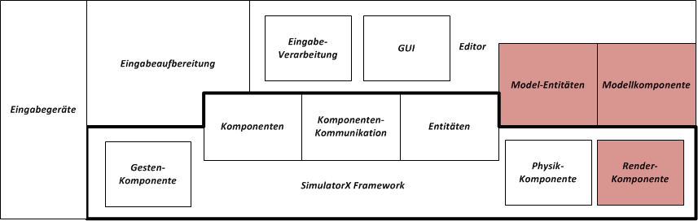

**************************************
Einordnung in das Gesamtprojekt I>PM3D
**************************************

Diese Arbeit und die dazugehörige Implementierung sind im Rahmen des I>PM3D-Projekts entstanden. Das Ziel des Projektes ist es, einen Prototypen eines grafischen 3D-Prozessmodellierungswerkzeugs zu erstellen, der prinzipielle Vor-und Nachteile von 3D-Editoren zeigen und als Grundlage für weitere Arbeiten in dieser Richtung dienen soll. 

Die Übersichtsgrafik :num:`Abbildung #ipm3d-konzeptionelle-uebersicht` zeigt den grundsätzlichen Aufbau des Projektes. Die Bestandteile, mit denen sich die vorliegende Arbeit befasst sind darin rot hervorgehoben.
Im Rahmen des Projekts sind ebenfalls die Bachelorarbeiten von Sebastian Buchholz :cite:`buchi` und Uli Holtmann :cite:`uli` entstanden, die die übrigen Bestandteile von I>PM3D beschreiben. 

.. _ipm3d-konzeptionelle-uebersicht:

   Übersicht über die Bestandteile von I>PM3D

Im Folgenden sollen die einzelnen Projektteile kurz vorgestellt und miteinander in Beziehung gesetzt werden.

Übersicht über die Projektbestandteile
======================================

.. _ipm3d-visualisierung:

Visualisierung
--------------

Eine zentrale Fragestellung bei der Realisierung eines grafischen Prozessmodellierungswerkzeugs ist, auf welche Weise Prozessmodelle visualisiert werden sollen.

Elemente aus dem Prozessmodell sollen in einer für den Benutzer leicht verständlichen Art und Weise angezeigt werden, die die Möglichkeiten des dreidimensionalen Raums nutzt. Die Darstellung soll dabei an die aus 2D-Prozessmodellierungswerkzeugen bekannten grafischen Notationen angelehnt sein. 

Prozessmodelle in I>PM3D werden in einer graphbasierten Form, also durch Knoten und damit verbundenen Kanten dargestellt. Zusätzlich zu den eigentlichen Prozessmodellelementen gibt es die Möglichkeit, beliebige 3D-Objekte anzuzeigen. Dies kann beispielsweise dafür genutzt werden, um abstrakte Konzepte mit Abbildern von realen Objekten zu illustrieren.

Welche Prozessmodellelemente verwendet werden dürfen und wie diese visualisiert werden wird durch 

Wie in der Computergrafik üblich wird das Prinzip einer virtuellen Kamera benutzt, durch die der Benutzer die Szene beobachtet, oft "Egoperspektive" genannt. 
Durch Verschieben und Rotieren der Kamera kann sich der Benutzer in der virtuellen Umgebung "bewegen" und die dargestellten Prozessdiagramme aus verschiedenen Perspektiven betrachten. 

Knoten und Szenenobjekte sind frei drehbar um alle drei Achsen, unter Beibehaltung der Seitenverhältnisse skalierbar und können prinzipiell frei in der 3D-Szene platziert werden.

Wie Prozessdiagramme in I>PM3D visualisiert werden wird in Kapitel :ref:`visualisierung` näher vorgestellt.

Modellanbindung
---------------

Ein Modellierungswerkzeug muss die Möglichkeit haben, bestehende Modelle in einer physischen Repräsentation zu laden, das Modell beziehungsweise dessen Elemente zu bearbeiten und wieder zu speichern. Außerdem sollen neue Modelle erstellt werden können. 

Das Konzept für die Einbindung dieser Modell-Funktionen in den Prototypen und die Implementierung zu erstellen ist ebenfalls Gegenstand dieser Arbeit und wird in den Kapiteln :ref:`modellanbindung` behandelt. 
In der Übersichtsgrafik :num:`Abbildung #ipm3d-konzeptionelle-uebersicht` wird dieser Abschnitt als "Modellanbindung" bezeichnet.

.. _ipm3d-gui:

GUI
---

Dem Benutzer wird das 3D-Prozessdiagramm in einer interaktiven Umgebung präsentiert, die das Erstellen, Bearbeiten und Löschen von Elementen erlaubt.

Die verschiedenen Funktionen des Prozessmodellierungswerkzeugs wie das Erstellen von Modellelementen und das Laden von Modellen lassen sich durch grafische Menüs aktivieren, die über der 3D-Szene gezeichnet werden und die an das Bedienkonzept verbreiteter 2D-Anwendungen mit grafischer Oberfläche angelehnt sind. 

Für das Erstellen von neuen Knoten und Szenenobjekten wird ein Menü, im Folgenden auch als "Palette" bezeichnet, bereitgestellt, über welches die zur Verfügung stehenden Objekte durch einen Klick auf eine Schaltfläche erzeugt werden können.

Attribute der Modellelemente, die entweder die Visualisierung selbst oder das damit verbundene Element des Prozessmodells betreffen werden können einem in einem Menü angezeigt und bearbeitet werden.

Die Menüs werden in der Übersichtsgrafik :num:`Abbildung #ipm3d-konzeptionelle-uebersicht` als GUI zusammengefasst.

Eingabeaufbereitung und Editor
------------------------------

Eine wichtige Anforderung an den Prototypen ist, dass verschiedene Arten von Eingabegeräten unterstützt, neue Geräte einfach angebunden und – soweit sinnvoll – nebeneinander benutzt werden können. 
Die von den Eingabegeräten gelieferten Daten unterscheiden sich je nach Art des Geräts und der verwendeten Schnittstelle deutlich voneinander.

Daher ist es sinnvoll, von den Eingabegeräten und deren Schnittstellen zu abstrahieren. Dies wird erreicht, indem die Eingabedaten aller Geräte von einer Eingabeschicht aufbereitet und an eine vereinheitlichte Schnittstelle zur Bedienung der Anwendung weitergeleitet werden. Diese Schnittstelle zur Eingabeverarbeitung wird, zusammen mit dem GUI, in der Übersichtsgrafik :num:`Abbildung #ipm3d-konzeptionelle-uebersicht` als *Editor* bezeichnet.

Mit der Realisierung des *Editors* sowie mit der Aufbereitung der Daten, die von Tastatur und Maus geliefert werden befasst sich :cite:`uli`.

Neuartige Eingabegeräte
-----------------------

Neben den für Arbeitsplatzrechner üblichen Eingabegeräten Tastatur und Maus, soll der Editor auch mittels "neuartiger" Eingabegeräte bedienbar sein, die sich besonders für die Interaktion mit virtuellen 3D-Umgebungen eignen könnten.
Dabei sind besonders solche Geräte interessant, die auch an einem handelsüblichen, aktuellen Desktop-PC angeschlossen werden können und relativ "preiswert" sind. 

Die Bereitstellung von neuartigen Eingabegeräten und die Aufbereitung der Eingabedaten werden von der Arbeit :cite:`buchi` abgedeckt, welche sich speziell mit der Anbindung der Microsoft Kinect und der Nintendo WiiMote befasst. Neben der direkten Nutzung dieser Geräte als "Mausersatz" [#f1]_ werden auch mit den Geräten ausgeführte Gesten und ein spezielles Kinect-Menü als Eingabemethode untersucht und für das Projekt nutzbar gemacht.

Diese Beiträge sind in der Übersichtsgrafik :num:`Abbildung #ipm3d-konzeptionelle-uebersicht` unter "Eingabegeräte" und "Eingabeaufbereitung" zu finden. 

I>PM3D als Simulator X - Applikation
====================================

I>PM3D ist als Anwendung auf Basis von :ref:`simulatorx` konzipiert. 

:num:`Abbildung #ipm3d-simulatorx` zeigt, wie die Architektur des Projekts auf den von Simulator X bereitgestellten Funktionalitäten aufbaut. 
In den beiden folgenden Abschnitten wird zusammengefasst, welche Änderungen am Simulator-X-Basissystem vorgenommen worden sind und wie die im letzten Abschnitt dargestellten Projektteile im Kontext von *Simulator X* umgesetzt werden.

.. _ipm3d-simulatorx:

   Architektur von I>PM3D, aufbauend auf Simulator X

Modifikationen an Simulator X
-----------------------------

Für I>PM3D wurde die von :ref:`Simulator X` bereitgestellte Physik-Komponente für spezielle Aufgaben erweitert. Die Physikengine wird für die Selektion von Modellobjekten, für die Realisierung von "Gravitationsebenen", und die Erkennung von Kollisionen zwischen Modellobjekten eingesetzt. Den Einsatz Physikkomponente und die projektspezifischen Modifikationen beschreibt :cite:`buchi`.

Die ebenfalls mitgelieferte Renderkomponente, die für die grafische Ausgabe auf Basis von OpenGL zuständig ist, war für das Projekt allerdings nicht sinnvoll nutzbar und wurde durch eine Anbindung an eine im Rahmen dieser Arbeit entwickelte :ref:`render-bibliothek` ersetzt. Dies war durch den modularen Aufbau von *Simulator X* problemlos umsetzbar. Die Anbindung wird unter :ref:`renderkomponente` beschrieben.

Modell-Komponente und Modell-Entities
-------------------------------------

Die im vorherigen Abschnitt als *Modellanbindung* bezeichneten Funktionalitäten werden im Simulator X - Kontext durch die *Modellkomponente* realisiert, die dem Editor eine Schnittstelle zur Verfügung stellt über welche die genannten Aktionen ausgelöst werden können.
Die Modellelemente selbst zu bearbeiten, also deren Visualisierungs und Prozessmodellattribute sowie die Position, Größe und Orientierung im Raum zu ändern wird durch die von der Modell-Komponente bereitgestellten *Modell-Entitäten* ermöglicht. Die ist ausschließlich dem Editor vorbehalten.
Dem Simulator X - Konzept folgend beschreiben diese Entities außerdem, wie die dazugehörigen Objekte von der Physikkomponente behandelt und wie sie von der Renderkomponente angezeigt werden.

Näheres zur Modellkomponente und den Modell-Entitäten in :ref:`modellanbindung` dargestellt.

.. [#f1] Dies bedeutet in diesem Zusammenhang, dass die Geräte einen Cursor ("Mauszeiger") steuern, der die aktuelle Position in einer zweidimensionalen Ebene anzeigt. Bei einem "Klick" wird eine Aktion auf dem darunter befindlichen Objekt ausgelöst.
