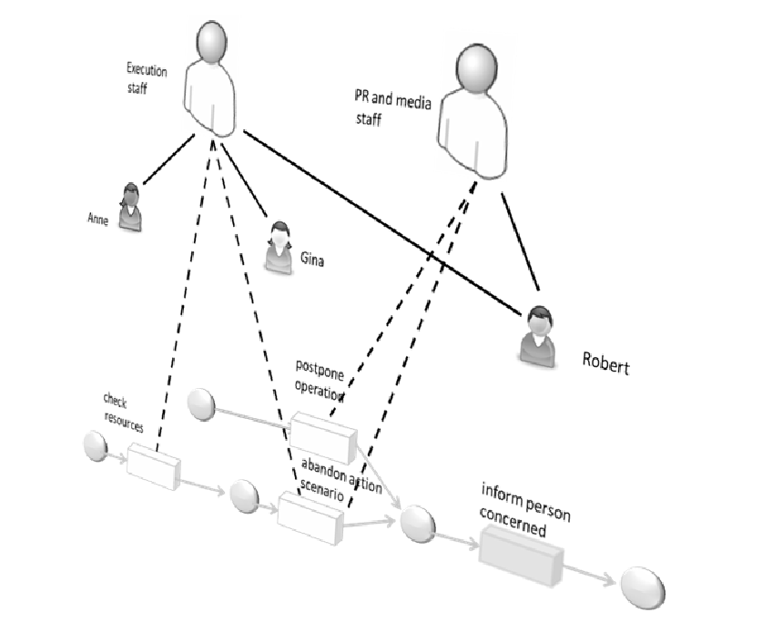

************
Related Work
************

Neben den (relativ wenigen) Arbeiten, die sich explizit mit der dreidimensionalen Modellierung und Visualisierung von Prozessen beschäftigen sollen hier auch solche Arbeiten vorgestellt werden, die sich allgemein mit 3D-Visualisierung oder verwandten Gebieten beschäftigen und für die Realisierung der Aufgabenstellung hilfreich sein könnten. Dies umfasst beispielsweise folgende Themengebiete:

* Visualisierung von Graphen in 3D
* Graph-Layouting
* 3D-Softwarevisualisierung
* 3D-Diagramm-Editoren

Allgemein stellt sich die Frage, inwieweit 3D-Visualisierungen Vorteile bieten können und welche Probleme dabei auftreten.

3D-Softwarevisualisierung
=========================

Nahe verwandt mit der Prozessmodellierung ist die Modellierung von Software. 

Die Softwarevisualisierung steht vor der Aufgabe, komplexe und abstrakte Systeme, Abläufe und Zusammenhänge zwischen Komponenten in einer für den Benutzer hilfreichen Weise darzustellen. 
Nicht selten sind Softwaresysteme überaus umfangreich und es muss daher nach Möglichkeiten gesucht werden, eine Vielzahl von Informationen übersichtlich und klar zu visualisieren ohne den Betrachter zu überfordern. 

Bisher nutzen verbreitete Werkzeuge zur Softwaremodellierung, die häufig auf der Unified Modeling Language (UML) aufsetzen nahezu ausschließlich 2D-Visualisierungen. 
Die UML lässt prinzipiell aber auch 3D-Repräsentationen zu :cite:`Booch:1999:UML:291167`

Es lässt sich eine Reihe von Arbeiten finden, die sich mit 3D-Visualisierungstechniken beschäftigen und deren Vorteile gegenüber 2D-Techniken sowie Probleme bei der Realisierung betrachten.

Einen umfassenden Überblick über derartige Arbeiten gibt :cite:`teyseyre_overview_2009`. 

:cite:`dwyer_three_2001` weist auf die Probleme von Softwarevisualisierungstechniken hin, große und insbesondere hierarchisch aufgebaute Diagramme darzustellen. 
3D-Darstellungen hätten hier Vorteile durch die Möglichkeit, Hierarchieebenen des Diagramms als Flächen im 3D-Raum zu zeigen. 

Die Platzierung von UML-Elementen per Hand sei eine zeitraubende Aufgabe, die besonders im dreidimensionalen Raum wegen der schlechten Verfügbarkeit von 3D-Eingabegeräten zum Problem wird. 
Daher wird eine Anordnung der Diagrammelemente im 3D-Raum mit Hilfe eines automatischen, kräftebasierten Layout-Algorithmus vorgeschlagen.

Es wurde ein Prototyp\ [#f1]_ realisiert, der Graphen im dreidimensionalen Raum visualisieren kann und Interaktionsmöglichkeiten wie den Wechsel der Betrachtungsperspektive bietet. 

Gezeigt werden Beispiele für 3D-Klassendiagramme basierend auf der UML.
So werden Klassen durch 3D-Würfel dargestellt, deren Seiten mit Hilfe von Texturen beschriftet werden können. Um die Lesbarkeit sicherzustellen wird immer eine Seite des Würfels auf den Betrachter ausgerichtet.
Zur Darstellung von Paketen werden transluzente Kugeln benutzt, die die enthaltenen Klassen einschließen.
Verbindungen zwischen Klassen werden durch gestreckte 3D-Zylinder ("Röhren") dargestellt.

Ein solches Diagramm ist in :num:`Abbildung #dywer-classdiag` zu sehen.

.. _dywer_classdiag:

.. figure:: _static/ext_pics/dywer_classdiag.png
    :height: 12cm

    3D-UML-Klassendiagramm aus :cite:`dwyer_three_2001`

In einer Studie zur Benutzbarkeit seien die 3D-Diagramme von Beteiligten als nützlich für das Verständnis des Modells eingestuft worden und konkrete Fragen zu verschiedenen Modellen seien von den Probanden sehr gut beantwortet worden. 
Es wird ein Benutzer zitiert, der die Möglichkeit, das Diagramm aus verschiedenen Richtungen betrachten zu können besonders positiv kommentiert.

Auch seien Benutzer gebeten worden, selbst ein 3D-Diagramm nach einer textuellen Vorlage zu modellieren. Dabei sei aufgefallen, dass die meisten Benutzer wenig Probleme mit der Aufgabe hatten. Es wird jedoch vermutet, dass die 3D-Darstellung bei einigen Benutzern eine gewisse Eingewöhnungszeit voraussetzen könnte.
Probanden mit vorheriger Erfahrung aus 3D-Computerspielen hätten im Versuch die wenigsten Schwierigkeiten mit der Navigation im 3D-Raum gehabt. 

In :cite:`mcintosh_x3d-uml:_2008` werden Zustandsdiagramme (state machine diagrams) der UML in den 3D-Raum übertragen.

Zu Beginn seien Zustandsdiagramme von 4 Unternehmen untersucht worden, die mit dem Modellierungswerkzeug IBM Rational Rose RealTime erstellt wurden. Daraus habe sich ergeben, dass die Modelle oft hierarchisch aus Unterzuständen aufgebaut seien. 
In RationalRose würden diese Unterdiagramme jedoch in separaten Tabs dargestellt, was dazu führt, dass Benutzer ständig zwischen einzelnen Diagrammen hin- und herwechseln müssten.

Das erschwere das Erkennen von Zusammenhängen und groben Strukturen. Diese Einschränkungen der 2D-Ansicht würde von Benutzern auf verschiedenem Wege "umgangen", etwa indem separate Handskizzen angefertigt würden oder Benutzer "in die Luft starren" würden, um sich die Zusammenhänge und Auswirkungen von Änderungen besser vorstellen zu können.

Daher sei es die wichtigste Anforderung an eine 3D-Repräsentation, hier Abhilfe zu schaffen und hierarchische Zustandsdiagramme besser abzubilden.

Es wird eine Darstellung vorgeschlagen, welche die Zustandsdiagramme selbst immer noch zweidimensional zeichnet, diese jedoch auf ebenen Flächen im 3D-Raum platziert. So würden sich Beziehungen zwischen mehreren Diagrammen gut grafisch darstellen lassen. 
Wie sich in :num:`Abbildung #mcintosh-sm` erkennen lässt, werden Beziehungen zwischen Super- und Subzuständen durch transluzente, graues Dreiecke dargestellt.

Solche Diagramme seien Benutzern mit Erfahrung in Rational Rose vorgelegt worden. Alle hätten sich insgesamt positiv zur Nützlichkeit von 3D-Diagrammen geäußert. Von den Benutzern seien verschiedene Erweiterungen vorgeschlagen worden, unter Anderem eine Filtermöglichkeit, mit der sich uninteressante Details verbergen lassen, Einschränkungen der Navigation um ungünstige Perspektiven auf das Modell zu vermeiden sowie Funktionen, um schnell zwischen verschiedenen Ansichten wechseln zu können. 

.. _mcintosh-sm:

.. figure:: _static/ext_pics/mcintosh_sm.png

    Hierarchisch aufgebautes 3D-UML-Zustandsdiagramm aus :cite:`mcintosh_x3d-uml:_2008`

3D-Visualisierungen von (großen) UML-Zustandsdiagrammen werden auch von :cite:`krolovitsch_3d_2009` und, darauf aufbauend, :cite:`alvergren_3d_2009` untersucht. Zustandsdiagramme werden, wie in :cite:`mcintosh_x3d-uml:_2008` auf Flächen im 3D-Raum gezeichnet, wobei hier die Zustände selbst als 3D-Objekte dargestellt werden, um den visuellen Eindruck zu verbessern, wie in :num:`Abbildung #krolovitsch-sm` zu sehen ist. 

In :num:`Abbildung #krolovitsch-sm-nodes` ist zu sehen, wie in komplexen Diagrammen komplette Diagrammteile ausgeblendet und durch einen blauen Würfel ersetzt werden können, um momentan unwichtige Details zu verbergen und die Übersichtlichkeit zu erhöhen. 

.. _krolovitsch-sm:

.. figure:: _static/ext_pics/krolovitsch_sm.png
    :width: 16cm

    3D-Zustandsdiagramm aus :cite:`krolovitsch_3d_2009`

.. _krolovitsch-sm-nodes:

.. figure:: _static/ext_pics/krolovitsch_sm_nodes.png
    :width: 16cm

    Zustandsdiagramm mit ausgeblendeten Diagrammteilen (dargestellt durch blaue Würfel) aus :cite:`krolovitsch_3d_2009`

:cite:`gil_three_1998` merkt an, dass durch 3D-Visualisierungen die Ausdruckstärke von (graphbasierten) grafischen Notationen deutlich erhöht werden könne. Besonders vorteilhaft seien 3D-Visualisierungen von Graphen, wenn es darum ginge, eine Vielzahl von unterschiedlichen Beziehungs- bzw. Verbindungstypen darzustellen. 
Im 2D-Bereich habe man nur relativ eingeschränkte Möglichkeiten, unterschiedliche Verbindungstypen durch Farbe, unterschiedliche Linentypen oder durch Konnektoren, also Symbole an den Enden der Linien, voneinander abzugrenzen. Um diese Probleme im 2D-Raum zu umgehen würden oft unterschiedliche Graphen bzw. Diagrammtypen genutzt. Dabei besitzen Knoten in unterschiedlichen Diagrammtypen oft die gleiche Bedeutung während Verbindungen eine komplett andere Semantik besäßen. 
Problematisch sei die Repräsentation von Zusammenhängen zwischen unterschiedlichen Diagrammtypen, was allgemein einen großen Schwachpunkt von Modellierungssprachen darstelle.

Hierfür lasse sich die dritte Dimension, also die z-Richtung sinnvoll nutzen. Verbindungen in der x-y-Ebene hätten eine andere Bedeutung als die, die aus der Ebene heraus in z-Richtung verlaufen. So würden sich mehrere Diagrammtypen in eine Darstellung integrieren lassen.

Die 3. Dimension ließe sich auch als Zeitachse interpretieren. So sei es möglich, in 3D-Sequenzdiagrammen (:num:`Abbildung #gil-sequencediag`) die Zustände des Systems zu bestimmten Zeitpunkten auf parallelen Flächen darzustellen, zu denen die Zeitachse senkrecht steht.

.. _gil-sequencediag:

    3D-UML-Sequenzdiagramm; Ausschnitt aus :cite:`gil_three_1998`

In :cite:`gogolla_towards_1999` wird ebenfalls die 3D-Darstellung von UML-Diagrammen, speziell Klassen-, Objekt- und Sequenzdiagrammen behandelt. 3D-Visualisierungen könnten die Verständlichkeit von komplexen UML-Diagrammen erhöhen. Graphen, die in zwei Dimensionen nicht mehr kreuzungsfrei zeichnen ließen, könnten in 3D ohne solche Überschneidungen dargestellt werden. Die dritte Dimension könnte beispielsweise dafür genutzt werden, als "uninteressant" eingestufte Elemente in den Hintergrund zu schieben und damit Elemente im Vordergrund besonders hervorzuheben.

In Abbildung :num:`Abbildung #gogolla-classdiag-a` :num:`Abbildung #gogolla-classdiag-b` wird das Prinzip am Beispiel eines Klassendiagramms verdeutlicht.
Außerdem ist in :num:`Abbildung #gogolla-classdiag-b` zu sehen, dass bei Klassen, die nah am Betrachter sind, mehr Information dargestellt wird als bei den hinteren Klassen, bei denen nur der Name als Text zu erkennen ist.

Zusätzlich wird die Nutzung von Animationen vorgeschlagen, um Übergänge zwischen verschiedenen Visualisierungsperspektiven, wie zwischen :num:`Abbildung #gogolla-classdiag-a` und :num:`Abbildung #gogolla-classdiag-b`, anschaulicher zu machen.

.. _gogolla-classdiag-a:

.. figure:: _static/ext_pics/gogolla_classdiag_a.png
    :height: 12cm

    3D-UML-Klassendiagramm aus :cite:`gogolla_towards_1999`

.. _gogolla-classdiag-b:

.. figure:: _static/ext_pics/gogolla_classdiag_b.png
    :height: 12cm

    Diagramm mit nach hinten verschobenen Klassen aus :cite:`gogolla_towards_1999`

Außerdem wurden auch schon 3D-Programmiersprachen vorgeschlagen, unter Anderem von : :cite:`Shu:1988:VP:59606` und :cite:`Freeman:1995:SSV:832276.834313`.

Graphical Editing Framework 3D
==============================

GEF3D :cite:`von_pilgrim_gef3d:_2008`. Das Projekt basiert auf den Konzepten von GEF, dem Grafical Editing Framework der Eclipse Plattform und uberträgt diese in den dreidimensionalen Raum.

Zur Implementierung ist zu sagen, dass das Projekt in den letzten beiden Jahren relativ wenig Änderungen und Verbesserungen erfahren hat und das Rendering noch auf "altem" OpenGL basiert und damit die Möglichkeiten moderner Grafikhardware eher unzureichend nutzt.

Conceptual Modelling in 3D Virtual Worlds for Process Communication
===================================================================

In dieser Arbeit wird ein Prototyp eines 3D BPMN-Editors vorgestellt, der in der virtuellen Welt von Second Life implementiert wurde. Besonderen Wert wurde auf die Zusammenarbeit zwischen mehreren Modellierern und die Prozesskommunikation, auch unter Beteiligung von Personen, die keine Modellierungsexperten sind, gelegt. 
"Naive stakeholders" hätten oft Probleme, die abstrakte Welt der konzeptuellen Modellierung zu verstehen, weil der Bezug zu realen Gegenständen fehle. Durch Zuhilfennahme einer virtuellen Welt, in der abstrakte Prozessmodelle eingebettet sind solle dies abgemildert werden. 

In dieser Umgebung können Abbilder von realen Entitäten, die mit dem Prozess in Beziehung stehen und / oder mit diesem interagieren - beispielsweise verwendete Betriebsmittel oder ausführende Personen - dargestellt werden. Dies könne auch dazu dienen, den Ort und die räumliche Anordnung von Prozessschritten, beispielsweise durch ein Einbettung in einem virtuellen Gebäude, zu visualisieren. Möglich sei auch eine Simulation der Prozessausführung in der virtuellen Welt.
(siehe folgendes Beispiel).

Dadurch solle es den Beteiligten leichter möglich sein, festzustellen, ob das Modell die Realität richtig abbildet und ob eventuell Probleme bei der Umsetzung des Prozesses in der Realität auftreten könnten.

Prozesse werden mit Hilfe eines 3D-Graphen dargestellt. Als Knoten werden in den 3D-Raum übertragene BPMN-Modellelemente genutzt während Kanten durch einfache Linien (mit Pfeilspitzen auf der Zielseite bei gerichtete Kanten) dargestellt werden. Auf den Knoten können wie in der BPMN üblich Informationen durch Texte oder statische Grafiken vermittelt werden. 

Die Objekte selbst sind 3D-Körper, jedoch scheinen die Informationen nur auf einer Seite dargestellt zu sein. Damit ergeben sich Probleme bei Rotationen der Modellelemente und Bewegungen um den Prozessgraphen herum. Je nach Perspektive ist es möglich, dass die Texte bzw. die Symbole nicht mehr sichtbar sind.

Auf den Objekten sind rote Kugeln als Anker für Verbindungen zu anderen Modellobjekten angeordnet.

Die Benutzer selbst werden als Avatar [wassn das?] gezeigt, welche die Interaktion des Benutzers mit dem Modell für andere Teilnehmer verdeutlichen.

Es gibt es die Möglichkeit, "Kommentarwände" einzurichten, auf denen beliebige Texte zur Kommunikation zwischen den Beteiligten dargestellt werden können. Daneben können auch andere Multimediainhalte wie Videos, Tonaufnahmen oder Statistiken zur Prozessausführung (über Web-Services) eingebettet werden.

Hier sind Screenshots aus einem Video zu sehen, das mit Hilfe des beschriebenen Systems erstellt wurde. Es zeigt einen Prozess an einem Flughafen. 

Im Bereich des Process- / Event-Mining anzusiedeln ist die Arbeit :cite:`suntinger_event_2008`, "The Event Tunnel". Hier wird eine 3D-Ansicht dafür genutzt, Ereignisse bei der Ausführung von Prozessen in hilfreicher Weise zu visualisieren. Die Ereignisse sind hierbei innerhalb eines 3D-"Tunnels" angeordnet, entlang dessen Achse die Zeitachse verläuft. So lassen sich Ereignisse leicht zeitlich einordnen und Zusammenhänge werden erkennbar.

3D Representation of Business Process Models
============================================

Von :cite:`betz_3d_2008` wird die Visualisierung von Prozessen mit Hilfe von dreidimensional dargestellten Petrinetzen vorgestellt. Es werden verschiedene Szenarien gezeigt, in denen 3D-Visualisierungen gewinnbringend genutzt werden könnten.

Es wird das Problem angesprochen, dass für die Modellierung von Prozessen oft verschiedene Diagrammtypen nötig seien, zwischen denen in üblichen 2D-Werkzeugen zeitraubend gewechselt werden müsse. Mehrere Diagrammtypen in eine 3D-Ansicht zu integrieren könne hier Abhilfe schaffen. 

Als Beispiel (:num:`Abbildung #betz-org-process`) wird eine Kombination eines Organisationsmodells mit einem Prozessmodell gezeigt. 
Neben den Beziehungen zwischen Aktivitäten im Prozessmodell und den Rollen des Organisationsmodells sei es gleichzeitig möglich, Beziehungen im Organisationsmodell, wie die Generalisierung von Rollen oder die Zuordnung von Ressourcen zu Rollen zu visualisieren.

Mit dieser Darstellung sei es auch einfach zu erkennen, an welchen Stellen und wie oft bestimmte Rollen an Prozessaktivitäten beteiligt seien.

.. _betz-org-process:

   Darstellung von Beziehungen zwischen Prozess- und Organisationsmodell aus :cite:`betz_3d_2008` 

Als dritte Anwendung wird, Gemeinsamkeiten und Unterschiede zwischen verschiedenen Prozessversionen oder -varianten aufzuzeigen. Die Darstellung als 3D-Graph hilft hierbei, da die Prozesse gut nebeneinander im Raum platziert und Verbindungen zwischen gleichen Modellelementen der gegenüberliegenden Modelle angezeigt werden könnten.

.. _betz-vergleich-pm:

   Visualisierung von Ähnlichkeiten zwischen Prozessmodellen aus :cite:`betz_3d_2008` 

Außerdem könnten Verfeinerungen und Aggregierungen von Prozessteilen gut im dreidimensionalen Raum dargestellt werden, da man neben dem verfeinerndem Diagramm die grobgranulare Prozessansicht zeigen kann, wie in :num:`Abbildung #betz-prozess-verfeinerung` zu sehen ist.

.. _betz-prozess-verfeinerung:

.. figure:: _static/ext_pics/betz_prozess_verfeinerung.png

   Darstellung von Prozessmodell-Verfeinerungen aus :cite:`betz_3d_2008` 

Das Konzept wurde in einem Prototypen implementiert.

.. [#f1] Quellcode und ausführbare Dateien des (weiterentwickelten) Prototyps "WilmaScope" können unter http://wilma.sourceforge.net/ heruntergeladen werden

