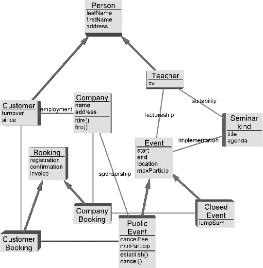
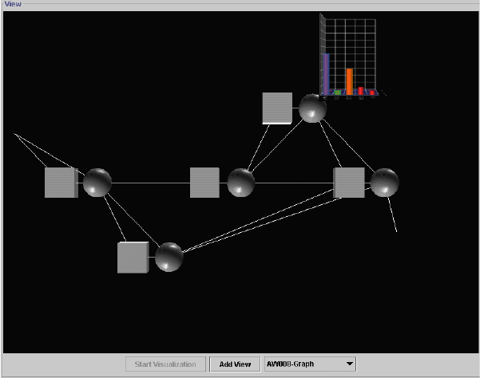

****************************************
Verwandte Arbeiten zur 3D-Visualisierung
****************************************

Neben den (wenigen) Arbeiten, die sich explizit mit der dreidimensionalen Visualisierung und Modellierung von Prozessen beschäftigen sollen hier auch solche vorgestellt werden, die sich allgemein mit 3D-Visualisierung oder verwandten Gebieten wie der Softwaremodellierung beschäftigen. 

Die hier gezeigten Arbeiten sollen als Anregung oder Motivation für die in dieser Arbeit dargestellte 3D-Visualisierung von Prozessen dienen.
Außerdem sollen Ideen für zukünftige Erweiterungen des vorliegenden Projekts gesammelt und prinzipielle Vor- und Nachteile von 3D-Visualisierungen beleuchtet werden.

3D-Softwarevisualisierung
=========================

Nahe verwandt mit der Prozessmodellierung ist die Modellierung von Software. 

Die Softwarevisualisierung steht vor der Aufgabe, komplexe und abstrakte Systeme, Abläufe und Zusammenhänge zwischen Komponenten in einer für den Benutzer hilfreichen Weise darzustellen. 
Nicht selten sind Softwaresysteme überaus umfangreich und es muss daher nach Möglichkeiten gesucht werden, eine Vielzahl von Informationen übersichtlich und klar zu visualisieren ohne den Betrachter zu überfordern. 

Bisher nutzen verbreitete Werkzeuge zur Softwaremodellierung, die häufig auf der Unified Modeling Language (UML) aufsetzen nahezu ausschließlich 2D-Visualisierungen. 
Die UML lässt prinzipiell aber auch 3D-Repräsentationen zu :cite:`booch_unified_1999`

Es lässt sich eine Reihe von Arbeiten finden, die sich mit 3D-Visualisierungstechniken beschäftigen und deren Vorteile gegenüber 2D-Techniken sowie Probleme bei der Realisierung betrachten.

Einen umfassenden Überblick über derartige Arbeiten gibt :cite:`teyseyre_overview_2009`. 

.. _dywer:

Three dimensional UML using force directed layout
-------------------------------------------------

:cite:`dwyer_three_2001` weist auf die Probleme von Softwarevisualisierungstechniken hin, große und insbesondere hierarchisch aufgebaute Diagramme darzustellen. 
3D-Darstellungen hätten hier Vorteile durch die Möglichkeit, Hierarchieebenen des Diagramms als Flächen im 3D-Raum zu zeigen. 

Die Platzierung von UML-Elementen per Hand sei eine zeitraubende Aufgabe, die besonders im dreidimensionalen Raum wegen der schlechten Verfügbarkeit von 3D-Eingabegeräten zum Problem wird. 
Daher wird eine Anordnung der Diagrammelemente im 3D-Raum mit Hilfe eines automatischen, kräftebasierten Layout-Algorithmus vorgeschlagen.

Es wurde ein Prototyp\ [#f1]_ realisiert, der Graphen im dreidimensionalen Raum visualisieren kann und Interaktionsmöglichkeiten wie den Wechsel der Betrachtungsperspektive bietet. 

Gezeigt werden Beispiele für 3D-Klassendiagramme basierend auf der UML.
So werden Klassen durch 3D-Würfel dargestellt, deren Seiten mit Hilfe von Texturen beschriftet werden können. Um die Lesbarkeit sicherzustellen wird immer eine Seite des Würfels auf den Betrachter ausgerichtet.
Zur Darstellung von Paketen werden transluzente Kugeln benutzt, die die enthaltenen Klassen einschließen.
Verbindungen zwischen Klassen werden durch gestreckte 3D-Zylinder ("Röhren") dargestellt.

Ein solches Diagramm ist in :num:`Abbildung #dywer-classdiag` zu sehen.

.. _dywer-classdiag:

.. figure:: _static/ext_pics/dywer_classdiag.png
    :height: 13cm

    3D-UML-Klassendiagramm aus :cite:`dwyer_three_2001`

In einer Studie zur Benutzbarkeit seien die 3D-Diagramme von Beteiligten als nützlich für das Verständnis des Modells eingestuft worden.
Konkrete Fragen zu verschiedenen Modellen seien von den Probanden sehr gut beantwortet worden. 
Es wird ein Benutzer zitiert, der die Möglichkeit, das Diagramm aus verschiedenen Richtungen betrachten zu können besonders positiv kommentiert.

Auch seien Benutzer gebeten worden, selbst ein 3D-Diagramm nach einer textuellen Vorlage zu modellieren. Dabei sei aufgefallen, dass die meisten Benutzer wenig Probleme mit der Aufgabe hatten. Es wird jedoch vermutet, dass die 3D-Darstellung bei einigen Benutzern eine gewisse Eingewöhnungszeit voraussetzen könnte.
Probanden mit vorheriger Erfahrung aus 3D-Computerspielen hätten im Versuch die wenigsten Schwierigkeiten mit der Navigation im 3D-Raum gehabt. 

.. _mcintosh:

X3D-UML: 3D UML State Machine Diagrams
--------------------------------------

In :cite:`mcintosh_x3d-uml:_2008` werden Zustandsdiagramme (state machine diagrams) der UML in den 3D-Raum übertragen.

Zu Beginn seien von vier Unternehmen erhaltene Zustandsdiagramme untersucht worden, die mit dem Modellierungswerkzeug IBM Rational Rose RealTime erstellt wurden. Daraus habe sich ergeben, dass die Modelle oft hierarchisch aus Unterzuständen aufgebaut seien. 
In RationalRose würden diese Unterdiagramme jedoch in separaten Tabs dargestellt, was dazu führt, dass Benutzer ständig zwischen einzelnen Diagrammen hin- und herwechseln müssten.

Das erschwere das Erkennen von Zusammenhängen und groben Strukturen. Diese Einschränkungen der 2D-Ansicht würde von Benutzern auf verschiedenem Wege "umgangen", etwa indem separate Handskizzen angefertigt würden oder Benutzer "in die Luft starren" würden, um sich die Zusammenhänge und Auswirkungen von Änderungen besser vorstellen zu können.

Daher sei es die wichtigste Anforderung an eine 3D-Repräsentation, hier Abhilfe zu schaffen und hierarchische Zustandsdiagramme besser abzubilden.

Es wird eine Darstellung vorgeschlagen, welche die Zustandsdiagramme selbst immer noch zweidimensional zeichnet, diese jedoch auf ebenen Flächen im 3D-Raum platziert. So würden sich Beziehungen zwischen mehreren Diagrammen gut grafisch darstellen lassen. 
Wie sich in :num:`Abbildung #mcintosh-sm` erkennen lässt, werden Beziehungen zwischen Super- und Subzuständen durch transluzente, graues Dreiecke dargestellt.

Solche Diagramme seien Benutzern mit Erfahrung in Rational Rose vorgelegt worden. Alle hätten sich insgesamt positiv zur Nützlichkeit von 3D-Diagrammen geäußert. Von den Benutzern seien verschiedene Erweiterungen vorgeschlagen worden, unter Anderem eine Filtermöglichkeit, mit der sich uninteressante Details verbergen lassen, Einschränkungen der Navigation um ungünstige Perspektiven auf das Modell zu vermeiden sowie Funktionen, um schnell zwischen verschiedenen Ansichten wechseln zu können. 

.. _mcintosh-sm:

.. figure:: _static/ext_pics/mcintosh_sm.png

    Hierarchisch aufgebautes 3D-UML-Zustandsdiagramm aus :cite:`mcintosh_x3d-uml:_2008`

.. _krolovitsch:

3D Visualization for Model Comprehension
----------------------------------------

3D-Visualisierungen von (großen) UML-Zustandsdiagrammen werden auch von :cite:`krolovitsch_3d_2009` und, darauf aufbauend, :cite:`alvergren_3d_2009` untersucht. Zustandsdiagramme werden, wie in :cite:`mcintosh_x3d-uml:_2008` auf Flächen im 3D-Raum gezeichnet, wobei hier die Zustände selbst als 3D-Objekte dargestellt werden, um den visuellen Eindruck zu verbessern, wie in :num:`Abbildung #krolovitsch-sm` zu sehen ist. 

In :num:`Abbildung #krolovitsch-sm-nodes` ist zu sehen, wie in komplexen Diagrammen komplette Diagrammteile ausgeblendet und durch einen blauen Würfel ersetzt werden können, um momentan unwichtige Details zu verbergen und die Übersichtlichkeit zu erhöhen. 

.. _krolovitsch-sm:

    3D-Zustandsdiagramm aus :cite:`krolovitsch_3d_2009`

.. _krolovitsch-sm-nodes:

    Zustandsdiagramm mit ausgeblendeten Diagrammteilen (dargestellt durch blaue Würfel) aus :cite:`krolovitsch_3d_2009`

Three Dimensional Software Modelling
------------------------------------

:cite:`gil_three_1998` merkt an, dass durch 3D-Visualisierungen die Ausdrucksstärke von (graphbasierten) grafischen Notationen deutlich erhöht werden könne. Besonders vorteilhaft seien 3D-Visualisierungen von Graphen, wenn es darum ginge, eine Vielzahl von unterschiedlichen Beziehungs- bzw. Verbindungstypen darzustellen. 
Im 2D-Bereich habe man nur relativ eingeschränkte Möglichkeiten, unterschiedliche Verbindungstypen durch Farbe, unterschiedliche Linentypen oder durch Konnektoren, also Symbole an den Enden der Linien, voneinander abzugrenzen. Um diese Probleme im 2D-Raum zu umgehen würden oft unterschiedliche Graphen bzw. Diagrammtypen genutzt. Dabei besitzen Knoten in unterschiedlichen Diagrammtypen oft die gleiche Bedeutung während Verbindungen eine komplett andere Semantik besäßen. 
Problematisch sei die Repräsentation von Zusammenhängen zwischen unterschiedlichen Diagrammtypen, was allgemein einen großen Schwachpunkt von Modellierungssprachen darstelle.

Hierfür lasse sich die dritte Dimension, also die z-Richtung sinnvoll nutzen. Verbindungen in der x-y-Ebene hätten eine andere Bedeutung als die, die aus der Ebene heraus in z-Richtung verlaufen. So würden sich mehrere Diagrammtypen in eine Darstellung integrieren lassen.

Die 3. Dimension ließe sich auch als Zeitachse interpretieren. 
So sei es möglich, in 3D-Sequenzdiagrammen die Zustände des Systems zu bestimmten Zeitpunkten auf parallelen Flächen darzustellen, zu denen die Zeitachse senkrecht steht wie in :num:`Abbildung #gil-sequencediag` gezeigt wird.

.. _gil-sequencediag:

.. figure:: _static/ext_pics/gil_sequencediag.png
    :height: 8cm

    3D-UML-Sequenzdiagramm; Ausschnitt aus :cite:`gil_three_1998`

.. _gogolla:

Towards Three-dimensional Representation and Animation of UML Diagrams
----------------------------------------------------------------------

In :cite:`gogolla_towards_1999` wird ebenfalls die 3D-Darstellung von UML-Diagrammen, speziell Klassen-, Objekt- und Sequenzdiagrammen behandelt. 3D-Visualisierungen könnten die Verständlichkeit von komplexen UML-Diagrammen erhöhen. Graphen, die in zwei Dimensionen nicht mehr kreuzungsfrei zeichnen ließen, könnten in 3D ohne solche Überschneidungen dargestellt werden. Die dritte Dimension könnte beispielsweise dafür genutzt werden, als "uninteressant" eingestufte Elemente in den Hintergrund zu schieben und damit Elemente im Vordergrund besonders hervorzuheben.

In :num:`Abbildung #gogolla-classdiag-a` und :num:`Abbildung #gogolla-classdiag-b` wird das Prinzip am Beispiel eines Klassendiagramms verdeutlicht.
Bei letzerer Abbildung ist zu sehen, dass bei Klassen, die nah am Betrachter sind, mehr Information dargestellt wird als bei den hinteren Klassen, bei denen nur der Name als Text zu erkennen ist.

Zusätzlich wird die Nutzung von Animationen vorgeschlagen, um Übergänge zwischen verschiedenen Visualisierungsperspektiven – wie zwischen den beiden gezeigten Abbildungen – anschaulicher zu machen.

.. _gogolla-classdiag-a:

    3D-UML-Klassendiagramm aus :cite:`gogolla_towards_1999`

.. _gogolla-classdiag-b:

    Diagramm mit nach hinten verschobenen Klassen aus :cite:`gogolla_towards_1999`

.. _gef3d:

Graphical Editing Framework 3D
------------------------------

Bei GEF3D handelt es sich um ein Framework für die Erstellung von Modell-Editoren :cite:`von_pilgrim_gef3d:_2008`.
Das Projekt basiert auf den Konzepten des Grafical Editing Framework der Eclipse Plattform und überträgt diese in den dreidimensionalen Raum.

Mit GEF3D sei es möglich, 3D-Editoren für Eclipse zu erstellen und schon vorhandene, GEF-basierte 2D-Editoren darin einzubetten indem 2D-Elemente auf Flächen im dreidimensionalen Raum gezeichnet würden. 
:num:`gef3d-tvt3d` zeigt ein Beispiel für die Darstellung von mehreren Diagrammtypen in einer Ansicht und Verbindungen zwischen Elementen verschiedener Diagramme.

In :num:`Abbildung #gef3d-ecore` ist ein mit GEF3D implementierter Ecore-Editor zu sehen. Diese Darstellungsform mit 2D-Elementen, die im 3D-Raum platziert werden können wird als "2.5D"-Darstellung bezeichnet. Elemente könnten wie in der Abbildung zu sehen ist auf Flächen oder auch frei im 3D-Raum platziert werden :cite:`www:gef3ddevblog`.

.. _gef3d-twt3d:

    Kombination mehrerer 2D-Editoren in einer 3D-Ansicht von :cite:`www:gef3d`

.. _gef3d-ecore:

.. figure:: _static/ext_pics/gef3d-ecore-rev436.png
    :height: 11.5cm

    3D-Ecore-Editor von :cite:`www:gef3ddevblog`

Die graphische Ausgabe von GEF3D baue direkt auf OpenGL auf; um 2D-Grafiken und Text zu zeichnen werde Vektorgrafik genutzt, was zu einer besseren Darstellungsqualität im Vergleich zu texturbasiertem 2D-Rendering führe\ [#f5]_\ .

3D-Prozessvisualisierung
========================

.. _betz:

3D Representation of Business Process Models
--------------------------------------------

Von :cite:`betz_3d_2008` wird die Visualisierung von Prozessen mittels dreidimensional dargestellter Petrinetze vorgestellt. Es werden verschiedene Szenarien gezeigt, in denen 3D-Visualisierungen gewinnbringend genutzt werden könnten. 

Es wird das Problem angesprochen, dass für die Modellierung von Prozessen oft verschiedene Diagrammtypen nötig seien, zwischen denen in üblichen 2D-Werkzeugen zeitraubend gewechselt werden müsse. Mehrere Diagrammtypen in eine 3D-Ansicht zu integrieren könne hier Abhilfe schaffen. 

Als Beispiel (:num:`Abbildung #betz-org-process`) wird eine Kombination eines Organisationsmodells mit einem Prozessmodell gezeigt. 
Neben den Beziehungen zwischen Aktivitäten im Prozessmodell und den Rollen des Organisationsmodells sei es gleichzeitig möglich, Beziehungen im Organisationsmodell, wie die Generalisierung von Rollen oder die Zuordnung von Ressourcen zu Rollen zu visualisieren.

.. _betz-org-process:

.. figure:: _static/ext_pics/betz_org_process.png
    :height: 8cm

    Darstellung von Beziehungen zwischen Prozess- und Organisationsmodell aus :cite:`betz_3d_2008` 

Ein weiteres Anwendungsszenario für 3D-Visualisierungen sei es, Ähnlichkeiten zwischen verschiedenen Prozessmodellen aufzuzeigen. 

Im 3D-Raum sei es einfach möglich, die zu vergleichenden Prozesse nebeneinander auf parallelen Ebenen im Raum zu platzieren.
Verbindungen zwischen Modellelementen der gegenüber gestellten Prozessmodelle könnten dafür genutzt werden, mit verschiedenen Metriken berechnete Ähnlichkeitswerte anzuzeigen. 
Wie in :num:`Abbildung #betz-vergleich-pm` zu sehen ist werden die Werte sowohl durch die Beschriftung als auch durch die Dicke der Verbindungslinien visualisiert. 

.. _betz-vergleich-pm:

.. figure:: _static/ext_pics/betz_vergleich_pm.png
    :height: 8cm

    Visualisierung von Ähnlichkeiten zwischen Prozessmodellen aus :cite:`betz_3d_2008` 

Außerdem könnten hierarchische Prozessdiagramme gut im dreidimensionalen Raum dargestellt werden. Der Benutzer könne mehrere Verfeinerungsstufen des Modells in einer Ansicht sehen, wie in :num:`Abbildung #betz-prozess-verfeinerung` gezeigt wird. 

.. _betz-prozess-verfeinerung:

    Vier Verfeinerungsstufen eines Prozessmodells aus :cite:`betz_3d_2008` 

3D gadgets for business process visualization — a case study
------------------------------------------------------------

In :cite:`schonhage_3d_2000` wird ein Prototyp einer interaktiven 3D-Umgebung vorgestellt, der dafür genutzt werden könne, Simulationen von Prozessen zu kontrollieren und dabei anfallende Daten zu visualisieren.

Der Prozess selbst wird, wie in :num:`Abbildung #schoenhage-graph` gezeigt, als 3D-Graph dargestellt, wobei Subgraphen durch den Benutzer nach Bedarf auf- und zugeklappt werden könnten. 

Datenflüsse würden durch animierte Kugeln angezeigt, die sich entlang der Kanten von einem Aktivitätsknoten zum nächsten bewegen würden.
Der Anwender könne durch die Auswahl von Knoten und dem Drücken einer "drill-down-Schaltfläche" eine Visualisierung zugehöriger Prozessdaten öffnen – hier im Beispiel ein 3D-Histogramm – wie in :num:`Abbildung #schoenhage-drilldown` zu sehen ist.
Es sei möglich, Ansichten auf den Prozessgraphen zu speichern um später wieder schnell zu diesen zurückspringen zu können.

.. _schoenhage-graph:

    Prozessgraph mit "Datenflusskugeln" aus :cite:`schonhage_3d_2000`

.. _schoenhage-drilldown:

    Darstellung eines Prozesses mit assoziierten Daten in einem 3D-Histogramm aus :cite:`schonhage_3d_2000`

.. _ross-brown:

Conceptual Modelling in 3D Virtual Worlds for Process Communication
-------------------------------------------------------------------

In :cite:`brown_conceptual_2010` wird ein Prototyp eines BPMN-Editors vorgestellt, der Prozesse innerhalb eine virtuellen 3D-Umgebung darstellt

Besonderer Wert sei auf die Zusammenarbeit zwischen mehreren Modellierern und die Prozesskommunikation, auch unter Beteiligung von Personen, die keine Modellierungsexperten sind, gelegt worden. 
"Naive stakeholders" hätten oft Probleme, die abstrakte Welt der konzeptuellen Modellierung zu verstehen, weil der Bezug zu realen Gegenständen fehle. Unter Zuhilfennahme einer virtuellen Welt, in der abstrakte Prozessmodelle eingebettet sind solle dies abgemildert werden. 

In dieser Umgebung können Abbilder von realen Entitäten, die mit dem Prozess in Beziehung stehen oder mit diesem interagieren – beispielsweise verwendete Betriebsmittel oder ausführende Personen – dargestellt werden. Dies könne auch dazu dienen, den Ort und die räumliche Anordnung von Prozessschritten, beispielsweise durch die Einbettung in ein virtuelles Gebäude, zu visualisieren. 
Möglich sei auch eine Simulation der Prozessausführung in der virtuellen Welt.

Dadurch solle es den Beteiligten leichter möglich sein, festzustellen, ob das Modell die Realität richtig abbilde und ob eventuell Probleme bei der Umsetzung des Prozesses in der Realität auftreten könnten.

Wie in :num:`Abbildung #brown-process` zu sehen ist, werden Prozesse als 3D-Graph dargestellt. 
Als Knoten werden in den 3D-Raum übertragene BPMN-Modellelemente genutzt; die Darstellung von Kanten erfolgt mittels einfacher Linien, wobei sich bei gerichteten Kanten Pfeilspitzen auf der Zielseite befinden. 
Auf den Knoten können – wie in der BPMN üblich – Informationen durch Texte oder statische Grafiken vermittelt werden. 

.. _brown-process:

    BPMN-Prozessgraph in virtueller Welt aus :cite:`brown_conceptual_2010` 

Informationen auf den Objekten scheinen nur auf einer Seite dargestellt zu sein. Damit ergeben sich Probleme wenn Modellelemente werden und Bewegungen um den Prozessgraphen herum ausgeführt werden. 
Je nach Perspektive ist es möglich, dass die Texte bzw. die Symbole nicht mehr sichtbar sind.
:num:`Abbildung #brown-process` zeigt auch, dass die gegenseitige Verdeckung von Modellelementen ebenfalls zu Schwierigkeiten bei der Lesbarkeit der Informationen führt.

Die Benutzer selbst werden, wie in :num:`Abbildung #brown-nodes` zu sehen ist, als Avatar gezeigt, welcher die Interaktion des Benutzers mit dem Modell für andere Teilnehmer zeigen soll.

.. _brown-nodes:

    Benutzer-Avatar vor 3D-BPMN-Elementen aus :cite:`brown_conceptual_2010` 

Es gebe die Möglichkeit, "Kommentarwände" einzurichten, auf denen beliebige Texte zur Kommunikation zwischen den Beteiligten dargestellt werden können. Daneben könnten auch andere Multimedia-Inhalte wie Videos, Tonaufnahmen oder Statistiken zur Prozessausführung (über Web-Services) eingebettet werden.
Dies ist in :num:`Abbildung #brown-datadisplay` zu sehen.

.. _brown-datadisplay:

    Kommentarwände und Multimedia-Inhalte in der virtuellen Welt aus :cite:`brown_conceptual_2010` 

Visualisierung von Graphen in 3D
================================

.. _ware-graphs:

Visualizing Graphs in Three Dimensions
--------------------------------------

In :cite:`ware_visualizing_2008` wird an Probanden untersucht, wie groß die Vorteile einer stereoskopischen 3D-Darstellung von umfangreichen Graphen im Vergleich zu einer 2D-Darstellung sind. 
Als Maß für die "Lesbarkeit" wird hier das Abschneiden bei der Aufgabe, die Pfadlänge zwischen zwei markierten Knoten zu erkennen genutzt. 

Eine stereoskopische 3D-Darstellung sei besonders hilfreich, um dem Betrachter einen realistischen Tiefeneindruck zu vermitteln und damit das Erkennen von Verbindungen zu erleichtern. 
Eine weitere Maßnahme, um den Tiefeneindruck zu verbessern sei es, den Graphen ständig zu rotieren und damit die Bewegungsparallaxe zu nutzen\ [#f2]_.

Es zeigte sich, dass die Probanden – bei gleicher Fehlerrate – Verbindungen in 3D-Graphen erkennen hätten können, die um eine Größenordung größer gewesen seien als die entsprechenden 2D-Graphen.

Dabei sei eine Anzeige mit einer sehr hohen Auflösung verwendet worden, die nahe an das Auflösungsvermögen des menschlichen Sehsystems herankomme. Für das Layouting der Graphen sei ein kräftebasierter Algorithmus verwendet worden.

Eine frühere Untersuchung mit ähnlicher Konzeption :cite:`ware_evaluating_1996` zeigte deutlich kleinere Vorteile für die stereoskopische 3D-Darstellung. Dies wird in der späteren Arbeit auf den Umstand zurückgeführt, dass hierbei Anzeigen mit einer viel niedrigeren Auflösung verwendet worden seien. 

.. _halpin-social-net:

Exploring Semantic Social Networks Using Virtual Reality
--------------------------------------------------------

Neben der Anzeige von 3D-Graphvisualisierungen auf handelsüblichen Arbeitsplatz-Rechnern könnten dafür auch immersive 3D-Umgebungen (fully immersive virtual reality) genutzt werden. 

So zeigt :cite:`halpin_exploring_2008` die Visualisierung von sozialen Netzwerken in einer CAVE-artigen\ [#f3]_ Umgebung. 
Benutzer könnten so direkt mit der Graphdarstellung der Daten in einer natürlichen Art und Weise interagieren und einen realitätsnahen räumlichen Eindruck von der virtuellen Welt bekommen. 

Der Graph würde zu Beginn in einer "2D-Darstellung" in einer Ebene vor dem Benutzer angezeigt, wie in der :num:`Abbildung #halpin-extrude` unten zu sehen ist. 
Links ist zu sehen, wie durch das "Berühren" mit einem virtuellen Werkzeug (grauer Quader) die mit dem Knoten assoziierten Daten angezeigt werden können.

Wenn sich ein Benutzer speziell für die Verbindungen eines bestimmten Knoten interessiere, sei es möglich aus dieser Darstellung, den gewünschten Knoten zu "extrudieren", also zu sich heranzuziehen. 
Wie in :num:`Abbildung #halpin-extrude` rechts zu sehen ist werden dadurch die Verbindungen des Knotens hervorgehoben.

.. _halpin-extrude:

    Visualisierung von semantischen Netzwerken aus :cite:`halpin_exploring_2008`

.. _related-verbindungen:

Darstellung von Verbindungen
-----------------------------

Die bisher betrachteten Arbeiten, in denen 3D-Graphdarstellungen gezeigt werden, stellen Kanten als einfache Linien oder gestreckte, einfarbige 3D-Zylinder dar. 

Kanten, die als "gebogene Röhren" dargestellt werden zeigen :cite:`spratt_using_1994` oder :cite:`balzer_hierarchy_2004`.

Von :cite:`holten_user_2009` wird eine Benutzerstudie zur Effektivität von unterschiedlichen Darstellungsformen für gerichtete Kanten vorgestellt, deren Richtung beispielsweise auch durch Farbverläufe und andere Farbeffekte angezeigt werden könnten.

.. _dynamische-Transparenz:

Dynamische Transparenz
----------------------

Das auch für die Prozessmodellierung interessante Konzept der dynamischen Transparenz von Modellobjekten, abhängig von deren Relevanz, wird von :cite:`elmqvist_dynamic_2009` vorgestellt. 
Es handelt sich hierbei um einen Lösungsansatz für das typische Problem der gegenseitigen Verdeckung von grafischen Objekten in der 3D-Visualisierung.

Die Grundidee ist hier, Objekte nach ihrer Wichtigkeit für die aktuelle Betrachtungssituation einzuteilen. 
Unwichtige, die Ansicht störende Objekte würden als "distractors", informationstragende Elemente als "targets" bezeichnet. 
Das Ziel sei nun, sicherzustellen, dass "targets" nie von "distractors" verdeckt werden können. 
Letztere würden, sobald sie wichtige Objekte verdecken transluzent dargestellt, damit das relevante Element jederzeit erkannt werden könne. 

Zusammenfassung und Bewertung
=============================

Verschiedene 3D-Visualisierungsansätze
--------------------------------------

Es wurden verschiedene Ansätze gezeigt, zu einer 3D-Visualisierung von Informationen zu gelangen und deren Vorteile zu nutzen. 
So lässt sich häufig der Ansatz beobachten, von einer bekannten 2D-Visualisierung auszugehen und diese in den 3D-Raum zu übertragen. 
Das war besonders bei den verschiedenen Arbeiten zu sehen, die sich mit 3D-UML beschäftigen.

Eine recht naheliegende Möglichkeit ist es, schon bekannte 2D-Modellierungssprachen wieder zweidimensional auf Flächen im 3D-Raum zu platzieren.
Dies wurde von :ref:`McIntosh <mcintosh>` für UML-Zustandsdiagramme oder allgemein von :ref:`GEF3D <gef3d>` (dort als 2.5D-Darstellung bezeichnet) gezeigt.
Für die Implementierung bedeutet das, dass sich möglicherweise schon vorhandene 2D-Bibliotheken nutzen lassen, deren Grafikausgabe einfach auf die Flächen gezeichnet wird.
Für den Benutzer hat die Darstellung den Vorteil, dass sich die Darstellung der Modellelemente selbst nicht ändert und sich mehrere Modelle gleichzeitig darstellen lassen, indem die Ebenen zueinander versetzt werden. 
Modellhierarchien und Beziehungen zwischen verschiedenen Modellen lassen sich gut darstellen, indem beispielsweise Linien zwischen assoziierten Elementen oder zu Unterdiagrammen gezeichnet werden.

Problematisch ist sicher, dass es bei "schrägen" Betrachtungswinkeln schwierig wird, Informationen abzulesen, was sich besonders bei Schrift bemerkbar machen wird.
Außerdem wird die natürliche Wahrnehmung des Menschen, die stark auf die Erkennung von 3D-Strukturen ausgelegt ist (ref?) kaum genutzt.

Als Weiterentwicklung lässt sich die von :ref:`Krolovitsch und Nilsson <krolovitsch>` vorgestellte Visualisierung von Zustandsdiagrammen ansehen, die ebenfalls 2D-Flächen nutzt, jedoch die Elemente aus der Ebene herausragen lässt.
So wirkt die Darstellung etwas "plastischer" und Strukturen lassen sich besser erkennen. 

Interessant ist die dort gezeigte Möglichkeit, Subdiagramme temporär auszublenden und durch ein einzelnes Symbol zu ersetzen.
Dies wäre auch in der Prozessmodellierung hilfreich für die Darstellung von kompositen (komplexen) Prozessen. 
So könnte beispielsweise durch einen Doppelklick auf einen Prozessknoten ein weiteres Modell in der 3D-Szene angezeigt werden ohne ein neues Fenster zu öffnen, wie es in 2D-Werkzeugen praktiziert wird.

:ref:`Betz et al. <betz>` zeigten für den Bereich der Prozessmodellierung die schon genannten Nutzungsmöglichkeiten des 3D-Raums, also die hierarchische Darstellung von Prozessdiagrammen und die Visualisierung von Beziehungen zwischen unterschiedlichen Modellarten.

Von :ref:`Dywer <dywer>` und :ref:`Gogolla <gogolla>` wurden UML-Diagramme mit "echten", frei plazierbaren 3D-Objekten gezeigt. 
3D-Objekte wie Quader haben den Vorteil, dass sich Information – oft in Textform — auf mehreren Seiten darstellen lässt. 
Wie von Dywer gezeigt ist es möglich, diese Objekte so zu drehen, dass dem Benutzer immer eine Seite zugewandt und damit gut lesbar ist.

Effektivität von 3D-Darstellungen?
----------------------------------

Die "entscheidende Frage", ob und in welchen Situationen 3D-Visualisierungen Vorteile gegenüber ähnlichen 2D-Darstellungen haben kann von den gezeigten Arbeiten sicher nicht beantwortet werden.
Es wurden immerhin einige Hinweise zur Effektivität gegeben, indem beispielsweise Benutzerstudien durchgeführt wurden, welche Vorteile für 3D-Darstellungen in der Softwaremodellierung andeuten, jedoch auch Probleme aufzeigen :cite:`dwyer_three_2001` :cite:`mcintosh_x3d-uml:_2008` :cite:`halpin_exploring_2008`.
Untersuchungen zur Effektivität, die sich speziell auf die Prozessmodellierung beziehen ließen sich nicht finden.

Bei der Betrachtung der Effektivität muss sicher auch berücksichtigt werden, dass die Erfahrung der Benutzer mit 3D-Darstellungen, beispielsweise aus Computerspielen oder 3D-CAD-Werkzeugen eine Rolle spielt
:cite:`dwyer_three_2001` :cite:`ware_visualizing_2008` :cite:`schonhage_3d_2000`. Wie unerfahrene Benutzer an 3D-Werkzeuge für die Prozessmodellierung herangeführt werden könnten, wäre wohl eine interessante Frage. 

In eine ähnliche Richtung geht die Frage, inwieweit 3D-Werkzeuge überhaupt von Benutzern akzeptiert werden. 
:cite:`schonhage_3d_2000` bemerkte, dass 3D-Visualisierungen oft als reines "Spielzeug" angesehen würden, die keinen wirklichen Nutzen bringen würden. 
Um eine höhere Akzeptanz zu erreichen müssten auch technische Probleme wie zu langsame Hardware und schlechte Eingabegeräte gelöst werden. 

Verwendbare Vorarbeiten?
-----------------------

In den vorgestellten Arbeiten wurden einige Prototypen für 3D-Modellierungswerkzeuge entwickelt. 
Allerdings war nur von :cite:`dwyer_three_2001` eine freie Version im Internet auffindbar\ [#f1]_. 
Diese ist allerdings technisch auf einem ziemlich alten Stand und lässt in Sachen Bedienung eher zu wünschen übrig.

Frei verfügbare Softwareprojekte, die schon ein flexibles 3D-Prozessmodellierungswerkzeug realisieren ließen sich nicht finden. 
Als Grundlage für ein solches Werkzeug könnte möglicherweise GEF3D dienen, was jedoch nicht weiter verfolgt wurde. 
Negativ könnte bei GEF3D gesehen werden, dass in letzter Zeit relativ wenige Änderungen an der Codebasis erfolgten und insgesamt eher wenig Aktivität festzustellen ist.

Ein Blick in den Quellcode zeigte, dass das Projekt noch auf "alter" OpenGL-Funktionalität aufbaut und damit die Möglichkeiten moderne Grafikhardware nicht nutzt.
Bei der vorliegenden Arbeit stand es aber im Vordergrund, eine möglichst flexible und "zukunftsorientierte" Grundlage für ein (anpassbares) Prozessmodellierungswerkzeug zu legen, wozu auch eine Grafikausgabe auf dem aktuellen Stand der Technik gehört.

Aus den hier vorgestellten Arbeiten ließen sich jedoch einige Konzepte ableiten, die für das Visualisierungskonzept in der vorliegenden Arbeit genutzt wurden. 

.. [#f1] Quellcode und ausführbare Dateien des (weiterentwickelten) Prototyps "WilmaScope" können unter http://wilma.sourceforge.net/ heruntergeladen werden.

.. [#f2] Näheres zu Wahrnehmung von Tiefe siehe :cite:`wickens_three_1989`, :cite:`wp:bewegungsparallaxe` oder :cite:`wp:stereoskopie`.

.. [#f3] Näheres zu CAVE-Systemen siehe :cite:`wpe:cave` oder :cite:`wpe:cave`.

.. [#f5] Ein verbreiteter Ansatz, um 2D-Grafiken und Text in OpenGL darzustellen ist es, diese erst in eine Textur zu zeichnen und diese auf 3D-Objekte aufzubringen. Dies wird auch in dieser Arbeit verwendet.
