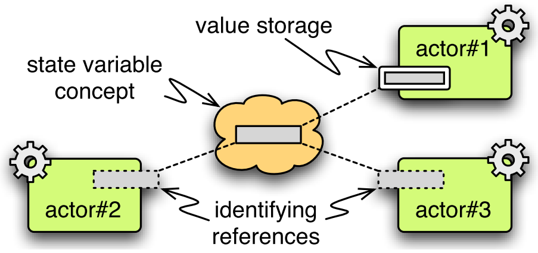

*********************************
Verwendete Techniken und Software
*********************************

Scala
*****

Die Implementierung des i>PM3D-Projekts erfolgte zum größten Teil in der Programmiersprache Scala :cite:`odersky_programming_2011` :cite:`www:scala`.
Die Verwendung von Scala ergab sich aus der Entscheidung, die in Scala implementierte Simulations-Middleware :ref:`simulatorx` als Basis für den Prototypen zu verwenden. 

Scala wird als "objektfunktionale" Programmiersprache charakterisiert. 
"Objektfunktional" soll die Bestrebungen ausdrücken, Aspekte aus funktionalen und objektorientierten Programmiersprachen zu einer flexiblen und effektiven Programmiersprache zu kombinieren.

Scala wird zur Zeit vorwiegend auf der Java VM genutzt, wobei der Compiler auch in der Lage ist, CIL-Code für die .NET-Runtime zu erzeugen. 
i>PM3D läuft wegen einiger Abhängigkeiten von Java-Bibliotheken bisher ausschließlich auf der Java VM.

Die "objektorientierte Facette" Scalas orientiert sich an den Konzepten von Java, bietet aber einige Erweiterungen.
Hier werden nur Features kurz vorgestellt, die für die Implementierung besonders hilfreich waren und in späteren Kapiteln erwähnt werden.

.. _traits:

Traits
------

Als Erweiterung zu Java unterstützt Scala eine (eingeschränkte) Mehrfachvererbung von Implementierungscode über sog. *Traits*. 
Traits kann man sich als ein Java-Interface vorstellen, in dem Methoden schon vorimplementiert sein können.
Zur Vereinfachung dürfen Traits keinen Konstruktor definieren.

Neben der Verwendung als "Interface" – wie in Java – werden diese oft genutzt, um wiederverwendbare Code-Einheiten zu realisieren, die sich in verschiedenen Klassen einsetzen lassen. 
Traits werden daher oft als **Mixin** bezeichnet.
Wie ein Trait zu einer Klasse hinzugefügt wird – auch **einmischen** genannt – zeigt das folgende Scala-Codebeispiel:

.. code-block:: scala

    class Example extends BaseClass with MixinTrait

``Example`` wird hiermit von ``BaseClass`` abgeleitet und ``MixinTrait`` eingemischt.

In dieser Arbeit werden Traits in UML-Diagrammen als Klasse mit dem Stereotyp *<<trait>>* dargestellt und Assoziationen zu einmischenden Klassen mit *<<mixin>>* versehen.

Objects
-------

Anstelle der aus Java bekannten statischen Klassenmethoden oder Singleton-Klassen wird in Scala das *object*-Konstrukt genutzt. 
*Objects* können Klassen "erweitern", das bedeutet, dass das *Object* als Instanz der Klasse betrachtet werden kann. 
Als Beispiel sei hier ein ausführbares Scala-Programm gezeigt, welches eine (im Sinne von Java statische) Methode definiert und aufruft:

.. code-block:: scala

    object Main extends App {
        def hello() {
            println("Hello World")
        }
        hello()
    }

.. _actors:

Actors
------

Ein sinnvoller Einsatzbereich von Scala ist unter anderem die Erstellung von parallelen und verteilten Anwendungen.
Dazu kommt oft das **Actor-Modell** :cite:`haller_scala_2009` zum Einsatz, das früher schon in der Programmiersprache Erlang :cite:`www:erlang` realisiert wurde.

Grundlage für das Actor-Modell ist das **message passing**, welches eine asynchrone Kommunikation zwischen den beteiligten Actors ermöglicht. 
Berechnungen innerhalb einzelner Actors können so prinzipiell parallel erfolgen. 
Informationen werden ausschließlich über Nachrichten ausgetauscht. Es ist nicht erlaubt, auf gemeinsame, veränderliche Datenstrukturen zuzugreifen. 
Actors können auf unterschiedlichen (Java-)Threads ausgeführt werden und somit auch mehrere Prozessorkerne nutzen, ohne den Programmierer mit der manuellen Verwaltung und Synchronisation von Threads zu belasten.

In Scala wird eine Nachricht oft durch ein Objekt einer **case class** dargestellt\ [#f9]_.
Diese Klassen werden dafür genutzt, Daten zu unveränderlichen Objekten zusammenzufassen, wie im folgenden Code gezeigt wird:

.. code-block:: scala

    case class Message(data: String, number: Int)
    receivingActor ! Message("hello!", 42)

In der zweiten Zeile wird ein Objekt der Klasse ``Message`` erzeugt und an ``receivingActor`` gesendet.

.. _implicit:

Implizite Methoden
------------------

Es ist möglich, sog. "implizite Methoden" zu definieren, welche vom Compiler automatisch eingesetzt werden können, wenn diese benötigt werden\ [#f8]_.
Besonders praktisch sind diese Methoden für die Realisierung von "transparenten" Adaptern, wie sie im vorliegenden Projekt genutzt werden. 
Diese werden auch **implizite Wrapper** genannt.

.. code-block:: scala

    implicit def conceptToAdapter(m: MConcept) = new MConceptAdapter(m)

Mit dieser Definition lassen sich nun Methoden, die für ``MConceptAdapter`` definiert sind auch auf Objekten des Typs ``MConcept`` aufrufen als wären sie Teil von ``MConcept``.

.. _parser-kombinatoren:

Parser-Kombinatoren
-------------------

Die Scala-Standardbibliothek bietet eine einfache Möglichkeit, Parser mit Hilfe von Parser-Kombinatoren :cite:`odersky_programming_2011` zu erstellen. 
Dies wird in dieser Arbeit für die Laden von Modellen in einer textuellen Repräsentation eingesetzt. 

Einfache Parser werden von Parser-Kombinatoren zu komplexeren Parsing-Ausdrücken zusammengesetzt. 
Parser sind als Funktionen definiert, die einen String auf eine beliebige Ausgabe abbilden. 
Parser-Kombinatoren sind Funktionen höherer Ordnung, die Parser als Eingabe erwarten und als Ausgabe wiederum eine Parser-Funktion liefern.

In Scala werden die Bestandteile der textuellen Eingabe oft in Objekte von *case classes* übersetzt, die zusammen einen Syntaxbaum der Eingabe ergeben.

Folgende Parser-Funktion 

.. code-block:: scala

    def stringAssignment = ident ~ ("=" ~> stringLits <~ ";") ^^ {
      case id ~ stringLits => LiteralTypeAssignment(id, stringLits)
    }

würde beispielsweise die LML-String-Zuweisung 

.. code-block:: java
    
    functions = "a", "test";

erkennen und in ein Scala-Objekt des Typs ``LiteralTypeAssignment`` übersetzen. Dieser Typ könnte wie folgt definiert sein:

.. code-block:: scala

    case class LiteralTypeAssignment(id: String, stringLiterals: List[String])

.. _simulatorx:

Simulator X
***********

*Simulator X* :cite:`latoschik_simulator_2011` :cite:`fischbach_sixtons_2011` ist ein Prototyp einer neuartigen Simulationsplattform, welche die Realisierung von interaktiven Echtzeit-Anwendungen besonders einfach machen soll. Der Fokus liegt dabei auf Anwendungen aus der Computergrafik, besonders in Verbindung mit multimodalen Bedienschnittstellen, welche neuartige Eingabemethoden wie Gesten- und Sprachsteuerung nutzen.

Simulator X setzt auf dem :ref:`(Scala-)Actor-Modell<actors>` auf und bietet daher dessen Eigenschaften wie die Ausnutzung mehrerer Prozessorkerne und eine asynchrone Kommunikation zwischen Actors.
Sog. **Komponenten** (``Component``) sind die grundlegenden Bestandteile einer Simulator X-Anwendung. Komponenten sind als Actor realisiert und stellen eine wohldefinierte Funktionalität für das System zur Verfügung. 

Von Simulator X wird eine Reihe von Komponenten bereitgestellt, beispielsweise die für i>PM3D verwendete Gestenerkennung und eine *Physikkomponente* für physikalische Simulationen (bspw. für Gravitation und Erkennung von Kollisionen zwischen Simulationsobjekten). 
Andere, typischerweise für Simulator X-Anwendungen verwendete Komponenten umfassen Renderkomponenten für die Realisierung der Grafikausgabe oder Komponenten zur Beeinflussung der Simulationsobjekte durch künstliche Intelligenz. 

Simulator X bietet – ebenfalls auf Basis des Actor-Modells – ein Event-System und eine Abstraktion globaler Zustandsvariablen an.  
Komponenten können sich beim Event-System für bestimmte Ereignisse, die von anderen Komponenten ausgelöst werden, registrieren und so automatisch benachrichtigt werden. 

Globale Zustandsvariablen, **SVars** genannt, vereinfachen für den Programmierer den Umgang mit verteilten Daten. 
Ein bestimmtes Datum wird von genau einem Actor, dem "Besitzer" verwaltet. 
Andere Actors besitzen nur eine spezielle Referenz auf den Wert und müssen mit dem Besitzer kommunizieren, um den Wert auszulesen oder zu manipulieren.
Diese Kommunikation wird von Simulator X automatisch und transparent für den Programmierer durchgeführt.
:num:`Abbildung #svars` zeigt ein Beispiel, in welchem ``actor#1`` der Besitzer der SVar ist und die beiden anderen Actors nur Referenzen auf diese SVar halten.

.. _svars:

    Zustandsvariablen-Konzept aus :cite:`latoschik_simulator_2011`

Eine zugeordnete ``SVarDescription``\ benennt die SVar, gibt ihr einen Scala-Datentyp und definiert deren Semantik in einer Anwendung. 
So lässt sich beispielsweise definieren, dass der Wert einer SVar eine Farbe darstellt, welche durch eine Klasse ``Vec4`` repräsentiert wird.

Eine Menge von SVars ergibt zusammen eine **Entität**, die genau ein Simulationsobjekt repräsentiert\ [#f2]_.
So kann durch die Manipulation der ``Color``-SVar einer bestimmten Entität deren Farbe festgelegt werden.

``Entities`` werden durch den Programmierer mittels einer ``EntityDescription`` beschrieben, die aus mehreren ``Aspect``-Definitionen aufgebaut sein kann :cite:`wiebusch_enhanced_2012`.
**Aspects** beschreiben eine wohldefinierte Facette der Entität und sind einer bestimmten Komponente zugeordnet. 
So gibt es beispielsweise Grafik- oder Physik-\ ``Aspects``. 

Ein ``Aspect`` legt fest, wie eine Komponente mit einem bestimmten Simulationsobjekt umgehen soll.
Über die ``Aspect``-Definition können Werte durch den Benutzer vorgegeben werden, die das Verhalten der Komponente im Bezug auf die zugehörige Entität festlegen.
So lässt sich beispielsweise über einen Physik-``Aspect`` festlegen, welche physikalische Repräsentation für die Entität genutzt werden soll, beispielsweise ein Quader mit bestimmten Abmessungen und einer Masse.
Für eine Renderkomponente kann der Pfad zu einer 3D-Objektdatei angegeben werden, welche als grafische Repräsentation für die Simulationsobjekt auf dem Bildschirm angezeigt werden soll.

Simulator X befindet sich gerade in der Entwicklung. Für das vorliegende Projekt wird eine Version von August 2011 genutzt.

.. _opengl:

OpenGL / LWJGL
**************

Um die Grafikausgabe von i>PM3D zu realisieren, wird die plattformunabhängige 3D-Schnittstelle OpenGL :cite:`opengl` genutzt. 

Zur Anbindung an OpenGL wird die Java-Bibliothek LWJGL (Lightweight Java Gaming Library) :cite:`www:lwjgl` in der Version 2.8.2 eingesetzt. 
Zusätzlich stellt LWJGL eine Schnittstelle für den Zugriff auf Tastatur- und Mausdaten zur Verfügung.

Hier sollen nur einige wenige Hinweise zu "modernem" OpenGL (ab Version 3.0) und den in späteren Kapiteln benutzten Begriffen gegeben werden. 
Näheres kann in :cite:`wright_opengl_2010` oder unter :cite:`opengl` nachgelesen werden. 
Allgemeines zu Begriffen aus der 3D-Computergrafik findet sich bei :cite:`akenine-moller_real-time_2008`.

In älteren OpenGL-Versionen (1.x) wurden von OpenGL viele, fest eingebaute Funktionen wie die Berechnung der Beleuchtung und Texturierung bereitgestellt, die nur aktiviert und konfiguriert werden mussten. 
Deshalb wird "altes" OpenGL oft mit dem Begriff *fixed-function-Pipeline* :cite:`akenine-moller_real-time_2008` in Verbindung gebracht.

Mit Version 3.0 wurden viele dieser Funktionen aus dem Kern von OpenGL entfernt. In neueren Versionen müssen die Berechnungen durch den Programmierer selbst in *Shadern* implementiert werden. 
Das neue Konzept gibt jedoch dem Programmierer die Freiheit, auch völlig neue Grafikeffekte zu implementieren, die mit der *fixed-function-Pipeline* nicht oder nur schwer umsetzbar gewesen wären. 
Diese Möglichkeit wurde in der vorliegenden Arbeit für einige "Spezialeffekte" genutzt, die sich auf diesem Weg einfach realisieren ließen.

Bei **Shadern** handelt es sich um kleine Programme, die in der Programmiersprache GLSL (OpenGL Shading Language) geschrieben und die direkt auf dem Grafikprozessor von sog. *Shader-Einheiten* ausgeführt werden.
Code kann in GLSL in Funktionen ausgelagert und so in mehreren Shadern genutzt werden.
Shader erfüllen verschiedene Aufgaben an von OpenGL festgelegten Positionen innerhalb der Render-Pipeline :cite:`www:glpipe` :cite:`akenine-moller_real-time_2008`.

In OpenGL 4 werden folgende Typen unterstützt:

Vertex-Shader  
    arbeiten auf einzelnen Vertices eines 3D-Objekts \ [#f10]_ und sind beispielsweise für die Transformation von 3D-Modellkoordinaten in das von OpenGL benutzte Koordinatensystem zuständig.

Geometry-Shader
    können aus den gegebenen Vertices neue Zwischen-Vertices erzeugen.

Fragment-Shader 
    werden einmal pro Fragment aufgerufen\ [#f3]_ und implementieren beispielsweise Texturierung und Beleuchtung.

Tesselation-Shader (ab OpenGL 4)
    können komplett neue Geometrien erzeugen.

Mit **Vertex-Attributen** lassen sich beliebige Daten pro Vertex an die Shaderprogramme übertragen; häufig sind das Vertexkoordinaten\ [#f4]_, Normalen\ [#f5]_ und Texturkoordinaten\ [#f6]_.
Vertex-Attribute werden vom Shader aus Puffern im Grafikspeicher ausgelesen, welche als Vertex Buffer Objects (VBO) bezeichnet werden.

**Uniforms** übermitteln Werte an Shaderprogramme, die üblicherweise für ein ganzes Grafikobjekt gelten. Dies können beispielsweise Lichtparameter oder Farbwerte sein.

Sonstiges
*********

.. _stringtemplate:

StringTemplate
--------------

Um Prozessmodelle in einer textuellen Form speichern zu können, wird die Template-Bibliothek *StringTemplate* (ST) in der Version 4.0.4 verwendet. :cite:`parr_language_2009` 
ST folgt dem Prinzip, einen Text mit "Platzhaltern" (Attributen) zu definieren. Die Attribute werden aus dem Anwendungsprogramm heraus gesetzt und so das Template mit Inhalt gefüllt.
Diese Schicht sorgt unter anderem dafür, dass beliebige Scala-Objekte als Java-Bean an ST weitergegeben werden können, auch wenn sie selbst nicht der Java-Bean-Konvention entsprechen.
In folgendem Beispiel wird ein Template erstellt, welches die LMM-Zuweisung ``function = "test"`` produziert:

.. code-block:: scala

    val assignTemplate = "<attribName> = \"<value>\""
    val assignST = ST(assignTemplate)
    assignST.addAll(
        "attribName" -> "function",
        "value" -> "test")
    val output = assignST.render

.. _simplex3d:

Simplex3D-Math
--------------

Im i>PM3D-Projekt wird die in Scala implementierte Mathematikbibliothek *Simplex3D-Math* in der Version 1.3 :cite:`www:simplex3d` genutzt. 
Durch die Bibliothek werden Matrizen, Vektoren und dazugehörige Utility-Funktionen bereitgestellt. Deren API orientiert sich weitgehend an der OpenGL Shading Language.

.. [#f2] Dies könnte im Prozesseditor beispielsweise ein Modellelement wie ein Prozess oder eine Kontrollflusskante sein.
.. [#f3] Ein Fragment entspricht – vereinfacht gesagt – einem Pixel auf dem Bildschirm.
.. [#f10] Ein Vertex ist ein "Eckpunkt" eines 3D-Objekts, welches in OpenGL üblicherweise als ein aus Dreiecken aufgebautes Gitter beschrieben wird.
.. [#f4] Vertexkoordinaten sind die Koordinaten des Punkts im 3D-Raum. OpenGL "rendert" ein 3D-Objekt, indem eine Liste von Vertices der Reihe nach gezeichnet wird.
.. [#f5] Normalen werden vor allem für die Berechnung der Beleuchtung benötigt.
.. [#f6] Texturkoordinaten sind häufig zweidimensional und werden vor allem dazu genutzt, 2D-Grafiken auf 3D-Objekten zu positionieren.
.. [#f7] Siehe http://www.opengl.org/wiki/Rendering_Pipeline_Overview
.. [#f8] Welche Bedingungen dafür erfüllt sein müssen, kann bspw. in :cite:`odersky_programming_2011` nachgelesen werden.
.. [#f9] Das *case class*-Konstrukt erzeugt eine Klasse, in der gewisse Methoden vorimplementiert sind, die bspw. einen inhaltlichen Vergleich mit dem ==-Operator oder einen Einsatz im *pattern matching* erlauben. Siehe :cite:`odersky_programming_2011`.
