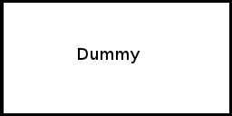

.. _konzept-visualisierung:

*******************************
3D-Visualisierung von Prozessen
*******************************

Nachdem die allgemeinen und prinzipiell von der Prozessmodellierung unabhängigen Teile des Editor-Meta-Models in den beiden vorherigen Kapiteln besprochen wurden, wird hier nun die Visualisierung von Prozessen im I>PM3D-Prototypen vorgestellt. 

Anschließend werden darauf aufbauend bisher nicht umgesetzte Erweiterungsmöglichkeiten vorgeschlagen, die für eine höhere Benutzerfreundlichkeit und Verständlichkeit sorgen könnten.

Anwender, die bereits Erfahrung mit verbreiteten grafischen 2D-Prozessmodellierungssprachen haben sollten durch das Aussehen der Modellelemente möglichst intuitiv verstehen können, welche Konzepte aus der Prozessmodellierung dadurch dargestellt werden. 

.. sollte man das als Anforderung definieren?

Grundlegende Darstellung der grafischen Elemente
================================================

Wie im vorherigen Kapitel unter :ref:`ebl` erläutert werden auf dem Editor-Base-Level grundlegende Figuren und deren Darstellung durch grafische Objekte im Modellierungswerkzeug definiert.
Die konkreten Repräsentationen für bestimmte Typen aus dem Prozessmodell werden auf dem Editor-Definition-Level festgelegt. 
Durch die Metamodelle wurde schon vorgegeben, dass ein graphbasierter Visualisierungsansatz genutzt wird. 

Wie nun die Modellelemente – also Knoten und Kanten – und Szenenobjekte prinzipiell dargestellt werden ist Gegenstand der folgenden Abschnitte.

Knoten
------

Für die Darstellung von Informationen auf den Knoten gibt es durch die auf dem :ref:`ebl` definierten Basis-Figuren *TextLabelNode* und *TexturedNode* grundsätzlich zwei Möglichkeiten.

Die Beschriftung von TextLabelNodes kann dazu verwendet werden, Attribute aus dem Prozessmodell direkt anzuzeigen.
:num:`prozessknoten` zeigt zwei Prozesse, auf denen deren Funktion als Text angezeigt wird. 
Texte werden nach Bedarf an Wortgrenzen auf mehrere Zeilen verteilt und zentriert angezeigt. 

Weitere Informationen hierzu können unter :ref:`darstellung-von-schriften` nachgelesen werden.

.. _prozessknoten:

    Zwei Prozessknoten (Screenshot aus I>PM3D)

Andererseits können Grafiken (Texturen) genutzt werden, die Bedeutung eines Knotentyps zu visualisieren. So steht ein Pluszeichen beispielsweise für einen AND-Connector, wie in :num:`Abbildung #and-connector` gezeigt wird. 

.. _and-connector:

    AND-Connector (Screenshot aus I>PM3D)

Durch die freie Beweglichkeit der Kamera und der Objekte (siehe :ref:`ipm3d-visualisierung`) ergeben sich sehr unterschiedliche Beobachtungsperspektiven. So können die Entfernungen zwischen Kamera und Modellelementen sehr groß sein; auch können die Objekte durch die freien Rotationsmöglichkeiten von allen Seiten betrachtet werden. 

Daher ist es sinnvoll, möglichst große Schriften zu verwenden und für einen guten Kontrast zwischen Text- und Hintergrundfarbe zu sorgen.

Trotz der freien Drehbarkeit soll sichergestellt werden, dass Texte oder Symbole auf den Objekten jederzeit lesbar sind. Daher werden diese auf allen Seiten dargestellt. 

Jedoch führt dies bei bestimmten Drehpositionen zu recht unschönen Darstellungen, wenn beispielesweise bei einem Würfel zwei oder sogar drei Seiten zu sehen sind, die dasselbe anzeigen.

Um dies etwas zu verbessern werden die Seiten abhängig von Betrachtungswinkel dargestellt. Wird eine Seite vom Benutzer weggedreht, wird die Schrift oder Textur nach und nach ausgeblendet.
Ab einer gewissen Abweichung wird nur noch die Hintergrundfarbe angezeigt.

Näheres dazu siehe :ref:`implementierung-vis`.

An die für Knoten verwendbaren geometrischen Objekte gibt es einige Anforderungen, die davon bestimmt sind, dass die Lesbarkeit und die Verständlichkeit des Prozessmodells möglichst hoch sein soll.

Für die Darstellung der Objekte wurden einfache, dreidimensionale geometrische Körper mit möglichst ebenen Seitenflächen wie Würfel oder Quader gewählt. 
Ebene Flächen eignen sich besonders gut zur Darstellung von Information; gekrümmte Flächen beeinträchtigen besonders die Lesbarkeit von (längeren) Textdarstellungen. 

Bei Würfeln oder ähnlichen Körpern ist es auch relativ einfach, einen (dreidimensionalen) Rahmen darzustellen, dessen Verwendung weiter unten in :ref:`visualisierungsvarianten` dargestellt wird.

Außerdem ist es sinnvoll, auf Quader oder annähernd quaderförmige Geometrien zu setzen, da die Knoten wie in :ref:`ipm3d-visualisierung` erwähnt in die physikalische Simulation eingebunden sind und Quader von der verwendeten Physik-Engine direkt unterstützt werden. 

Da dieser Prototyp neben der klassischen Desktop-Bedienung mit Maus und Tastatur auch zur Evaluierung von neuartigen Eingabegeräten eingesetzt werden soll müssen auch die Besonderheiten dieser Eingabemethoden berücksichtigt werden. 

Die im Projekt verwendeten 3D-Eingabegeräte :cite:`buchi` haben nur eine relativ begrenzte Genauigkeit bei der Auswahl und Platzierung von Objekten. 
Vor allem ungeübten Benutzern kann es schwer fallen, Objekte zu selektieren und zu bewegen, besonders wenn die Objekte relativ klein sind.

Dies ist auch ein Grund, warum hier eine reine Graphdarstellung mit möglichst einfachen Objekten verwendet wird. 
Es wird also darauf verzichtet, Elemente ineinander zu schachteln, wie es in 2D-Werkzeugen wie IPM2 (siehe :ref:`prozessmodellierungssprachen`) üblich ist.  

.. _kanten:

Kanten
------

Eine Kante sollte optisch leicht als Verbindung zwischen zwei Knoten erkannt werden können, die auch gerichteter Natur sein kann.

In I>PM3D werden Kanten werden durch einen (in y-Richtung) gestreckten 3D-Quader dargestellt, der vom Startknoten bis zum Endknoten reicht. 
Die Länge und Ausrichtung der Kanten wird automatisch angepasst, wenn die beteiligten Knoten im Raum verschoben werden. 
Dies wird von der von :cite:`uli` beschriebenen Editor-Komponente durchgeführt.

Die durch das Concept *TexturedConnection*  (:ref:`ebl`) bereitgestellte texturierte Verbindung dient dazu, gerichtete Kanten zu visualisieren. 

Eine Möglichkeit ist es, eine Textur mit farblich vom Hintergrund abgehobenen Dreiecken zu verwenden, die so platziert sind, dass an zwei Ecken der Verbindung ein Pfeil entsteht.

:num:`Abbildung #gerichtete-verbindung` zeigt als Beispiel zwei Prozesse, die mit einem Kontrollfluss verbunden sind. Der Kontrollfluss läuft von Prozess A zu Prozess B.

.. _gerichtete-verbindung:

    Gerichtete Kontrollflusskante (Screenshot aus I>PM3D)

Szenenobjekte
-------------

Zusätzlich zu den Elementen des eigentlichen Prozessmodells gibt es noch die Möglichkeit, beliebige 3D-Modelle in die Szene einzufügen, die im Metamodell als *SceneryObject* bezeichnet werden. 

Solche Szenenobjekte können zum Beispiel dafür eingesetzt werden, Abbilder von realen Objekten anzuzeigen. 
Diese können zur Illustration von Prozessschritten dienen, wie unter :ref:`ross-brown` erwähnt wurde.

Szenenobjekte können genauso wie Knoten, selektiert, frei bewegt, skaliert und rotiert werden, besitzen aber sonst keine anderen Möglichkeiten, das Erscheinungsbild zu beeinflussen.

.. _visualisierungsvarianten:

Visualisierungsvarianten für interaktive Modelleditoren
=======================================================

Da das hier vorgestellte Visualisierungskonzept in einem interaktiven Modelleditor eingesetzt wird ergibt sich noch die weitere Anforderung, Visualisierungsvarianten der Modellelemente zu unterstützen.

So sollen Interaktionen des Benutzers mit den Modellobjekten sichtbar gemacht werden, indem die Visualisierung der Objekte temporär verändert wird. 
Diese Modifikationen werden nicht im Editor-Usage-Model persistiert; daher werden alle Objekte im Normalzustand angezeigt nachdem ein Modell neu geladen wurde.

Hervorhebung
------------

Diese Variante wird dafür eingesetzt, ein Objekt kurzzeitig beim Überfahren durch einem Cursor eines Eingabegeräts hervorzuheben. 
Dargestellt wird das abhängig von der Helligkeit der Grundfarbe des Objekts durch eine Aufhellung bzw. einer Abdunkelung der Farbe. Der Farbton wird dabei nicht verändert.

:num:`Abbildung #hervorhebung` zeigt im Vergleich einen hervorgehobenen und einen AND-Connector im Normalzustand (rechts).

Selektion
---------

Prozessmodellelemente und Szenenobjekte können durch den Benutzer ausgewählt werden. 
Selektierte Objekte sollen von unselektierten Objekten auch bei großer Entfernung und ungünstigen Blickwinkeln unterscheidbar sein, wobei aber jederzeit noch erkennbar sein muss, um welche Art von Modellelement es sich handelt. 

Die Visualisierung des Selektionszustandes soll daher möglich auffällig sein ohne das Erscheinungsbild allzu stark zu beeinflussen. 

Um die Selektion von der Hervorhebung unterscheidbar zu machen wird für die Selektion der Rand des Objekts in der Komplementärfarbe eingefärbt. Wie der "Rand" definiert ist je nach Objekttyp unterschiedlich.

In :num:`Abbildung #selektion` wird links ein Prozess und rechts ein AND-Connector im selektierten Zustand gezeigt.

Deaktivierung
-------------

Objekte können durch den Modelleditor deaktiviert werden. Welche Bedeutung dies hat wird vom Editor festgelegt. 
Zur Visualisierung dieses Zustandes wird das Objekt transluzent in einem Grauton dargestellt, der von der normalen Farbe abhängig ist. 

So kann man auch Elemente erkennen, die hinter dem deaktivierten liegen und von diesem verdeckt werden.

:num:`Abbildung #deaktivierung` zeigt einen deaktivierten Prozess, hinter dem sich ein anderer Prozess befindet.

.. _hervorhebung:

    Hevorgehobener und AND-Konnektor im Normalzustand (rechts) (Screenshot aus I>PM3D)

.. _selektion:

    Prozess und AND-Connector im selektierten Zustand (Screenshot aus I>PM3D)

.. _deaktivierung:

    Deaktivierter Prozessknoten (vorne) und aktivierter Prozess (hinten) (Screenshot aus I>PM3D)

Die drei vorgestellen Visualisierungsvarianten können frei kombiniert werden. 
Damit ist es zum Beispiel auch möglich, ein gleichzeitig hervorgehobenes, selektiertes und deaktiviertes Modellelement darzustellen.

.. _modellierungsflaechen:

2D-Modellierungsflächen
=======================

Für eine übersichtliche Darstellung des Prozessmodells ist es häufig erwünscht, Elemente in einer bestimmten Weise anzuordnen. 

Durch die freie Positionier- und Drehbarkeit kann zwar prinzipiell jede beliebige geometrische Anordnung erreicht werden, doch ist dies mit einem relativ hohen Aufwand bei der Platzierung durch den Benutzer verbunden. 

Um das Platzieren zu vereinfachen werden in 2D-Modellierwerkzeugen oft im Hintergrund dargestellte Gitter genutzt, die eine optische Hilfe darstellen. 
Noch hilfreicher können "magnetische" Gitter sein, die grob in der Nähe platzierte Objekte automatisch auf feste, regelmäßige Positionen verschieben.

Eine ähnliche Technik war auch für den I>PM3D-Prototypen erwünscht. 

Da schon eine Physik-Engine integriert ist war es naheliegend, diese auch für die Platzierung von Objekten zu nutzen. 
Sobald sich ein Objekt nahe genug an einer solchen Modellierungsebene befindet, wird es nach dem Loslassen durch den Benutzer (Deselektion) von der "Gravitation" der Ebene angezogen, solange bis der Mittelpunkt des Objekts die Fläche erreicht hat, wo es angehalten wird.

Näheres zur Implementierung dieser "Gravitationsflächen" findet sich in :cite:`buchi`.

Grafisch werden diese Ebenen transluzent dargestellt, wobei darauf Gitterlinien zu erkennen sind. 
Diese Linien haben allerdings keine physikalische Bedeutung sondern diesen nur als optische Platzierungshilfe.

:num:`Abbildung #modellierungsflaeche` zeigt eine solche Ebene.

.. _modellierungsflaeche:

    Modellierungsfläche, grün (Screenshot aus I>PM3D)

.. _beleuchtung:

Beleuchtung
===========

Für die Beleuchtung der Szene werden mehrere Lichtquellen eingesetzt. Die primäre Lichtquelle befindet direkt an der Kamera sich und bewegt sich mit dieser. 
Die Lichtfarbe ist weiß, also wird der Farbton der beleuchteten Objekte unverfälscht dargestellt. 

Zur Verbesserung der Orientierung befindet sich jeweils eine weniger intensive, farbige Lichtquelle an drei festen Positionen unterhalb(), links() und rechts() der Szene. 
Dadurch wird also eine "Standard-Ansicht" auf die Szene definiert. 
So soll es für den Benutzer leichter zu erkennen sein, welche Seite der Objekte nach unten, links beziehungsweise nach rechts zeigt. 

Die von der Renderbibliothek bereitgestellten Lichtquellen nach dem Phong-Lichtmodell sorgen für eine relativ realistische Beleuchtung bei vertretbarem Rechenaufwand.

Für die Visualisierung von 3D-Graphmodellen stellt sich die Frage, wie die Lichtparameter am besten gewählt werden sollten um eine möglichst hohe Lesbarkeit und eine gute Orientierung im Raum zu ermöglichen.

Im Phong-Lichtmodell wird das von einem Objekt reflektierte Licht in drei Beiträge unterschieden. 

Der "ambient"-Anteil (Umgebungslicht) ist unabhängig von der Ausrichtung des Objekts relativ zur Lichtquelle.

Üblicherweise wird der Hauptanteil des reflektierten Lichts vom "diffuse"-Anteil (diffuses Licht) beigesteuert. 
Dieser Beitrag ist abhängig vom Winkel zur Lichtquelle und ist für den räumlichen Eindruck wichtig.

Der "specular-Anteil" erzeugt spiegelnde Reflexionen auf Objekten, die auch von der Betrachterposition relativ zum Objekt abhängen. 
Dieser Anteil kann deshalb die räumliche Orientierung unterstützen, was auch für die Darstellung der Prozessdiagramme hilfreich ist. 
Allerdings führt die starke Aufhellung an bestimmten Stellen dazu, dass sich vor allem Text dort schlecht ablesen lässt.

Außerdem kann bei Lichtquellen noch angegeben werden, wie stark die Helligkeit mit steigender Entfernung von der Lichtquelle abfällt. 
Hierdurch kann ebenfalls den Tiefeneindruck und die räumliche Darstellung verbessert werden. 

Ein starker Abfall der Beleuchtung führt aber beispielsweise zu Problemen, wenn gleichzeitig Objekte mit Text in der Nähe der Lichtquelle und weit entfernt in lesbarer Form dargestellt werden sollen.
Objekte in der Nähe werden zu hell dargestellt, während weit entfernte Objekte zu dunkel sind.
Genauso ergibt sich bei gerichteten Verbindungen, die sich weit im Hintergrund befinden das Problem, dass die darauf abgebildeten Richtungsmarkierungen schlecht zu erkennen sind.

Insgesamt hat sich bei Versuchen gezeigt, dass es schwierig ist, die Lichtparameter so zu setzen, dass eine in allen Situationen nahezu optimale Beleuchtung entsteht.

Zusätzliche Aspekte und Erweiterungsmöglichkeiten
=================================================

Die momentan umgesetzte Visualisierung von Prozessen zeigt nach unserer Ansicht, dass eine 3D-Ansicht auf Prozessdiagramme durchaus praktikabel ist. 
Allerdings kann das bisherige Konzept und die Implementierung nur der Anfang sein. 
Es zeigten sich einige Probleme, die teilweise schon angesprochen wurden oder im Folgenden noch erwähnt werden. 

Um die Darstellung zu verbessern, und den "Nutzen" für den Anwender zu erhöhen gibt es eine Vielzahl von Verbesserungs- und Erweiterungsmöglichkeiten.
Hier sollen vor allem einige dargestellt werden, die sich aus den Erfahrungen mit dem Prototypen ergeben haben und die auf Basis des momentanen Projektes ohne grundlegende Veränderungen umgesetzt werden könnten.

Darstellung von Text
--------------------

Von der :ref:`render-bibliothek` wird für das Projekt das Rendern von Schrift auf 3D-Objekten zur Verfügung gestellt. 
Text wird in ein 2D-Bild geschrieben und dieses als Textur auf dem zu beschriftenden Objekt angezeigt. (siehe :ref:`schrift-rendering`).

Andere Techniken, die eine höhere Darstellungsqualität erreichen, wie sie beispielsweise von :ref:`gef3d` genutzt oder von :cite:`font` vorgestellt werden, wurden ebenfalls in Betracht gezogen. 
Besonders die Möglichkeiten aktuellster Grafikhardware mit OpenGL4-Unterstützung, neue Geometrien direkt auf der Grafikeinheit per Tesselation-Shader zu erzeugen, könnten für die Implementierung von gut lesbaren und dennoch performanten Darstellungstechniken interessant sein.

Jedoch war die Schriftqualität des verwendeten texturbasierten Ansatzes ausreichend für den hier entwickelten Prototypen und lies sich einfach implementieren. 

Für weitere Arbeiten auf diesem Gebiet sollte dies jedoch erneut evaluiert werden, da die Schriftqualität wichtig für Verständlichkeit und Nutzen der grafischen Repräsentation ist. 
Bei ungünstigen Beobachtungssituationen, also bei großer Entfernung und schräger Betrachtung von Flächen, wird es im Prototypen schnell schwierig, Texte ohne Anstrengung zu lesen.  
Es müssen eher große Schriften gewählt werden und daher lässt sich relativ wenig Information auf den Knoten darstellen.

Eine andere sinnvolle Erweiterungsmöglichkeit wäre, die Anzeige von Informationen bei weit entfernten Objekten automatisch zu vereinfachen\ [#f1]_, zum Beispiel indem ein Text abgekürzt und größer dargestellt wird. 
So wäre es möglich, Knoten mit größerem Abstand immerhin noch zu unterscheiden. 
Dafür könnte ein zusätzliches Attribut im Prozessmodell genutzt werden, dass eine Abkürzung für ein längeres Textattribut angibt.

Konfigurierbarkeit
------------------

Abgesehen von den im Metamodell konfigurierbaren Visualisierungsparametern fehlt es noch an weiteren Möglichkeiten, die grafische Darstellung zu beeinflussen. 

Sehr sinnvoll wäre es, die :ref:`beleuchtung` konfigurieren zu können. 
Wie in jenem Abschnitt gesagt ist es schwierig, Einstellungen zu finden, die für alle Situationen gut geeignet sind.
Diese hängen auch von der verwendeten Anzeige und von Einflüssen wie Umgebungslicht oder der persönlichen Wahrnehmung des Benutzers ab.
In der grafischen Oberfläche sollte es hierzu eine Möglichkeit geben, Lichtquellen zu setzen und deren Parameter zu verändern, aber auch sinnvolle Standardeinstellungen oder auswählbare Profile anbieten. 
Lichtquellen sind in Simulator X über zugehörige Licht-Entities erstell- und konfigurierbar, wie es auch von der :ref:`renderkomponte` unterstützt wird.

Ähnliches gilt für :ref:`modellierungsflaechen`. Sie sind momentan in der Implementierung fest vorgegeben, da es in der GUI noch keine Konfigurationsmöglichkeit gibt.
Die Flächen können aber ebenfalls nach Bedarf erstellt und über zugehörige Entities konfiguriert werden.

Es sollte darüber nachgedacht werden, die aktuellen Einstellungen für Lichtquellen und Modellierungsflächen auch in die Editor-Modelle aufzunehmen und damit persistent zu machen.

Räumliche Darstellung
---------------------

.. TODO cite oder Verweis auf related work

Die räumliche Darstellung, vor allem der Tiefeneindruck ist für das Verständnis von 3D-Visualisierungen wichtig. 
Der Vorteil der zusätzlichen Dimension ist es eben, Objekte unterschiedlich weit vom Betrachter entfernt zu zeichnen und somit mehr Information darstellen zu können.

Modellierungsflächen und eine passende Beleuchtung können schon hilfreich sein, um dem Benutzer die räumliche Orientierung zu erleichtern.

Jedoch ist die Darstellung von 3D-Szenen auf einem PC-Bildschirm oder Projektor üblicherweise nur eine 2D-Projektion, bei der ein realistischer Tiefeneindruck fehlt.
Dies macht es manchmal schwierig zu erkennen, welche Objekte näher am Betrachter liegen und welche sich im Hintergrund befinden. 

Es besteht die Möglichkeit, sich an der Größe der Objekte zu orientieren. Jedoch kann dies auch scheitern, wenn Objekte unterschiedlich groß sein dürfen, wie es momentan der Fall ist. 
Die Skalierung von Modellelementen allerdings komplett zu verbieten ist wohl auch unpraktikabel.

Andere Effekte, die aus der "Umwelt" bekannt sind und die einen besseren räumlichen Eindruck ermöglichen können sind die Bewegungsparallaxe, Stereoskopie und Schatten.

Die Nutzung von stereoskopischer Darstellung und Bewegungsparallaxe für die Darstellung von Graphen wurde im Abschnitt :ref:`ware-graphs` vorgestellt.

Der Bewegungsparallaxen-Effekt lässt sich durch die Bewegung des Benutzers in der Szene erzeugen und gibt einen Eindruck davon, wie weit Objekte von ihm entfernt sind.

Ein Schattenwurf der Objekte könnte zum Beispiel verdeutlichen, wie weit Objekte von einer Fläche entfernt sind und wie der Betrachter zur Lichtquelle orientiert ist.
Jedoch müsste getestet werden, inwieweit dies hilfreich ist und ob Schatten nicht zu häufig dazu führen, dass sich Informationen im Modell schlecht erkennen lassen. 
Eine Konfigurationsmöglichkeit oder eine "intelligente" Schattenberechnung, die weniger auf realistische Effekte setzt aber dafür Lesbarkeitsaspekte berücksichtigt könnte hier interessant sein.

Eine weitere Entwicklungsmöglichkeit wäre es, voll immersive virtuelle Welten zu nutzen wie es im Abschnitt :ref:`halpin-social-net` gezeigt wurde. 
Dies ist auch ein Anwendungsgebiet, das von der hier verwendeten Plattform Simulator X unterstützt werden soll.

Das Ziel des Projekts ist es aber eher auf technisch noch sehr aufwändige sowie teure Lösungen zu verzichten und vor allem eine Lösung für die "breite Masse" bereitzustellen.
Durch die ständige technische Weiterentwicklung könnten solche Systeme aber in Zukunft durchaus eine praktische Alternative zu üblichen Benutzerschnittstellen für diverse Einsatzgebiete werden.

Darstellung von Kanten
----------------------

Ein "Ärgernis" bei 3D-Visualisierungen können schlecht erkennbare Verbindungen sein; vor allem die Richtung zu sehen kann bei weit entfernten Kanten ein Problem darstellen.
Hier kann man sagen, dass es wohl keine "perfekte" Lösung gibt, die immer funktioniert.

Wie unter :ref:`kanten` gezeigt werden gerichtete Kanten durch eine sich wiederholende "Pfeiltextur" auf Verbindungen dargestellt. 
Das hat den Vorteil, dass die Richtung auch erkennbar ist, wenn die Verbindung zu großen Teilen durch andere Objekte verdeckt wird.   

Der Ansatz, die Richtung durch eine dreidimensionalen Pfeilspitze darzustellen leidet beispielsweise unter dem Problem der Verdeckung. 
Eine solche Darstellung liegt aber näher an den bekannten Visualisierungssprachen und sollte wohl noch unterstützt werden.

Damit gäbe es auch mehr Möglichkeiten um den Typ von Verbindungen durch verschiedene Pfeilspitzen oder -enden besser zu unterscheiden.
Bisher kann dies nur über die Farbe, Variation der Textur, und die Dicke dargestellt werden.

So könnten Verbindungen auch gekrümmt oder aus mehreren Liniensegmenten aufgebaut gezeichnet werden um die Überdeckung von Knoten oder das Schneiden von anderen Verbindungen zu vermeiden. 
Arbeiten zu alternativen Darstellungsformen wurden unter :ref:`related-verbindungen` genannt.

.. [#f1] In der Computergrafik wird das Prinzip als "Level Of Detail" bezeichnet. 
