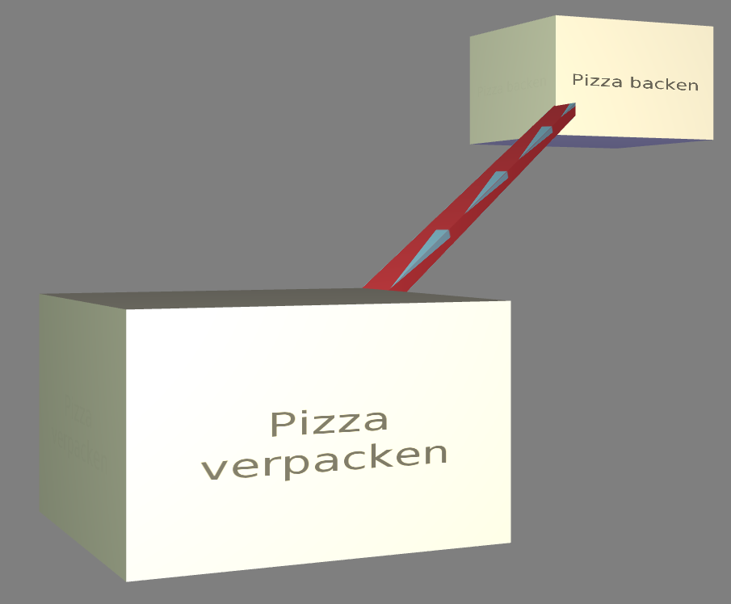
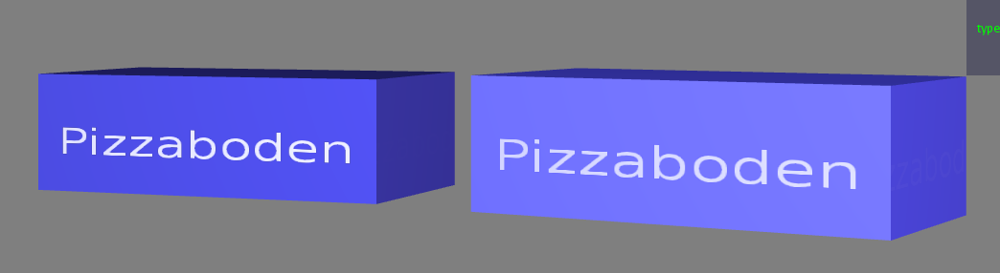

.. _visualisierung:

*******************************
3D-Visualisierung von Prozessen
*******************************

Im Folgenden wird die Visualisierung von Prozessen im i>PM3D-Prototypen vorgestellt, wie sie durch das im vorherigen Kapitel vorgestellte Editor-Metamodell festgelegt wird.
Außerdem werden durch die Implementierung vorgegebene Aspekte angesprochen, welche aber weitgehend unabhängig von der Prozessmodellierung sind.
Dabei werden auch Hinweise gegeben, welche beim Hinzufügen von neuen Modellfiguren oder Ändern von Visualisierungsparametern beachtet werden sollten.
Anschließend wird gezeigt, welche Nutzungsmöglichkeiten der dritten Dimension sich in i>PM3D umsetzen lassen und welche Erweiterungsmöglichkeiten bestehen, die für eine höhere Benutzerfreundlichkeit und Verständlichkeit sinnvoll sind.

Grundlegende Darstellung der grafischen Elemente
================================================

Wie im vorherigen Kapitel unter :ref:`ebl` erläutert, werden auf dem Editor-Base-Level grundlegende Figuren und deren Darstellung durch grafische Objekte im Modellierungswerkzeug definiert.
Die konkreten Repräsentationen für bestimmte Typen aus dem Prozessmodell werden auf dem Editor-Definition-Level festgelegt. 
In den Metamodellen wurde schon vorgegeben, dass ein graphbasierter Visualisierungsansatz genutzt wird. 
Anwender, die bereits Erfahrung mit verbreiteten grafischen 2D-Prozessmodellierungssprachen haben, sollten durch das Aussehen der Modellelemente möglichst intuitiv verstehen können, welche Konzepte aus der Prozessmodellierung dargestellt werden.

Knoten
------

Für die Darstellung von Informationen auf den Knoten gibt es durch die auf dem :ref:`ebl` definierten Basis-Figuren ``TextLabelNode`` und ``TexturedNode`` grundsätzlich zwei Möglichkeiten.
Die Beschriftung von ``TextLabelNodes`` kann dazu verwendet werden, textuelle Attribute aus dem Prozessmodell direkt anzuzeigen (:ref:`Anforderung (h) <anforderungen>`).

Es sollten möglichst einfache, dreidimensionale geometrische Körper mit möglichst ebenen Seitenflächen wie Würfel oder Quader gewählt werden. 
Ebene Flächen eignen sich besonders gut zur Darstellung von Information; gekrümmte Flächen beeinträchtigen besonders die Lesbarkeit von (längeren) Textdarstellungen. 
Bei Würfeln oder ähnlichen Körpern ist es auch relativ einfach, einen (dreidimensionalen) Rahmen zu zeichnen, dessen Verwendung weiter unten in :ref:`visualisierungsvarianten` dargestellt wird.

:num:`Abbildung #prozessknoten` zeigt zwei Prozessknoten, auf welchen die Prozess-Funktion als Text angezeigt wird. 

Da die Erstellung von Knoten nach dem :ref:`tvk` erfolgt, lässt sich die Visualisierung für jeden Knoten individuell anpassen.
In der Abbildung wurde beim rechten Knoten zur Laufzeit die Hintergrundfarbe geändert.

Texte werden nach Bedarf an Wortgrenzen auf mehrere Zeilen verteilt und zentriert angezeigt. 
Weitere Details zur Schriftdarstellung können im Kapitel zur :ref:`Render-Bibliothek <schrift-rendering>` nachgelesen werden.

.. _prozessknoten:

.. figure:: _static/screenshots/prozessknoten.png
    :width: 16.5cm

    Zwei Prozessknoten; links im Ursprungszustand, rechts als angepasste Verwendung (Screenshot aus i>PM3D)

Andererseits können Grafiken (Texturen) genutzt werden, um die Bedeutung eines Knotentyps zu visualisieren. 
So steht ein Pluszeichen für einen AND-Connector, wie in :num:`Abbildung #and-connector` gezeigt wird. 

.. _and-connector:

.. figure:: _static/screenshots/and_connector.png
    :height: 8cm

    AND-Connector (Screenshot aus i>PM3D)

Blickwinkelabhängige Darstellung von Informationen
^^^^^^^^^^^^^^^^^^^^^^^^^^^^^^^^^^^^^^^^^^^^^^^^^^

Durch die freie Beweglichkeit und Rotationsmöglichkeit der Kamera sowie der :ref:`Objekte<ipm3d-visualisierung>` ergeben sich sehr unterschiedliche Beobachtungsperspektiven. 
Objekte können so von allen Seiten betrachtet werden. 
Trotzdem soll sichergestellt werden, dass Texte oder Symbole auf den Objekten jederzeit erkennbar sind. Daher werden diese grundsätzlich auf allen Seiten dargestellt. 
Jedoch führt dies bei bestimmten Drehpositionen zu störenden und möglicherweise verwirrenden Darstellungen, wenn beispielsweise bei einem Würfel zwei oder sogar drei Seiten zu sehen sind, die dasselbe anzeigen.

Um dies zu verbessern, werden die Seiten abhängig von Betrachtungswinkel dargestellt. 
Wird eine Seite vom Benutzer weggedreht, wird die Schrift oder Textur nach und nach "ausgeblendet", indem die Vordergrundfarbe je nach Winkel mit der Hintergrundfarbe gemischt wird.
Ab einer gewissen Abweichung wird nur noch die Hintergrundfarbe angezeigt. So ist nur eine Seite deutlich zu erkennen und der Betrachter wird nicht durch die anderen Seiten abgelenkt.

:num:`Abbildung #schrift-uebergang` zeigt links den ungünstigsten Grenzfall, in dem alle Seiten gleich deutlich dargestellt werden. Dies ist der Fall, wenn der Betrachter direkt auf eine Ecke blickt.
Rechts ist der Knoten günstiger ausgerichtet und die Schrift ist auf der rechten Seite des Objekts kaum mehr zu erkennen.

.. _schrift-uebergang:

    Schriftdarstellung bei direkter Sicht auf eine Ecke (links) und bei günstigerer Perspektive (Screenshot aus i>PM3D)

Berücksichtigung der Eingabemethoden
^^^^^^^^^^^^^^^^^^^^^^^^^^^^^^^^^^^^

Da i>PM3D nicht nur die klassischen Desktop-Bedienung mit Maus und Tastatur erlauben, sondern auch zur Evaluierung von neuartigen Eingabegeräten eingesetzt werden soll, müssen auch die Besonderheiten dieser Eingabemethoden berücksichtigt werden. 
Die im Projekt verwendeten 3D-Eingabegeräte :cite:`buchi` haben nur eine relativ begrenzte Genauigkeit bei der Auswahl und Platzierung von Objekten. 
Vor allem ungeübten Benutzern kann es schwerfallen, Objekte zu selektieren und zu bewegen, besonders wenn die Objekte relativ klein sind.

Dies ist auch ein Grund, eine Graphdarstellung mit möglichst einfachen Objekten zu verwenden.
Es wird deswegen auch verzichtet, Elemente nach dem geometrischen Visualisierungsansatz ineinander zu schachteln, wie es bei 2D-Werkzeugen wie :ref:`i>PM2<mdf>` zu sehen war.
Es ist sinnvoll, Quader (oder annähernd quaderförmige Geometrien) einzusetzen, da Knoten in die physikalische Simulation eingebunden sind und Quader von der verwendeten Physikkomponente direkt unterstützt werden\ [#f4]_. 
Die physikalische Simulation wird von den Eingabegeräten für die Selektion von Elementen genutzt, wie von :cite:`buchi` beschrieben.

.. _kanten:

Kanten
------

Eine Kante sollte optisch leicht als Verbindung zwischen zwei Knoten erkannt werden können; außerdem muss ggf. visualisiert werden, welche Richtung die Kante besitzt.
In i>PM3D werden Kanten durch einen (in y-Richtung) gestreckten 3D-Quader dargestellt, der vom Startknoten bis zum Endknoten reicht. 
Die Länge und Ausrichtung der Kanten wird automatisch angepasst, wenn die beteiligten Knoten im Raum verschoben werden. 
Dies wird von der in :cite:`uli` beschriebenen Editor-Komponente übernommen.

Die durch das Concept ``TexturedConnection`` (siehe :ref:`ebl`) bereitgestellte texturierte Verbindung dient dazu, gerichtete Kanten zu visualisieren. 
Eine Möglichkeit ist es, eine Textur mit farblich vom Hintergrund abgehobenen Dreiecken zu verwenden, die so platziert sind, dass an zwei Ecken der Verbindung ein Pfeil entsteht.

:num:`Abbildung #gerichtete-verbindung` zeigt als Beispiel zwei Prozesse, die mit einem Kontrollfluss verbunden sind. Der Kontrollfluss läuft von "Pizza backen" nach "Pizza verpacken".

.. _gerichtete-verbindung:

    Gerichtete Kontrollflusskante von "Backen" nach "Verpacken" (Screenshot aus i>PM3D)

Szenenobjekte
-------------

Zusätzlich zu den Elementen des eigentlichen Prozessmodells gibt es noch die Möglichkeit, beliebige 3D-Grafikobjekte in die Szene einzufügen, die im Editor-Metamodell als ``SceneryObject`` bezeichnet werden
(*Anforderung (h)*).
Solche Szenenobjekte können zum Beispiel dafür eingesetzt werden, Abbilder von realen Objekten anzuzeigen. 
Szenenobjekte können genauso wie Knoten, selektiert, frei bewegt, skaliert und rotiert werden. Sie besitzen aber sonst keine anderen Möglichkeiten, das Erscheinungsbild zu beeinflussen.

.. _visualisierungsvarianten:

Visualisierungsvarianten für interaktive Modelleditoren
=======================================================

Da die hier vorgestellte Visualisierung in einem interaktiven Modelleditor eingesetzt wird, ergibt sich noch die Anforderung, Visualisierungsvarianten der Modellelemente zu unterstützen.
So sollen Interaktionen des Benutzers mit den Modellobjekten sichtbar gemacht werden, indem die Visualisierung der Objekte temporär verändert wird. 
Diese Modifikationen werden nicht im Editor-Usage-Model persistiert; daher werden alle Objekte im Normalzustand angezeigt nachdem ein Modell neu geladen wurde.

.. _hervorhebung:

Hervorhebung
------------

Diese Variante wird dafür eingesetzt, ein Objekt kurzzeitig beim Überfahren durch einen Cursor eines Eingabegeräts hervorzuheben. 
Dargestellt wird das abhängig von der Helligkeit der Grundfarbe des Objekts durch eine Aufhellung bzw. einer Abdunkelung der Farbe. Der Farbton wird dabei nicht verändert.
:num:`Abbildung #hervorhebung-sc` zeigt im Vergleich ein hervorgehobenes Datenelement und eines im Normalzustand (rechts).

.. _hervorhebung-sc:

    Datenknoten, normal (links) und hervorgehoben (Screenshot aus i>PM3D)

Selektion
---------

Prozessmodellelemente und Szenenobjekte können durch den Benutzer ausgewählt werden. 
Selektierte Objekte sollen von unselektierten Objekten auch bei großer Entfernung und ungünstigen Blickwinkeln unterscheidbar sein, wobei aber jederzeit noch erkennbar sein muss, um welche Art von Modellelement es sich handelt. 

Die Visualisierung des Selektionszustandes soll daher möglich auffällig sein, ohne das Erscheinungsbild allzu stark zu beeinflussen. 
Um die Selektion von der Hervorhebung unterscheidbar zu machen, wird für die Selektion der Rand des Objekts in der Komplementärfarbe eingefärbt. Die Definition des "Rands" ist je nach Objekttyp unterschiedlich\ [#f5]_.
In :num:`Abbildung #selektion-sc` sind zwei selektierte Knoten zu sehen.

.. _selektion-sc:

.. figure:: _static/screenshots/selektierte_knoten.png
    :width: 16.5cm

    Entscheidungsknoten und Prozess im selektierten Zustand (Screenshot aus i>PM3D)

.. _deaktivierung:

Deaktivierung
-------------

Objekte können durch den Modelleditor deaktiviert werden. Welche Bedeutung dies hat, wird vom Editor festgelegt. 
Zur Visualisierung dieses Zustandes wird das Objekt transluzent in einem Grauton dargestellt, der von der normalen Farbe abhängig ist. 
So kann man auch Elemente erkennen, die hinter dem deaktivierten liegen und von diesem verdeckt werden.
:num:`Abbildung #deaktivierung-sc` zeigt einen deaktivierten Prozess, hinter dem sich ein anderer Prozess befindet.

.. _deaktivierung-sc:

    Deaktivierter (vorne, durchsichtig) und aktivierter Prozess (Screenshot aus i>PM3D)

Die drei gezeigten Visualisierungsvarianten können frei kombiniert werden. 
So ist es möglich, ein gleichzeitig hervorgehobenes, selektiertes und deaktiviertes Modellelement darzustellen.

.. _modellierungsflaechen:

2D-Modellierungsflächen
=======================

Für eine übersichtliche Darstellung des Prozessmodells ist es häufig erwünscht, Elemente in einer bestimmten Weise anzuordnen. 
Zur Vereinfachung der Platzierung werden in 2D-Modellierungswerkzeugen oft im Hintergrund dargestellte Gitter genutzt, die eine optische Hilfe darstellen. 
Noch hilfreicher können "magnetische" Gitter sein, die grob in der Nähe platzierte Objekte automatisch auf feste, regelmäßige Positionen verschieben.

Um dies zu erreichen, wird die :ref:`Physikkomponente<mod-simx>` genutzt. 
Sobald sich ein Objekt nahe genug an einer solchen 2D-Modellierungsfläche befindet, wird es nach dem Loslassen durch den Benutzer (Deselektion) von der "Gravitation" der Ebene angezogen. 
Das Objekt bewegt sich solange, bis dessen Mittelpunkt die Fläche erreicht hat und dort automatisch angehalten wird.
Näheres zur Implementierung dieser "Gravitationsflächen" findet sich in :cite:`buchi`.

Grafisch werden diese Flächen transluzent dargestellt, wobei darauf Gitterlinien zu erkennen sind. 
Diese Linien haben allerdings keine physikalische Bedeutung, sondern dienen nur als optische Platzierungshilfe.

:num:`Abbildung #modellierungsflaeche` zeigt zwei solcher Flächen ober- und unterhalb des Betrachters.

.. _modellierungsflaeche:

    Zwei leere Modellierungsflächen (Screenshot aus i>PM3D)

.. _beleuchtung:

Beleuchtung
===========

Für die Beleuchtung der Szene werden mehrere Lichtquellen eingesetzt. Die primäre Lichtquelle befindet sich direkt an der Kamera und bewegt sich mit dieser. 
Die Lichtfarbe ist weiß, also wird der Farbton der beleuchteten Objekte unverfälscht dargestellt. 

Zur Verbesserung der Orientierung befindet sich jeweils eine weniger intensive, farbige Lichtquelle an drei festen Positionen unterhalb (blau), links (grün) und rechts (rot) der Szene, von der Startposition der Kamera aus gesehen. 
So soll es für den Benutzer leichter zu erkennen sein, welche Seite der Objekte in Bezug auf die Ausgangsposition nach unten, links beziehungsweise nach rechts zeigt. 

Die von der :ref:`render-bibliothek` bereitgestellten Lichtquellen nach dem Phong-Lichtmodell :cite:`phong_illumination_1975` sorgen für eine relativ realistische Beleuchtung bei vertretbarem Rechenaufwand.
Für die Visualisierung von 3D-Graphmodellen stellt sich die Frage, wie die Lichtparameter am besten gewählt werden sollten, um eine möglichst hohe Lesbarkeit und eine gute Orientierung im Raum zu ermöglichen.

Im Phong-Lichtmodell wird das von einem Objekt reflektierte Licht in drei Beiträge unterschieden :cite:`akenine-moller_real-time_2008`.

Der Hauptanteil des reflektierten Lichts wird im Normalfall vom *diffuse*-Anteil beigesteuert, welcher abhängig vom Winkel zur Lichtquelle ist.
Von der Lichtquelle eher abgewandte Seiten erscheinen daher dunkel, was sich ungünstig auf die Erkennbarkeit von Informationen auswirken kann.

Um dies auszugleichen, kann der *ambient*-Anteil (Umgebungslicht) erhöht werden, der vom Winkel unabhängig ist. 
Wird dieser zu hoch gesetzt, leidet allerdings der räumliche Eindruck.

Der *specular*-Anteil erzeugt spiegelnde Reflexionen auf Objekten, die auch von der Betrachterposition relativ zum Objekt abhängen. 
Dieser Anteil kann folglich die räumliche Orientierung unterstützen.
Allerdings führt die starke Aufhellung an bestimmten Stellen dazu, dass sich Text dort schlecht ablesen lässt.

Außerdem kann bei (OpenGL)-Lichtquellen noch angegeben werden, wie stark die Helligkeit mit steigender Entfernung von der Lichtquelle abfällt. 
Hierdurch kann der Tiefeneindruck verbessert werden.

Ein starker Abfall der Beleuchtung führt aber zu Problemen, wenn gleichzeitig Objekte mit Text in der Nähe der Lichtquelle und weit entfernt in lesbarer Form dargestellt werden sollen.
Objekte in der Nähe werden zu hell dargestellt, während weit entfernte Objekte zu dunkel sind.
Genauso ergibt sich bei gerichteten Verbindungen, die sich weit im Hintergrund befinden, das Problem, dass die darauf abgebildeten Richtungsmarkierungen schlecht zu erkennen sind.

Insgesamt hat sich bei Versuchen gezeigt, dass es schwierig ist, die Lichtparameter so zu setzen, dass eine in allen Situationen brauchbare Beleuchtung entsteht.

.. _vis-beispiel:

Visualisierung eines Beispielsprozesses
=======================================

:num:`Abbildung #beispielprozess-screenshot` zeigt den in i>PM3D modellierten Prozess "Pizza produzieren". 
Zusätzlich zu den bisher gezeigten Knoten ist hier noch der Start-/Stop-Knoten – als roter, abgerundeter Quader dargestellt – zu sehen.
Neben der funktionalen Perspektive, vertreten durch die Start-Stop-Knoten, Prozessknoten und zwei AND-Konnektoren, wird auch die Datenperspektive mit Datenknoten und dazwischen verlaufenden Datenflüssen dargestellt.
Die Abbildung zeigt, wie sich durch das Deaktivieren von Knoten ein Teil des Modells (hier der Datenperspektive) ausblenden lässt, um die Ansicht auf momentan interessante Teile zu fokussieren und die Übersichtlichkeit zu erhöhen.
Aktiviert ist nur der Datenfluss der Pizza selbst, von "Pizza belegen" bis hin zum Ende des Prozesses; die restlichen Datenknoten und damit auch die dazwischenliegenden Verbindungen sind deaktiviert.
Die dünnen, blauen Kanten zwischen den Prozessen und Datenknoten stellen ``NodeDataConnections`` dar, welche ``Nodes`` und ``DataItems`` des Prozessmodells miteinander assoziieren.

.. _beispielprozess-screenshot:

    Beispiel für einen Prozess mit deaktivierten Datenfluss-Elementen (Screenshot aus i>PM3D)

.. _vis-umsetzung:

Umsetzung von verschiedenen Nutzungsmöglichkeiten der dritten Dimension
=======================================================================

In diesem Abschnitt soll gezeigt werden, welche :ref:`in <related-zusammenfassung>` genannten Nutzungsmöglichkeiten sich mit dem bisherigen Prototypen umsetzen lassen oder welche Erweiterungen dafür vorgenommen werden sollten.
Die folgende Tabelle zeigt hierzu eine Übersicht über verschiedene Verwendungen der dritten Dimension und deren Umsetzung in i>PM 3D, welche anschließend näher ausgeführt wird.

|

.. include:: table2.rst

|

Visualisierung von Attributen
-------------------------------

Welche Information durch den Abstand (die "Tiefe") vermittelt werden soll, wird durch den Benutzer festgelegt. 
Durch die freie Platzierbarkeit lässt sich prinzipiell jede gewünschte geometrische Anordnung erreichen.
Elemente nach ihrer Wichtigkeit anzuordnen, wie es :ref:`in <related>` vorgeschlagen wurde, ist damit möglich. 
Außerdem lassen sich durch unterschiedliche Entfernung der Knoten von einem Fixpunkt beliebige Attribute aus dem Prozessmodell visualisieren. 

Allerdings ist der Nutzen dadurch eingeschränkt, dass der Benutzer die Positionierung der Elemente manuell vornehmen muss. 
Bei einer Änderung der Attribute muss auch die Tiefen-Visualisierung entsprechend angepasst werden. Dies ist allerdings aufwändig und fehleranfällig.
Um dies für den Anwender effizient zu gestalten, müssten Algorithmen integriert werden, welche die Platzierung anhand von Attributwerten aus dem Prozessmodell automatisch übernehmen und die Visualisierung auch bei Änderungen am Prozessmodell zur Laufzeit synchron halten.

Eine gewisse Hilfe, besonders für diskrete Attribute, können die 2D-Modellierungsflächen darstellen. So kann jeder Fläche ein bestimmter Wert zugewiesen werden. 
Alle Elemente, die diesen Wert aufweisen, werden auf der passenden Fläche platziert. 
Die Fläche unterstützt den Benutzer bei der Anordnung, indem sie die Objekte automatisch in einer Ebene platziert, wenn sie in der Nähe der Fläche abgelegt werden.
Um Objekte beispielsweise in die Kategorien "wichtig" und "unwichtig" einzuteilen, ließen sich zwei (parallele) Flächen definieren, anhand derer die Objekte sortiert werden können.
Da bisher nur die Platzierung senkrecht zur Fläche automatisch erfolgt, sollte in einer Erweiterung von i>PM3D die Möglichkeit hinzugefügt werden, 2D-Layout-Algorithmen anzuwenden, um beispielsweise Knoten mit bestimmten Eigenschaften zu gruppieren oder für eine kreuzungsfreie Darstellung der Verbindungen in der Ebene zu sorgen.

Zeitliche Abläufe
-----------------

Eine weitere Nutzungsmöglichkeit für die dritte Dimension ist die Darstellung von zeitlichen Abläufen. 
Diese werden in einem Prozess üblicherweise schon durch den Kontrollfluss grob vorgegeben, allerdings lassen sich gewisse Aspekte mit einer sinnvollen 3D-Anordnung weiter betonen.
Die Zeitdauer lässt sich durch die Entfernung zwischen Prozessknoten visualisieren. 
Einerseits lassen sich Prozesschritte, die (nahezu) gleichzeitig ausgeführt werden, und zugehörige Knoten – wie assoziierte Daten – gemeinsam auf einer 2D-Ebene darstellen, ähnlich wie es von :ref:`Gil <gil>` anhand von 3D-UML-Sequenzdiagrammen gezeigt wurde.
Andererseits kann man 2D-Ebenen als "Swimlanes" nutzen, wie sie aus BPMN bekannt sind. 
Dazu werden Prozessschritte auf parallel verlaufenden Flächen gruppiert, die zu einer bestimmten ausführenden Entität gehören.

Veranschaulichung von Beziehungen
---------------------------------

Durch die Anordnung der Elemente die Bedeutung von Beziehungen zu unterstreichen ist ebenfalls möglich, wobei wiederum die 2D-Flächen hilfreich sind. 
So kann durch die Positionierung der Knoten auf einer Fläche leicht verdeutlicht werden, dass Kanten, die parallel zur Fläche verlaufen, eine andere Bedeutung haben als diejenigen, die aus der Ebene herausragen und zu Elementen führen, die auf einer anderen Fläche platziert sein können. 
Bei :ref:`GEF3D <gef3d>` wurde dies genutzt, um gleichzeitig Beziehungen innerhalb eines Modells als auch Beziehungen zu Elementen eines anderen Modells (möglicherweise auch anderen Typs) zu visualisieren.
i>PM 3D hat die Fähigkeit, mehrere Modelle gleichzeitig zu laden, allerdings werden Verbindungen zwischen mehreren Modellen und verschiedene Modelltypen zur gleichen Zeit noch nicht unterstützt (:ref:`siehe <modellanbindung>`). 
Dies sollte in einer weiteren Entwicklung vorrangig hinzugefügt werden, um diese Anwendung der dritten Dimension zu erlauben, welche deutliche Vorteile zu 2D-Darstellungen verspricht.

Hierarchische Darstellung und mehrere Modelle
---------------------------------------------

Die Visualisierung von hierarchischen Diagrammen in derselben 3D-Szene ist für die Darstellung von kompositen Prozessen hilfreich.
Ein Verfeinerungsmodell sollte in einem separaten Modell abgelegt werden, welches im grobgranularen Modell durch einen kompositen Prozessknoten vertreten wird. 
Wird das Verfeinerungsmodell nach Bedarf "ausgeklappt", sollte eine optische Verbindung zum Knoten im übergeordneten Modell die Zusammengehörigkeit anzeigen, wie es beispielsweise von :ref:`McIntosh<mcintosh>` gezeigt wurde.
Dies ist noch nicht möglich, da Verbindungen zwischen Modellen nicht erlaubt sind.
Durch die Fähigkeit von i>PM3D, manuell mehrere Modelle laden zu können :cite:`uli`, lassen sich solche Hierarchiestufen immerhin schon in separaten Modellen ablegen und in derselben 3D-Szene anzeigen. 
Weiterhin wäre eine direkte Unterstützung durch den Editor angebracht, welcher die Subdiagramme bei einer Benutzerinteraktion mit dem kompositen Prozessknoten automatisch öffnen sollte.

Da sich der Benutzer frei in der Szene bewegen kann, können unterschiedliche Betrachtungsperspektiven eingenommen werden. 
Die Perspektive kann so gewählt werden, dass die momentan für den Benutzer besonders interessanten Aspekte der 3D-Szene deutlich zu erkennen sind.
Besonders hilfreich ist dies, wenn mehrere Modelle gleichzeitig dargestellt werden. 
Werden beispielsweise zwei Modelle angezeigt, wobei das eine aktuell im Vordergrund dargestellt wird und das andere im Hintergrund liegt, ist das Modell im Vordergrund wegen des geringeren Abstands zum Benutzer besser zu erkennen. 
:num:`Abbildung #zweimodelle-vorne` zeigt diese Situation.
Soll nun das andere Modell genauer betrachtet werden, kann dies erreicht werden, indem die Szene einfach von hinten betrachtet wird. 
:num:`Abbildung #zweimodelle-hinten` stellt dieselben Modelle dar, allerdings hat sich der Benutzer erst um 180° gedreht und dann etwas nach hinten bewegt, um das Modell mit den blauen Prozessknoten zu fokussieren.

Die andere Möglichkeit ist, dass sich der Benutzer zum blauen Modell hinbewegt, wobei das gelbe dann hinter dem Benutzer liegt und nicht mehr zu sehen ist.

.. _zweimodelle-vorne:

    Darstellung von zwei Prozessen, Fokus auf gelbem Modell (Screenshot aus i>PM3D)

.. _zweimodelle-hinten:

    Darstellung von zwei Prozessen, Fokus auf blauem Modell (Screenshot aus i>PM3D)

Einbettung in eine virtuelle Umgebung
-------------------------------------

Durch die Möglichkeit, mittels Szenenobjekten beliebige 3D-Objekte einzubinden, lässt sich der Prozessgraph in eine virtuelle Ausführungsumgebung einbetten. 
Die Szenenobjekte können in i>PM3D aus COLLADA-Dateien geladen werden, welche von Anwendungen wie beispielsweise *Blender* :cite:`www:blender` erstellt werden können.
So lässt sich grundsätzlich jede beliebige 3D-Szene aus einzelnen Objekten aufbauen, um die :ref:`in <informations-integration>` gezeigten Nutzungsmöglichkeiten zu realisieren. 

Durch den modularen Aufbau des Systems auf Basis von Simulator X ist die Integration weiterer Funktionalität durch die Implementierung einer neuen Komponente einfach möglich.
Bewegungsanimationen von Szenenobjekten – beispielsweise Werkstücken – sind bisher noch nicht integriert. Um dies nachzurüsten, müsste eine "Animationskomponente" implementiert werden. 
Eine solche Komponente könnte Objekte automatisch oder vom Benutzer gesteuert (bspw. durch ein Kommando "zum nächsten Datenknoten bewegen") entlang von Datenflüssen bewegen und so die Dynamik des Prozessablaufs veranschaulichen.
Für :ref:`Szenenobjekte <ebl-figures>` kann eine physikalische Repräsentation in Form eines Quaders oder einer Kugel definiert werden, um diese in die Physiksimulation aufzunehmen.
Dies kann durch eine Animationskomponente genutzt werden, um Kollisionen zwischen bewegten Szenenobjekten zu erkennen. 
Eine andere Möglichkeit ist die Integration von Komponenten, die automatische Pfadsuch-Algorithmen wie beispielsweise den A*-Algorithmus :cite:`hart_correction_1972` anwenden, welche unter anderem dazu genutzt werden können, optimale Laufwege zu finden.

.. _vis-entwicklungsmoeglichkeiten:

Weitere Entwicklungsmöglichkeiten
=================================

Die momentan umgesetzte Visualisierung von Prozessen zeigt nach unserer\ [#f3]_ Ansicht, dass eine 3D-Ansicht auf Prozessdiagramme durchaus praktikabel ist.
Es zeigten sich bei ersten Versuchen mit dem i>PM3D Prototypen einige Probleme in Hinblick auf die Visualisierung, die teilweise schon angesprochen wurden oder im Folgenden noch erwähnt werden. 

Um die Darstellung zu verbessern und den Nutzen für den Anwender weiter zu erhöhen, gibt es eine Vielzahl von Entwicklungsmöglichkeiten.
Hier sollen vor allem einige dargestellt werden, die sich aus den Erfahrungen mit dem Prototypen ergeben haben und die auf Basis des momentanen Projektstands ohne grundlegende Veränderungen umgesetzt werden können.

Darstellung von Text
--------------------

Die :ref:`Render-Bibliothek<schrift-rendering>` stellt Text dar, indem dieser in ein 2D-Bild geschrieben und so als Textur auf dem Objekt angezeigt wird.

Andere Techniken, die eine höhere Darstellungsqualität erreichen, wie sie beispielsweise von :ref:`GEF3D<gef3d>` genutzt oder von :cite:`ray_vector_2005` vorgestellt werden, wurden ebenfalls in Betracht gezogen. 
Besonders die Möglichkeiten aktuellster Grafikhardware mit OpenGL4-Unterstützung, neue Geometrien direkt auf der Grafikeinheit per Tesselation-Shader zu erzeugen, könnten für die Implementierung von gut lesbaren und dennoch performanten Darstellungstechniken interessant sein.

Jedoch war die Schriftqualität des verwendeten texturbasierten Ansatzes ausreichend für den hier entwickelten Prototypen und lies sich einfach implementieren. 
Da die Darstellung von Schrift wichtig für Verständlichkeit und Nutzen der grafischen Repräsentation ist, sollte für weitere Arbeiten auf diesem Gebiet jedoch evaluiert werden, inwieweit sich die Qualität des hier genutzten Ansatzes verbessern lässt oder ob ein anderer Ansatz gewählt werden muss.

Bei ungünstigen Beobachtungssituationen, also bei großer Entfernung und schräger Betrachtung von Flächen, wird es im Prototypen schnell schwierig, Texte ohne Anstrengung zu lesen.  
Es müssen eher große Schriften gewählt werden und daher lässt sich relativ wenig Information auf den Knoten darstellen.
Außerdem muss der Kontrast zwischen Textfarbe und Hintergrund immer sehr hoch sein, um eine angemessene Lesbarkeit zu erreichen. Eine bessere Darstellungsqualität würde hier für mehr Flexibilität sorgen.

Eine sinnvolle Erweiterungsmöglichkeit wäre es, die Anzeige von Informationen bei weit entfernten Objekten automatisch zu vereinfachen\ [#f1]_, indem beispielsweise ein Text abgekürzt und größer dargestellt wird. 
So wäre es möglich, Knoten mit größerem Abstand immerhin noch zu unterscheiden. 
Dafür kann ein zusätzliches Attribut im Prozessmodell definiert werden, dass eine Abkürzung für ein längeres Textattribut angibt.

Konfigurierbarkeit
------------------

Abgesehen von den im :ref:`Metamodell<ebl>` konfigurierbaren Visualisierungsparametern fehlt es noch an weiteren Möglichkeiten, die grafische Darstellung zu beeinflussen. 

So wäre es angebracht, eine Konfigurationsmöglichkeit für die :ref:`beleuchtung` anzubieten.
Wie in jenem Abschnitt gesagt ist es schwierig, Einstellungen zu finden, die für alle Situationen gut geeignet sind.
Diese hängen auch von der verwendeten Anzeige und von Einflüssen wie Umgebungslicht oder der persönlichen Wahrnehmung des Benutzers ab.

In der grafischen Oberfläche sollte es hierzu eine Möglichkeit geben, Lichtquellen zu setzen und deren Parameter zu verändern. 
Es bietet sich an, auch sinnvolle Standardeinstellungen bzw. auswählbare Profile zur Verfügung zu stellen, um den Benutzer nicht mit zu vielen Aufgaben zu überfordern. 
Lichtquellen sind in Simulator X über zugehörige Licht-Entities erstell- und konfigurierbar, wie es auch von der :ref:`renderkomponente` unterstützt wird.

Ähnliches gilt für :ref:`modellierungsflaechen`. Sie sind momentan in der Implementierung fest vorgegeben, da es in der GUI noch keine Konfigurationsmöglichkeit gibt.
Die Flächen können aber ebenfalls nach Bedarf erstellt und über zugehörige Entities konfiguriert werden.

Es wäre sinnvoll, die aktuellen Einstellungen für Lichtquellen und Modellierungsflächen auch in die Editor-Modelle aufzunehmen und damit persistent zu machen.

Räumliche Darstellung
---------------------

Die räumliche Darstellung, vor allem der Tiefeneindruck ist für das Verständnis von 3D-Visualisierungen wichtig :cite:`wickens_three_1989` :cite:`ware_visualizing_2008`. 
Modellierungsflächen und eine passende Beleuchtung können hilfreich sein, um dem Benutzer die räumliche Orientierung zu erleichtern, wie es der Prototyp zeigt.

Jedoch ist die Darstellung von 3D-Szenen auf einem PC-Bildschirm oder Projektor üblicherweise nur eine 2D-Projektion, bei der ein realistischer Tiefeneindruck fehlt.
Dies macht es manchmal schwierig zu erkennen, welche Objekte näher am Betrachter liegen und welche sich im Hintergrund befinden. 

Es besteht die Möglichkeit, sich an der Größe der Objekte zu orientieren. Jedoch kann dies auch scheitern, wenn Objekte unterschiedlich groß sein dürfen, wie es momentan der Fall ist. 
Die Skalierung von Modellelementen allerdings komplett zu verbieten würde eine zu starke Einschränkung bedeuten.

Andere Effekte, die aus der "Umwelt" bekannt sind und die einen besseren räumlichen Eindruck ermöglichen können sind die Bewegungsparallaxe, Stereoskopie (:ref:`siehe <ware-graphs>`) und Schatten.
Der Bewegungsparallaxen-Effekt lässt sich durch seitliche Bewegung des Benutzers in der Szene erzeugen und gibt einen Eindruck davon, wie weit Objekte von diesem entfernt sind.

Schatten
^^^^^^^^

Ein Schattenwurf der Objekte kann verdeutlichen, wie weit Objekte von einer Fläche entfernt sind und wie der Betrachter zur Lichtquelle orientiert ist.
Jedoch müsste getestet werden, inwieweit dies hilfreich ist und ob Schatten nicht zu häufig dazu führen, dass sich Informationen im Modell schlecht erkennen lassen.
Konfigurationsmöglichkeiten oder eine "intelligente" Schattenberechnung, die weniger auf realistische Effekte setzt aber dafür Lesbarkeitsaspekte berücksichtigt sind hier angebracht.

Voll immersive virtuelle Welten
^^^^^^^^^^^^^^^^^^^^^^^^^^^^^^^

Eine weitere Entwicklungsmöglichkeit wäre es, :ref:`voll immersive virtuelle Welten <halpin-social-net>` zu nutzen.
Dies ist auch ein Anwendungsgebiet, das von der hier verwendeten Plattform Simulator X unterstützt wird.
Besonders Anzeigen mit hoher Auflösung würden Vorteile für Lesbarkeit und Verständlichkeit mit sich bringen (:ref:`siehe <ware-graphs>`).

Das Ziel des Projekts ist es aber eher auf technisch noch sehr aufwändige sowie teure Lösungen zu verzichten und ein System für die "breite Masse" bereitzustellen.
Durch die ständige technische Weiterentwicklung könnten solche Systeme aber in Zukunft durchaus eine praktische Alternative zu üblichen Benutzerschnittstellen für diverse Einsatzgebiete werden.

Verdeckung
^^^^^^^^^^

Problematisch ist die in 3D-Visualisierungen auftretende Verdeckung von Informationen durch andere Modellelemente, wie schon bei dem von :ref:`Brown <ross-brown>` vorgestellten 3D-Prozesseditor zu sehen war.
Ist ein Element verdeckt, kann im Prototypen die Betrachterposition verändert werden, um die Sicht auf das Element freizugeben. 
Allgemein sollten Modelle aber so erstellt werden, dass aus "üblichen" Betrachtungsrichtungen möglichst wenig Verdeckung auftritt, um sich nicht ständig hin- und herbewegen zu müssen.
Eine andere Möglichkeit ist es, die verdeckenden Elemente transluzent zu machen, wie es im Prototypen durch das Deaktivieren von Elementen möglich ist. 

Interessant wäre es auch, die Durchsichtigkeit von verdeckenden Elementen automatisch zu beeinflussen wie es unter dem Stichwort "dynamic transparency" von :cite:`elmqvist_dynamic_2009` vorgestellt wird.
Objekte würden nach ihrer Wichtigkeit für die aktuelle Betrachtungssituation eingeteilt. 
Unwichtige Objekte, "distractors" genannt, würden automatisch transluzent\ [#f2]_ dargestellt falls sie wichtige Objekte ("targets") verdecken.
So könnte durch den Benutzer beispielsweise festgelegt werden, dass aktuell "Datenknoten" besonders wichtig sind und nicht verdeckt werden dürfen.

Darstellung von Kanten
----------------------

Ein großes Problem bei 3D-Visualisierungen können schlecht erkennbar Verbindungen sein; vor allem die Richtung festzustellen, ist bei weit entfernten Kanten oft nur schwer möglich. 
Dies zeigte sich bei den Versuchen mit den Prototypen.
Hier lässt sich feststellen, dass es keine Lösung gibt, die für jeden Anwendungsfall optimal geeignet ist.

Gerichtete Kanten werden in i>PM3D durch eine sich wiederholende "Pfeiltextur" auf Verbindungen dargestellt (siehe :ref:`kanten`). 
Das hat den Vorteil, dass die Richtung auch erkennbar ist, wenn die Verbindung zu großen Teilen durch andere Objekte verdeckt wird.   

Der Ansatz, die Richtung durch eine dreidimensionale Pfeilspitze darzustellen, leidet unter dem Problem der Verdeckung. 
Eine solche Darstellung liegt jedoch näher an bekannten visuellen Sprachen und sollte daher unterstützt werden.
Damit gäbe es auch mehr Möglichkeiten um den Typ von Verbindungen durch verschiedene Pfeilspitzen oder -enden besser zu unterscheiden.
Bisher kann dies nur über die Farbe, Variation der Textur, und die Dicke dargestellt werden.

Die Darstellung als gerade Linie, wie sie momentan verwendet wird, kann dazu führen, dass Knoten verdeckt oder andere Elemente geschnitten werden. 
Das Problem sich kreuzender Verbindungen ist immerhin nicht so groß wie im 2D-Bereich, da die zusätzliche Dimension zur Vermeidung genutzt werden kann.

Verbindungen könnten alternativ auch gekrümmt oder aus mehreren Liniensegmenten aufgebaut gezeichnet werden, um solche Probleme weiter einzudämmen, wie es auch in 2D-Werkzeugen häufig zu sehen ist.
Kanten, die als "gebogene 3D-Röhren" dargestellt werden, zeigen :cite:`spratt_using_1994` und :cite:`balzer_hierarchy_2004` (:num:`Abbildung #balzert-tubes`).
Von :cite:`holten_user_2009` wird eine Benutzerstudie zur Effizienz von unterschiedlichen Darstellungsformen für gerichtete Kanten vorgestellt, deren Richtung beispielsweise auch durch Farbverläufe und andere Farbeffekte angezeigt werden könnten.

.. _balzert-tubes:

    Visualisierung von Beziehungen mit gekrümmten 3D-Röhren aus :cite:`balzer_hierarchy_2004`

.. [#f1] In der Computergrafik wird das Prinzip als "Level Of Detail" bezeichnet. 

.. [#f2] Es muss nicht das komplette Objekt durchsichtig sein; es reicht aus, wenn Teile eines Objekts transluzent sind, die auch wirklich für eine Verdeckung sorgen.

.. [#f3] Damit sind der Autor dieser Arbeit und :cite:`uli` sowie :cite:`buchi` gemeint.

.. [#f4] Von der Physikkomponente werden auch Kugeln unterstützt, allerdings ist die Verwendung von Quadern bisher fest in der Implementierung von i>PM3D vorgegeben.

.. [#f5] Der Rand ist über die Texturkoordinaten definiert. :ref:`Siehe <erweiterung-interaction>`.
