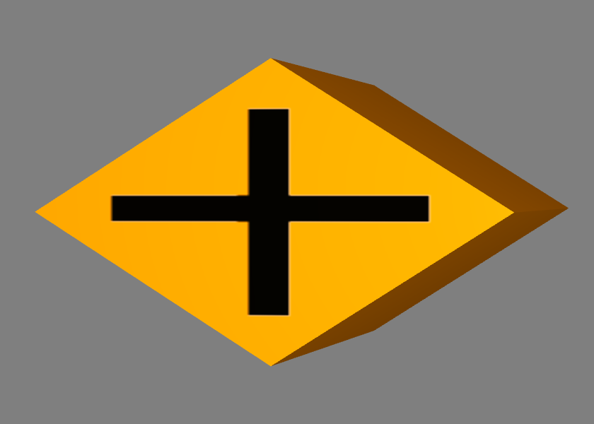
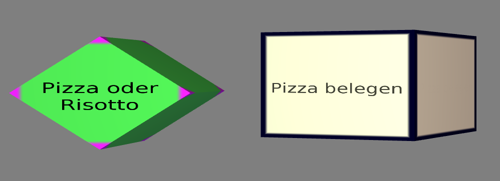

.. _visualisierung:

*******************************
3D-Visualisierung von Prozessen
*******************************

Im Folgenden wird die Visualisierung von Prozessen im I>PM3D-Prototypen vorgestellt, wie sie durch das im vorherigen Kapitel vorgestellte Editor-Metamodell festgelegt wird.
Außerdem werden durch die Implementierung vorgegebene Aspekte angesprochen, welche aber weitgehend unabhängig von der Prozessmodellierung sind.
Dabei werden auch Hinweise gegeben, welche beim Hinzufügen von neuen Modellfiguren oder Ändern von Visualisierungsparametern beachtet werden sollten.

Abschließend werden bisher nicht umgesetzte Erweiterungsmöglichkeiten vorgeschlagen, die für eine höhere Benutzerfreundlichkeit und Verständlichkeit sorgen könnten.

Grundlegende Darstellung der grafischen Elemente
================================================

Wie im vorherigen Kapitel unter :ref:`ebl` erläutert werden auf dem Editor-Base-Level grundlegende Figuren und deren Darstellung durch grafische Objekte im Modellierungswerkzeug definiert.
Die konkreten Repräsentationen für bestimmte Typen aus dem Prozessmodell werden auf dem Editor-Definition-Level festgelegt. 
In den Metamodellen wurde schon vorgegeben, dass ein graphbasierter Visualisierungsansatz genutzt wird. 
Anwender, die bereits Erfahrung mit verbreiteten grafischen 2D-Prozessmodellierungssprachen haben sollten durch das Aussehen der Modellelemente möglichst intuitiv verstehen können, welche Konzepte aus der Prozessmodellierung dargestellt werden.

Knoten
------

Für die Darstellung von Informationen auf den Knoten gibt es durch die auf dem :ref:`ebl` definierten Basis-Figuren ``TextLabelNode`` und ``TexturedNode`` grundsätzlich zwei Möglichkeiten.

Die Beschriftung von TextLabelNodes kann dazu verwendet werden, Attribute aus dem Prozessmodell direkt anzuzeigen.

Es sollten möglichst einfache, dreidimensionale geometrische Körper mit möglichst ebenen Seitenflächen wie Würfel oder Quader gewählt werden. 
Ebene Flächen eignen sich besonders gut zur Darstellung von Information; gekrümmte Flächen beeinträchtigen besonders die Lesbarkeit von (längeren) Textdarstellungen. 

Bei Würfeln oder ähnlichen Körpern ist es auch relativ einfach, einen (dreidimensionalen) Rahmen zu zeichnen, dessen Verwendung weiter unten in :ref:`visualisierungsvarianten` dargestellt wird.

:num:`Abbildung #prozessknoten` zeigt zwei Prozesse, auf denen deren Funktion als Text angezeigt wird. 

Da die Erstellung von Knoten nach dem :ref:`tvk` erfolgt lässt sich die Visualisierung für jeden Knoten individuell anpassen.
In der Abbildung wurde beim rechten Knoten zur Laufzeit die Hintergrundfarbe geändert.

Texte werden nach Bedarf an Wortgrenzen auf mehrere Zeilen verteilt und zentriert angezeigt. 
Weitere Details zur Schriftdarstellung können im Kapitel zur :ref:`Render-Bibliothek <schrift-rendering>` nachgelesen werden.

.. _prozessknoten:

.. figure:: _static/screenshots/prozessknoten.png
    :height: 7cm

    Zwei Prozessknoten; links im Ursprungszustand, rechts als angepasste Verwendung (Screenshot aus I>PM3D)

Andererseits können Grafiken (Texturen) genutzt werden, um die Bedeutung eines Knotentyps zu visualisieren. 
So steht ein Pluszeichen für einen AND-Connector, wie in :num:`Abbildung #and-connector` gezeigt wird. 

.. _and-connector:

    AND-Connector (Screenshot aus I>PM3D)

Blickwinkelabhängige Darstellung von Informationen
^^^^^^^^^^^^^^^^^^^^^^^^^^^^^^^^^^^^^^^^^^^^^^^^^^

Durch die freie Beweglichkeit und die Rotationsmöglichkeit der Kamera sowie der Objekte :ref:`Objekte<ipm3d-visualisierung>` ergeben sich sehr unterschiedliche Beobachtungsperspektiven. 
Objekte können so von allen Seiten betrachtet werden. 
Trotzdem soll sichergestellt werden, dass Texte oder Symbole auf den Objekten jederzeit erkennbar sind. Daher werden diese grundsätzlich auf allen Seiten dargestellt. 

Jedoch führt dies bei bestimmten Drehpositionen zu störenden und möglicherweise verwirrenden Darstellungen, wenn beispielsweise bei einem Würfel zwei oder sogar drei Seiten zu sehen sind, die dasselbe anzeigen.

Um dies zu verbessern, werden die Seiten abhängig von Betrachtungswinkel dargestellt. 
Wird eine Seite vom Benutzer weggedreht, wird die Schrift oder Textur nach und nach "ausgeblendet", indem die Vordergrundfarbe je nach Winkel mit der Hintergrundfarbe gemischt wird.
Ab einer gewissen Abweichung wird nur noch die Hintergrundfarbe angezeigt. So ist nur eine Seite deutlich zu erkennen und der Betrachter wird nicht durch die anderen Seiten abgelenkt.

Berücksichtigung der Eingabemethoden
^^^^^^^^^^^^^^^^^^^^^^^^^^^^^^^^^^^^

Da dieser Prototyp neben der klassischen Desktop-Bedienung mit Maus und Tastatur auch zur Evaluierung von neuartigen Eingabegeräten eingesetzt werden soll, müssen auch die Besonderheiten dieser Eingabemethoden berücksichtigt werden. 

Die im Projekt verwendeten 3D-Eingabegeräte :cite:`buchi` haben nur eine relativ begrenzte Genauigkeit bei der Auswahl und Platzierung von Objekten. 
Vor allem ungeübten Benutzern kann es schwerfallen, Objekte zu selektieren und zu bewegen, besonders wenn die Objekte relativ klein sind.

Dies ist auch ein Grund, eine Graphdarstellung mit möglichst einfachen Objekten zu verwenden.
Es wird deswegen auch verzichtet, Elemente nach dem geometrischen Visualisierungsansatz ineinander zu schachteln, wie es in 2D-Werkzeugen wie es bei :ref:`i>PM<mdf>`\ :sup:`2` zu sehen war.

Es ist sinnvoll, Quader (oder annähernd quaderförmige Geometrien) einzusetzen, da Knoten in die physikalische Simulation eingebunden sind, welche von den Eingabegeräten für die Selektion von Elementen genutzt wird.
Quader werden von der verwendeten Physikkomponente direkt unterstützt\ [#f4]_. Bei Verwendung anderer Geometrien zur Visualisierung würde diese nicht mehr mit den physikalischen Ausdehnungen übereinstimmen.

.. _kanten:

Kanten
------

Eine Kante sollte optisch leicht als Verbindung zwischen zwei Knoten erkannt werden können, die auch gerichteter Natur sein kann.

In I>PM3D werden Kanten werden durch einen (in y-Richtung) gestreckten 3D-Quader dargestellt, der vom Startknoten bis zum Endknoten reicht. 
Die Länge und Ausrichtung der Kanten wird automatisch angepasst, wenn die beteiligten Knoten im Raum verschoben werden. 
Dies wird durch die in :cite:`uli` beschriebene Editor-Komponente übernommen.

Die durch das Concept ``TexturedConnection`` (siehe :ref:`ebl`) bereitgestellte texturierte Verbindung dient dazu, gerichtete Kanten zu visualisieren. 

Eine Möglichkeit ist es, eine Textur mit farblich vom Hintergrund abgehobenen Dreiecken zu verwenden, die so platziert sind, dass an zwei Ecken der Verbindung ein Pfeil entsteht.

:num:`Abbildung #gerichtete-verbindung` zeigt als Beispiel zwei Prozesse, die mit einem Kontrollfluss verbunden sind. Der Kontrollfluss läuft von Prozess A zu Prozess B.

.. _gerichtete-verbindung:

.. figure:: _static/screenshots/control_flow.png
    :scale: 100%

    Gerichtete Kontrollflusskante (Screenshot aus I>PM3D)

Szenenobjekte
-------------

Zusätzlich zu den Elementen des eigentlichen Prozessmodells gibt es noch die Möglichkeit, beliebige 3D-Modelle in die Szene einzufügen, die im Metamodell als ``SceneryObject`` bezeichnet werden. 

Solche Szenenobjekte können zum Beispiel dafür eingesetzt werden, Abbilder von realen Objekten anzuzeigen. 
Diese können zur Illustration von Prozessschritten dienen, wie es :ref:`in <ross-brown>` gezeigt wurde.

Szenenobjekte können genauso wie Knoten, selektiert, frei bewegt, skaliert und rotiert werden, besitzen aber sonst keine anderen Möglichkeiten, das Erscheinungsbild zu beeinflussen.

.. _visualisierungsvarianten:

Visualisierungsvarianten für interaktive Modelleditoren
=======================================================

Da die hier vorgestellte Visualisierung in einem interaktiven Modelleditor eingesetzt wird, ergibt sich noch die weitere Anforderung, Visualisierungsvarianten der Modellelemente zu unterstützen.

So sollen Interaktionen des Benutzers mit den Modellobjekten sichtbar gemacht werden, indem die Visualisierung der Objekte temporär verändert wird. 
Diese Modifikationen werden nicht im Editor-Usage-Model persistiert; daher werden alle Objekte im Normalzustand angezeigt nachdem ein Modell neu geladen wurde.

Hervorhebung
------------

Diese Variante wird dafür eingesetzt, ein Objekt kurzzeitig beim Überfahren durch einem Cursor eines Eingabegeräts hervorzuheben. 
Dargestellt wird das abhängig von der Helligkeit der Grundfarbe des Objekts durch eine Aufhellung bzw. einer Abdunkelung der Farbe. Der Farbton wird dabei nicht verändert.

:num:`Abbildung #hervorhebung-sc` zeigt im Vergleich einen hervorgehobenen AND-Connector und einen im Normalzustand (rechts).

Selektion
---------

Prozessmodellelemente und Szenenobjekte können durch den Benutzer ausgewählt werden. 
Selektierte Objekte sollen von unselektierten Objekten auch bei großer Entfernung und ungünstigen Blickwinkeln unterscheidbar sein, wobei aber jederzeit noch erkennbar sein muss, um welche Art von Modellelement es sich handelt. 

Die Visualisierung des Selektionszustandes soll daher möglich auffällig sein, ohne das Erscheinungsbild allzu stark zu beeinflussen. 

Um die Selektion von der Hervorhebung unterscheidbar zu machen, wird für die Selektion der Rand des Objekts in der Komplementärfarbe eingefärbt. Wie der "Rand" definiert ist je nach Objekttyp unterschiedlich\ [#f5]_.

In :num:`Abbildung #selektion-sc` wird links ein Prozess und rechts ein AND-Connector im selektierten Zustand gezeigt.

.. _deaktivierung:

Deaktivierung
-------------

Objekte können durch den Modelleditor deaktiviert werden. Welche Bedeutung dies hat, wird vom Editor festgelegt. 
Zur Visualisierung dieses Zustandes wird das Objekt transluzent in einem Grauton dargestellt, der von der normalen Farbe abhängig ist. 

So kann man auch Elemente erkennen, die hinter dem deaktivierten liegen und von diesem verdeckt werden.

:num:`Abbildung #deaktivierung-sc` zeigt einen deaktivierten Prozess, hinter dem sich ein anderer Prozess befindet.

.. _hervorhebung-sc:

.. figure:: _static/screenshots/dataitems_hervorhebung.png
    :scale: 100%

    Datenknoten, normal (links) und hervorgehoben (Screenshot aus I>PM3D)

.. _selektion-sc:

    Prozess und Entscheidungsknoten im selektierten Zustand (Screenshot aus I>PM3D)

.. _deaktivierung-sc:

.. figure:: _static/screenshots/prozesse_deaktiviert.png
    :scale: 100%

    Deaktivierter (vorne, durchsichtig) und aktivierter Prozess (Screenshot aus I>PM3D)

Die drei vorgestellten Visualisierungsvarianten können frei kombiniert werden. 
Damit ist es möglich, ein gleichzeitig hervorgehobenes, selektiertes und deaktiviertes Modellelement darzustellen.

.. _modellierungsflaechen:

2D-Modellierungsflächen
=======================

Für eine übersichtliche Darstellung des Prozessmodells ist es häufig erwünscht, Elemente in einer bestimmten Weise anzuordnen. 

Durch die freie Positionier- und Drehbarkeit kann zwar prinzipiell jede beliebige geometrische Anordnung erreicht werden, doch ist dies mit einem relativ hohen Aufwand bei der Platzierung durch den Benutzer verbunden. 

Zur Vereinfachung der Platzierung werden in 2D-Modellierungswerkzeugen oft im Hintergrund dargestellte Gitter genutzt, die eine optische Hilfe darstellen. 
Noch hilfreicher können "magnetische" Gitter sein, die grob in der Nähe platzierte Objekte automatisch auf feste, regelmäßige Positionen verschieben.

Um dies zu erreichen, wird die Physikkomponente genutzt. 
Sobald sich ein Objekt nahe genug an einer solchen Modellierungsebene befindet, wird es nach dem Loslassen durch den Benutzer (Deselektion) von der "Gravitation" der Ebene angezogen, solange bis der Mittelpunkt des Objekts die Fläche erreicht hat, wo es angehalten wird.

Näheres zur Implementierung dieser "Gravitationsflächen" findet sich in :cite:`buchi`.

Grafisch werden diese Ebenen transluzent dargestellt, wobei darauf Gitterlinien zu erkennen sind. 
Diese Linien haben allerdings keine physikalische Bedeutung, sondern dienen nur als optische Platzierungshilfe.

:num:`Abbildung #modellierungsflaeche` zeigt eine solche Ebene.

.. _modellierungsflaeche:

    Modellierungsfläche, grün (Screenshot aus I>PM3D)

.. _beleuchtung:

Beleuchtung
===========

Für die Beleuchtung der Szene werden mehrere Lichtquellen eingesetzt. Die primäre Lichtquelle befindet direkt an der Kamera und bewegt sich mit dieser. 
Die Lichtfarbe ist weiß, also wird der Farbton der beleuchteten Objekte unverfälscht dargestellt. 

Zur Verbesserung der Orientierung befindet sich jeweils eine weniger intensive, farbige Lichtquelle an drei festen Positionen unterhalb (blau), links (grün) und rechts (rot) der Szene, von der Startposition der Kamera aus gesehen. 
So soll es für den Benutzer leichter zu erkennen sein, welche Seite der Objekte in Bezug auf die Ausgangsposition nach unten, links beziehungsweise nach rechts zeigt. 

Die von der :ref:`render-bibliothek` bereitgestellten Lichtquellen nach dem Phong-Lichtmodell sorgen für eine relativ realistische Beleuchtung bei vertretbarem Rechenaufwand.

Für die Visualisierung von 3D-Graphmodellen stellt sich die Frage, wie die Lichtparameter am besten gewählt werden sollten, um eine möglichst hohe Lesbarkeit und eine gute Orientierung im Raum zu ermöglichen.

Im Phong-Lichtmodell wird das von einem Objekt reflektierte Licht in drei Beiträge unterschieden. 

Der Hauptanteil des reflektierten Lichts wird im Normalfall vom "diffuse"-Anteil (diffuses Licht) beigesteuert, welcher abhängig vom Winkel zur Lichtquelle ist.
Von der Lichtquelle eher abgewandte Seiten erscheinen daher dunkel, was sich ungünstig auf die Erkennbarkeit von Informationen auswirken kann.

Um dies auszugleichen, kann der "ambient"-Anteil (Umgebungslicht) erhöht werden, der vom Winkel unabhängig ist. 
Wird dieser zu hoch gesetzt, leidet allerdings der räumliche Eindruck.

Der "specular-Anteil" erzeugt spiegelnde Reflexionen auf Objekten, die auch von der Betrachterposition relativ zum Objekt abhängen. 
Dieser Anteil kann folglich die räumliche Orientierung unterstützen.
Allerdings führt die starke Aufhellung an bestimmten Stellen dazu, dass sich Text dort schlecht ablesen lässt.

Außerdem kann bei (OpenGL)-Lichtquellen noch angegeben werden, wie stark die Helligkeit mit steigender Entfernung von der Lichtquelle abfällt. 
Hierdurch kann der Tiefeneindruck verbessert werden.

Ein starker Abfall der Beleuchtung führt aber zu Problemen, wenn gleichzeitig Objekte mit Text in der Nähe der Lichtquelle und weit entfernt in lesbarer Form dargestellt werden sollen.
Objekte in der Nähe werden zu hell dargestellt, während weit entfernte Objekte zu dunkel sind.
Genauso ergibt sich bei gerichteten Verbindungen, die sich weit im Hintergrund befinden, das Problem, dass die darauf abgebildeten Richtungsmarkierungen schlecht zu erkennen sind.

Insgesamt hat sich bei Versuchen gezeigt, dass es schwierig ist, die Lichtparameter so zu setzen, dass eine in allen Situationen brauchbare Beleuchtung entsteht.

.. _vis-beispiel:

Visualisierung eines Beispielsprozesses
=======================================

(kommt noch)
.. TODO

:num:`Abbildung #beispielprozess-screenshot` zeigt einen in I>PM3D modellierten Prozess.

.. _beispielprozess-screenshot:

    Beispiel für einen Prozess in I>PM3D 

Probleme und Erweiterungsmöglichkeiten
======================================

Die momentan umgesetzte Visualisierung von Prozessen zeigt nach unserer\ [#f3]_ Ansicht, dass eine 3D-Ansicht auf Prozessdiagramme durchaus praktikabel ist. 
Es zeigten sich bei ersten Versuchen mit dem i>PM3D Prototypen einige Probleme in Hinblick auf die Visualisierung, die teilweise schon angesprochen wurden oder im Folgenden noch erwähnt werden. 

Um die Darstellung zu verbessern, und den "Nutzen" für den Anwender zu erhöhen gibt es eine Vielzahl von Verbesserungs- und Erweiterungsmöglichkeiten.
Hier sollen vor allem einige dargestellt werden, die sich aus den Erfahrungen mit dem Prototypen ergeben haben und die auf Basis des momentanen Projektes ohne grundlegende Veränderungen umgesetzt werden könnten.

Darstellung von Text
--------------------

Die :ref:`Render-Bibliothek<schrift-rendering>` stellt Text dar, indem dieser in ein 2D-Bild geschrieben und so als Textur auf dem Objekt angezeigt wird.

Andere Techniken, die eine höhere Darstellungsqualität erreichen, wie sie beispielsweise von :ref:`GEF3D<gef3d>` genutzt oder von :cite:`ray_vector_2005` vorgestellt werden, wurden ebenfalls in Betracht gezogen. 
Besonders die Möglichkeiten aktuellster Grafikhardware mit OpenGL4-Unterstützung, neue Geometrien direkt auf der Grafikeinheit per Tesselation-Shader zu erzeugen, könnten für die Implementierung von gut lesbaren und dennoch performanten Darstellungstechniken interessant sein.

Jedoch war die Schriftqualität des verwendeten texturbasierten Ansatzes ausreichend für den hier entwickelten Prototypen und lies sich einfach implementieren. 
Für weitere Arbeiten auf diesem Gebiet sollte dies jedoch erneut evaluiert werden, da die Schriftqualität wichtig für Verständlichkeit und Nutzen der grafischen Repräsentation ist. 

Bei ungünstigen Beobachtungssituationen, also bei großer Entfernung und schräger Betrachtung von Flächen, wird es im Prototypen schnell schwierig, Texte ohne Anstrengung zu lesen.  
Es müssen eher große Schriften gewählt werden und daher lässt sich relativ wenig Information auf den Knoten darstellen.
Außerdem muss der Kontrast zwischen Textfarbe und Hintergrund immer sehr hoch sein, um eine angemessene Lesbarkeit zu erreichen. Eine bessere Darstellungsqualität würde hier für mehr Flexibilität sorgen.

Eine sinnvolle Erweiterungsmöglichkeit wäre es, die Anzeige von Informationen bei weit entfernten Objekten automatisch zu vereinfachen\ [#f1]_, indem beispielsweise ein Text abgekürzt und größer dargestellt wird. 
So wäre es möglich, Knoten mit größerem Abstand immerhin noch zu unterscheiden. 
Dafür könnte ein zusätzliches Attribut im Prozessmodell genutzt werden, dass eine Abkürzung für ein längeres Textattribut angibt.

Konfigurierbarkeit
------------------

Abgesehen von den im Metamodell konfigurierbaren Visualisierungsparametern fehlt es noch an weiteren Möglichkeiten, die grafische Darstellung zu beeinflussen. 

Sehr sinnvoll wäre es, die :ref:`beleuchtung` konfigurieren zu können. 
Wie in jenem Abschnitt gesagt ist es schwierig, Einstellungen zu finden, die für alle Situationen gut geeignet sind.
Diese hängen auch von der verwendeten Anzeige und von Einflüssen wie Umgebungslicht oder der persönlichen Wahrnehmung des Benutzers ab.

In der grafischen Oberfläche sollte es hierzu eine Möglichkeit geben, Lichtquellen zu setzen und deren Parameter zu verändern. 
Es sollten auch sinnvolle Standardeinstellungen bzw. auswählbare Profile angeboten werden, um den Benutzer nicht mit zu vielen Aufgaben zu überfordern. 
Lichtquellen sind in Simulator X über zugehörige Licht-Entities erstell- und konfigurierbar, wie es auch von der :ref:`renderkomponente` unterstützt wird.

Ähnliches gilt für :ref:`modellierungsflaechen`. Sie sind momentan in der Implementierung fest vorgegeben, da es in der GUI noch keine Konfigurationsmöglichkeit gibt.
Die Flächen können aber ebenfalls nach Bedarf erstellt und über zugehörige Entities konfiguriert werden.

Es sollte darüber nachgedacht werden, die aktuellen Einstellungen für Lichtquellen und Modellierungsflächen auch in die Editor-Modelle aufzunehmen und damit persistent zu machen.

Räumliche Darstellung
---------------------

Die räumliche Darstellung, vor allem der Tiefeneindruck ist für das Verständnis von 3D-Visualisierungen wichtig :cite:`wickens_three_1989` :cite:`ware_visualizing_2008`. 
Der Hauptvorteil der zusätzlichen Dimension ist es, Objekte unterschiedlich weit vom Betrachter entfernt zu zeichnen und somit mehr Information darstellen zu können.

Modellierungsflächen und eine passende Beleuchtung können hilfreich sein, um dem Benutzer die räumliche Orientierung zu erleichtern, wie es der Prototyp zeigt.

Jedoch ist die Darstellung von 3D-Szenen auf einem PC-Bildschirm oder Projektor üblicherweise nur eine 2D-Projektion, bei der ein realistischer Tiefeneindruck fehlt.
Dies macht es manchmal schwierig zu erkennen, welche Objekte näher am Betrachter liegen und welche sich im Hintergrund befinden. 

Es besteht die Möglichkeit, sich an der Größe der Objekte zu orientieren. Jedoch kann dies auch scheitern, wenn Objekte unterschiedlich groß sein dürfen, wie es momentan der Fall ist. 
Die Skalierung von Modellelementen allerdings komplett zu verbieten ist wohl auch unpraktikabel.

Andere Effekte, die aus der "Umwelt" bekannt sind und die einen besseren räumlichen Eindruck ermöglichen können sind die Bewegungsparallaxe, Stereoskopie und Schatten.

Die Nutzung von stereoskopischer Darstellung und Bewegungsparallaxe für die Darstellung von Graphen wurde in :ref:`ware-graphs` vorgestellt.

Der Bewegungsparallaxen-Effekt lässt sich durch seitliche Bewegung des Benutzers in der Szene erzeugen und gibt einen Eindruck davon, wie weit Objekte von diesem entfernt sind.

Schatten
^^^^^^^^

Ein Schattenwurf der Objekte könnte verdeutlichen, wie weit Objekte von einer Fläche entfernt sind und wie der Betrachter zur Lichtquelle orientiert ist.
Jedoch müsste getestet werden, inwieweit dies hilfreich ist und ob Schatten nicht zu häufig dazu führen, dass sich Informationen im Modell schlecht erkennen lassen. 
Konfigurationsmöglichkeiten oder eine "intelligente" Schattenberechnung, die weniger auf realistische Effekte setzt aber dafür Lesbarkeitsaspekte berücksichtigt könnten hier Vorteile mit sich bringen.

Voll immersive virtuelle Welten
^^^^^^^^^^^^^^^^^^^^^^^^^^^^^^^

Eine weitere Entwicklungsmöglichkeit wäre es, voll immersive virtuelle Welten zu nutzen wie es in :ref:`\ <halpin-social-net>` gezeigt wurde. 
Dies ist auch ein Anwendungsgebiet, das von der hier verwendeten Plattform Simulator X unterstützt werden soll.
Besonders Anzeigen mit hoher Auflösung könnten Vorteile für Lesbarkeit und Verständlichkeit mit sich bringen, wie in :ref:`\ <ware-graphs>` angemerkt wurde.

Das Ziel des Projekts ist es aber eher auf technisch noch sehr aufwändige sowie teure Lösungen zu verzichten und ein System für die "breite Masse" bereitzustellen.
Durch die ständige technische Weiterentwicklung könnten solche Systeme aber in Zukunft durchaus eine praktische Alternative zu üblichen Benutzerschnittstellen für diverse Einsatzgebiete werden.

Verdeckung
^^^^^^^^^^

Problematisch ist die in 3D-Visualisierungen auftretende Verdeckung von Informationen durch andere Modellelemente, wie schon :ref:`in <ross-brown>` zu sehen war.
Ist ein Element verdeckt, kann im Prototypen einfach die Betrachterposition verändert werden. 
Allgemein sollten Modelle aber so erstellt werden, dass aus "üblichen" Betrachtungsrichtungen möglichst wenig Verdeckung auftritt, um sich nicht ständig hin- und herbewegen zu müssen.

Eine andere Möglichkeit ist es, die verdeckenden Elemente transluzent zu machen, wie es im Prototypen durch das Deaktivieren von Elementen möglich ist. 

Interessant wäre es auch, die Durchsichtigkeit von verdeckenden Elementen automatisch zu beeinflussen wie es unter dem Stichwort "dynamic transparency" von :cite:`elmqvist_dynamic_2009` vorgestellt wird.
Objekte würden nach ihrer Wichtigkeit für die aktuelle Betrachtungssituation eingeteilt. 
Unwichtige Objekte, "distractors" genannt, würden automatisch transluzent\ [#f2]_ dargestellt falls sie wichtige ("targets") Objekte verdecken.

So könnte durch den Benutzer beispielsweise festgelegt werden, dass aktuell "Datenknoten" besonders wichtig sind und nicht verdeckt werden dürfen.

Darstellung von Kanten
----------------------

Ein "Ärgernis" bei 3D-Visualisierungen können schlecht erkennbare Verbindungen sein; vor allem die Richtung zu sehen kann bei weit entfernten Kanten ein Problem darstellen. 
Dies zeigte sich auch bei den Versuchen mit den Prototypen.
Hier kann man sagen, dass es wohl keine "perfekte" Lösung gibt, die immer funktioniert.

Wie unter :ref:`kanten` gezeigt werden gerichtete Kanten durch eine sich wiederholende "Pfeiltextur" auf Verbindungen dargestellt. 
Das hat den Vorteil, dass die Richtung auch erkennbar ist, wenn die Verbindung zu großen Teilen durch andere Objekte verdeckt wird.   

Der Ansatz, die Richtung durch eine dreidimensionale Pfeilspitze darzustellen, leidet unter dem Problem der Verdeckung. 
Eine solche Darstellung liegt jedoch näher an bekannten visuellen Sprachen und sollte wohl noch unterstützt werden.
Damit gäbe es auch mehr Möglichkeiten um den Typ von Verbindungen durch verschiedene Pfeilspitzen oder -enden besser zu unterscheiden.
Bisher kann dies nur über die Farbe, Variation der Textur, und die Dicke dargestellt werden.

Gerade Linien, wie sie momentan verwendet werden können störend sein wenn sie Knoten verdecken oder andere Elemente schneiden. 
Das Problem sich kreuzender Verbindungen ist immerhin nicht so groß wie im 2D-Bereich, da man die zusätzliche Dimension zur Vermeidung nutzen kann.

Verbindungen könnten alternativ auch gekrümmt oder aus mehreren Liniensegmenten aufgebaut gezeichnet werden, um solche Probleme weiter einzudämmen, wie es auch in 2D-Werkzeugen häufig zu sehen ist.
Kanten, die als "gebogene 3D-Röhren" dargestellt werden zeigen :cite:`spratt_using_1994` und :cite:`balzer_hierarchy_2004`.
Von :cite:`holten_user_2009` wird eine Benutzerstudie zur Effektivität von unterschiedlichen Darstellungsformen für gerichtete Kanten vorgestellt, deren Richtung beispielsweise auch durch Farbverläufe und andere Farbeffekte angezeigt werden könnten.

.. [#f1] In der Computergrafik wird das Prinzip als "Level Of Detail" bezeichnet. 

.. [#f2] Es muss nicht das komplette Objekt durchsichtig sein; es reicht aus, wenn Teile eines Objekts transluzent sind, die auch wirklich für eine Verdeckung sorgen.

.. [#f3] Damit sind der Autor dieser Arbeit und :cite:`uli` sowie :cite:`buchi` gemeint.

.. [#f4] Von der Physikkomponente werden auch Kugeln unterstützt, allerdings ist die Verwendung von Quadern bisher fest in der Implementierung von i>PM3D vorgegeben.

.. [#f5] Der Rand ist über die Texturkoordinaten definiert. Näheres :ref:`siehe <erweiterung-interaction>`.
